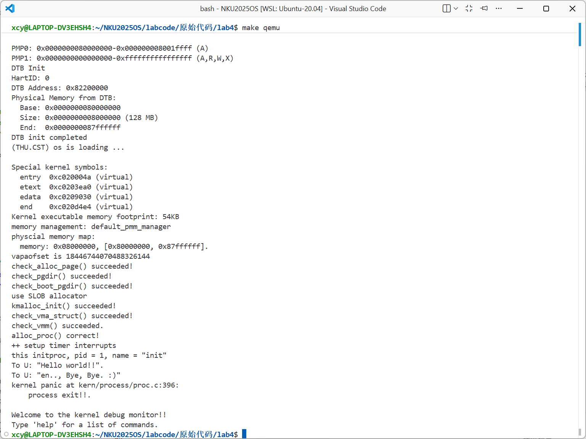
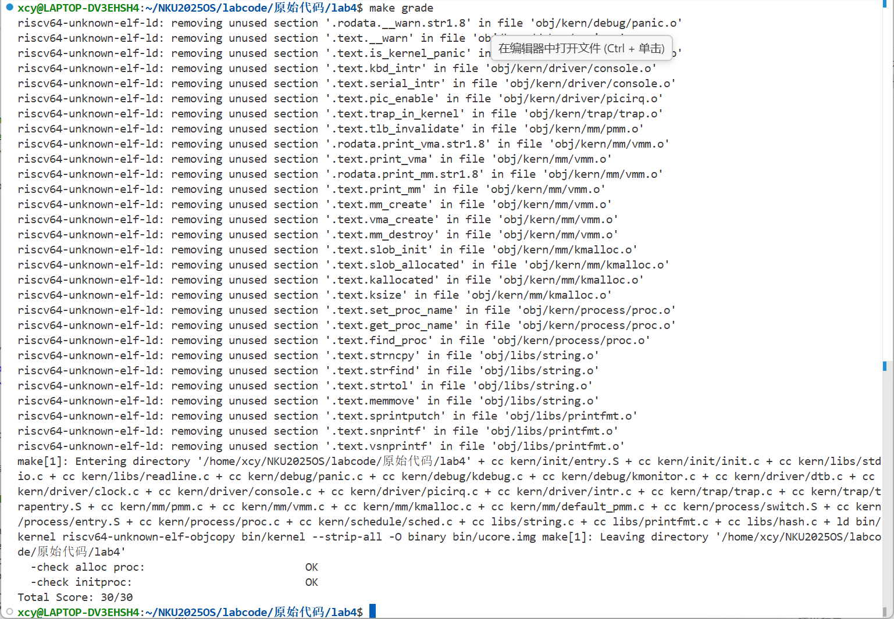

# <center>lab4 实验报告</center>

<center>2310364 柳昕彤   2313310 熊诚义  2311887 陈语童</center>

[toc]

## **实验概述**

本次 Lab4 的目标为实现内核线程/进程的基础创建与切换逻辑。主要工作点为：
- 分配并初始化进程控制块（`alloc_proc`）
- 在 `do_fork` 中为新内核线程分配资源（内核栈、复制 trapframe/context、加入进程表、唤醒进程等）
- 实现 `proc_run`，完成页表切换与上下文切换

---

## **练习1：分配并初始化一个进程控制块**

alloc_proc 的职责是从内核堆中分配一段用于保存进程控制块（`struct proc_struct`）的内存，并为进程控制块设置一组合理的初始值。这里的初始化包括：

完整代码（ `kern/process/proc.c`）：

```c
static struct proc_struct *
alloc_proc(void)
{
    struct proc_struct *proc = kmalloc(sizeof(struct proc_struct));
    if (proc != NULL)
    {
        // LAB4:EXERCISE1 2313310
        proc->state = PROC_UNINIT;                      // 设置进程为未初始化状态
        proc->pid = -1;                                 // 未初始化的进程ID
        proc->runs = 0;                                 // 初始化运行次数为0
        proc->kstack = 0;                               // 内核栈地址初始化为0
        proc->need_resched = 0;                         // 不需要调度
        proc->parent = NULL;                            // 没有父进程
        proc->mm = NULL;                                // 未分配内存管理结构
        memset(&(proc->context), 0, sizeof(struct context)); // 初始化上下文
        proc->tf = NULL;                                // 中断帧指针初始化为NULL
        proc->pgdir = boot_pgdir_pa;                    // 使用内核页目录表
        proc->flags = 0;                                // 初始化标志位为0
        memset(proc->name, 0, PROC_NAME_LEN + 1);       // 初始化进程名
    }
    return proc;
}
```

alloc_proc 的职责是从内核堆中分配一段用于保存进程控制块（`proc_struct`）的内存，并为进程控制块设置一组合理的初始值。这里的初始化包括：
- `state = PROC_UNINIT`：表示刚分配的 proc 尚未被真正初始化和调度；后续创建过程会把它设置为 `PROC_RUNNABLE`。
- `pid = -1`：尚未分配真实 pid（`get_pid()` 会在将进程加入进程表时分配）。
- `runs = 0`：运行次数清零。
- `kstack = 0`：内核栈尚未分配。
- `need_resched = 0`：不需要调度。
- `parent = NULL` 与 `mm = NULL`：新分配的 proc 还没有父指针也没有 mm（内核线程通常不需要 mm，或在后续步骤依据 clone_flags 复制/共享）。
- `context` 使用 `memset` 清零，保证寄存器保存区初始为 0。
- `tf = NULL`：trapframe 尚未建立。
- `pgdir = boot_pgdir_pa`：默认使用内核的页目录（内核线程共享内核页目录）。
- `flags = 0` 与 `name` 清零。

这些初始值确保在后续 `do_fork` 中可以安全地对 `proc` 进行资源分配（如分配内核栈）并设置正确的 pid、上下文和 trapframe。

### 问题：proc_struct 中 `struct context context` 与 `struct trapframe *tf` 的含义和本实验中的作用：

### struct context context：

`struct context` 结构体用于保存进程在**内核态上下文切换**时需要保存的寄存器集合，通常是那些**调用者保存 (Caller-saved)** 和**被调用者保存 (Callee-saved)** 的寄存器，以及返回地址 `ra` 和栈指针 `sp`。本实验中它用于 `switch_to()` 函数进行**上下文切换**。当调用 `switch_to(&prev->context, &next->context)` 时，CPU 的状态会被保存到 `prev->context` 中，然后从 `next->context` 中恢复状态。在新线程创建时 (`copy_thread`)，它的 `ra` 和 `sp` 会被特殊设置，确保新线程在被切换运行时，能从正确的入口函数 (`forkret`) 开始执行。

### **struct trapframe *tf：**

中断帧用于保存**完整的 CPU 状态**（包括所有通用寄存器、程序计数器 `epc`、状态寄存器 `status` 等）。它是在**中断、异常或系统调用**发生时，CPU 硬件或汇编代码自动/手动将所有寄存器状态保存到栈上所形成的结构。本实验在 `copy_thread` 中，会在新线程的内核栈顶**伪造**一个 `trapframe` 结构，并让 `proc->tf` 指向它。这个伪造的 `trapframe` 包含了新线程**开始执行时的初始寄存器状态**。当新线程第一次被调度运行时，它最终会从这个 `trapframe` 恢复寄存器并开始执行。 `fork` 机制中，它还用于设置子进程的**返回值**（例如 `a0` 寄存器设置为 0)。

在 lab3 中我们已经实现了低层的中断/异常保存与恢复机制，lab4 直接沿用了该设计并在进程创建与调度中利用了同样的中断帧布局。汇编在发生异常/中断时把 CPU 的全部寄存器和 CSR（如 `sstatus`、`sepc`、`sbadvaddr`、`scause`）按固定顺序压入内核栈，形成一个 `struct trapframe` 布局；内核 C 通过接收这个 `struct trapframe *` 来查看、修改寄存器状态并决定如何返回或调度：

```c
struct trapframe
{
    struct pushregs gpr;
    uintptr_t status;
    uintptr_t epc;
    uintptr_t badvaddr;
    uintptr_t cause;
};
```

在汇编端，`kern/trap/trapentry.S` 提供了保存和恢复的宏，并把栈指针作为 `trap` 的参数传入 C 函数：

```asm
    SAVE_ALL

    move  a0, sp
    jal trap
    # sp should be the same as before "jal trap"
```

上述代码把异常时的寄存器按 `trapframe` 布局保存到栈上，然后把栈指针（`struct trapframe *`）传给 `trap()`。因此 C 侧拿到的 `tf` 指向的是刚由汇编保存的中断帧，内核可以直接读写 `tf->gpr`、`tf->epc`、`tf->status` 等字段来实现异常处理或返回控制流的调整。

在 C 侧，`kern/trap/trap.c` 中的 `trap` 会根据 `tf->cause` 分流到中断或异常处理函数：

```c
void trap(struct trapframe *tf)
{
    trap_dispatch(tf);
}

static inline void trap_dispatch(struct trapframe *tf)
{
    if ((intptr_t)tf->cause < 0)
        interrupt_handler(tf);
    else
        exception_handler(tf);
}
```

在进程创建路径上，我们的lab4实验 利用了相同的 `trapframe` 布局来“伪造”一个初始的中断帧，使新进程能够通过汇编的恢复路径直接启动。`kern/process/proc.c` 的 `copy_thread` 会把传入的 `struct trapframe` 拷贝到子进程的内核栈顶并设置 `proc->tf`：

```c
proc->tf = (struct trapframe *)(proc->kstack + KSTACKSIZE - sizeof(struct trapframe));
*(proc->tf) = *tf;
proc->tf->gpr.a0 = 0; // 子进程 fork 返回值为 0
proc->tf->gpr.sp = (esp == 0) ? (uintptr_t)proc->tf : esp;
proc->context.ra = (uintptr_t)forkret;
proc->context.sp = (uintptr_t)(proc->tf);
```

当新进程第一次被调度时，`switch_to` 恢复的 `context` 会使执行流进入 `forkret`，`forkret` 调用 `forkrets(current->tf)`：

```c
static void forkret(void)
{
    forkrets(current->tf);
}
```

而 `forkrets` 在 `trapentry.S` 中把传入的 `proc->tf` 设为栈指针并跳转到 `__trapret` 恢复寄存器并执行 `sret`：

```asm
.globl forkrets
forkrets:
    move sp, a0
    j __trapret
```

我们的lab3实验中的 的汇编保存/恢复约定（`SAVE_ALL`/`RESTORE_ALL`、`__alltraps`、`__trapret`）与 lab4实验的进程初始化（`copy_thread`、`forkret`、`forkrets`）组合，使得同一个 `trapframe` 布局既可用于真实中断时保存现场，也可用于伪造新进程的启动现场，把中断处理与进程管理连接起来。

---

## **练习2：为新创建的内核线程分配资源**

`do_fork` 的目标是创建当前进程（parent）的一个子进程（child），对于内核线程来说主要需要复制以下内容：

1. **分配 PCB **：调用练习 1 的函数，获取一个空的 `proc_struct` 容器。
2. **分配内核栈 (`setup_kstack`)**：每个内核线程都需要一个独立的内核栈，用于处理中断、异常和内核函数调用。
3. **复制/共享内存 **：对于本实验中的**内核线程**，它们共享内核地址空间，所以这个函数是空实现。对于用户进程，它将负责复制或共享用户态的页表结构。 
4. **复制线程状态 (`copy_thread`)**：这是最关键的一步。它在子进程的内核栈顶部伪造一个 `trapframe` (`proc->tf`)，并设置 `proc->context` 的 `ra` 和 `sp`，使其在第一次被 `switch_to` 切换时能够正确启动。
5. **加入管理结构**：分配**唯一 PID** (`get_pid`)。将新进程的 `proc_struct` 加入到全局的进程哈希表 (`hash_proc`) 和链表 (`proc_list`) 中，并增加进程计数器 (`nr_process++`)。整个插入过程必须在**禁用中断** (`local_intr_save`/`local_intr_restore`) 的临界区内完成，以确保操作的原子性，防止并发错误。
6. **唤醒线程 (`wakeup_proc`)**：将新线程的状态设置为 `PROC_RUNNABLE`，使其可以被调度器选择执行。返回新子进程的 PID。

若中间某步失败（例如内核栈分配失败），需要释放已分配的资源并返回错误码，代码中通过 `goto` 分支处理清理。

- 完整代码（摘自 `kern/process/proc.c`）：

```c
int do_fork(uint32_t clone_flags, uintptr_t stack, struct trapframe *tf)
{
    int ret = -E_NO_FREE_PROC;
    struct proc_struct *proc;
    if (nr_process >= MAX_PROCESS)
    {
        goto fork_out;
    }
    ret = -E_NO_MEM;
    // LAB4:EXERCISE2 2310364

    //    1. call alloc_proc to allocate a proc_struct
    if ((proc = alloc_proc()) == NULL) {
        goto fork_out;
    }
    
    //    2. call setup_kstack to allocate a kernel stack for child process
    if (setup_kstack(proc) != 0) {
        goto bad_fork_cleanup_proc;//子进程需要独立的内核栈用于中断/异常处理和内核调用
    }
    
    //    3. call copy_mm to dup OR share mm according clone_flag
    if (copy_mm(clone_flags, proc) != 0) {
        goto bad_fork_cleanup_kstack;
    }
    
    //    4. call copy_thread to setup tf & context in proc_struct
    copy_thread(proc, stack, tf);
    
    //    5. insert proc_struct into hash_list && proc_list
    bool intr_flag;
    local_intr_save(intr_flag);
    {
        proc->pid = get_pid();
        hash_proc(proc);
        list_add(&proc_list, &(proc->list_link));
        nr_process++;
    }
    local_intr_restore(intr_flag);
    
    //    6. call wakeup_proc to make the new child process RUNNABLE
    wakeup_proc(proc);
    
    //    7. set ret vaule using child proc's pid
    ret = proc->pid;
    
fork_out:
    return ret;

bad_fork_cleanup_kstack:
    put_kstack(proc);
bad_fork_cleanup_proc:
    kfree(proc);
    goto fork_out;
}
```

### 问题：ucore 是否为每个新 fork 的线程分配唯一 id？

  是的，ucore 通过 `get_pid()` 确保分配到的 PID 是**唯一**的。分配逻辑是用一个静态变量 `last_pid` 来记录上一个分配的 PID，并尝试递增分配。当 `last_pid` 达到最大值 `MAX_PID` 时，它会**回绕**到 1。

  为了避免分配到已经被占用的 PID，它会遍历当前的进程链表 (`proc_list`)。如果发现 `last_pid` 已经被占用，它会继续递增并**重试** (`goto repeat`)，直到找到一个空闲的 PID。`next_safe` 是一个优化变量。它记录了当前进程集中**大于** `last_pid` 的**最小** PID。这样，如果 `last_pid` 递增到 `next_safe` 之前，就可以假设这个范围内的 PID 是空闲的，从而减少不必要的完整链表扫描，提高了连续分配 PID 的效率。

`get_pid` 函数本身**不负责**原子性。`do_fork` 函数通过在调用 `get_pid()` 并将新进程插入链表的整个临界区**禁用中断**，来保证整个进程创建和插入操作的原子性，避免并发冲突。

```c++
static int
get_pid(void)
{
    static_assert(MAX_PID > MAX_PROCESS);
    struct proc_struct *proc;
    list_entry_t *list = &proc_list, *le;
    static int next_safe = MAX_PID, last_pid = MAX_PID;
    if (++last_pid >= MAX_PID)
    {
        last_pid = 1;
        goto inside;
    }
    if (last_pid >= next_safe)
    {
    inside:
        next_safe = MAX_PID;
    repeat:
        le = list;
        while ((le = list_next(le)) != list)
        {
            proc = le2proc(le, list_link);
            if (proc->pid == last_pid)
            {
                if (++last_pid >= next_safe)
                {
                    if (last_pid >= MAX_PID)
                    {
                        last_pid = 1;
                    }
                    next_safe = MAX_PID;
                    goto repeat;
                }
            }
            else if (proc->pid > last_pid && next_safe > proc->pid)
            {
                next_safe = proc->pid;
            }
        }
    }
    return last_pid;
}

```

因此，插入新进程时调用 `proc->pid = get_pid();` 可以保证当前进程集合中 pid 唯一；通过在插入过程前后禁用中断并在临界区内完成插入（`local_intr_save`/`local_intr_restore`），避免并发分配冲突。

### proc_list 和 hash_list 说明

在 ucore 中，为了有效地管理和查找进程，我们使用了两个关键的数据结构：`proc_list` 和 `hash_list`。

*   `proc_list`：定义为 `list_entry_t proc_list;`，是一个双向链表，用于维护系统中的所有进程控制块（PCB）。
*   `hash_list`：定义为 `static list_entry_t hash_list[HASH_LIST_SIZE];`，是一个哈希表（数组），用于根据 PID 快速查找对应的进程。`HASH_LIST_SIZE` 定义为 1024 ($2^{10}$)。

```c
// the process set's list
list_entry_t proc_list;

#define HASH_SHIFT 10
#define HASH_LIST_SIZE (1 << HASH_SHIFT)
#define pid_hashfn(x) (hash32(x, HASH_SHIFT))

// has list for process set based on pid
static list_entry_t hash_list[HASH_LIST_SIZE];
```

**初始化：**

*   这两个结构在 `kern/process/proc.c` 的 `proc_init` 函数中进行初始化。
*   `proc_list` 使用 `list_init(&proc_list);` 初始化为空链表。
*   `hash_list` 通过循环遍历数组的每个元素，并对每个元素调用 `list_init` 进行初始化。

```c
void proc_init(void)
{
    int i;

    list_init(&proc_list);
    for (i = 0; i < HASH_LIST_SIZE; i++)
    {
        list_init(hash_list + i);
    }
    // ...
}
```

**作用：**

*   `proc_list`：主要用于遍历系统中的所有进程。比如在 `get_pid()` 函数中，为了分配一个唯一的 PID，我们需要遍历 `proc_list` 来检查某个 PID 是否已被占用。
*   `hash_list`：主要用于加速进程查找。当需要根据 PID 获取进程控制块时（例如 `find_proc` 函数），使用哈希表可以避免遍历整个 `proc_list`，从而将查找的时间复杂度从 O(N) 降低到 O(1)。

**插入进程：**

* 在 `do_fork` 函数中，当新进程创建并初始化完成后，会将其插入到这两个结构中。

* 使用 `list_add(&proc_list, &(proc->list_link));` 将进程加入 `proc_list`。

* 使用 `hash_proc(proc);` 将进程加入 `hash_list`。`hash_proc` 函数会根据 `proc->pid` 计算哈希值（`pid_hashfn`），然后将进程插入到对应的哈希桶中。

  注：这些操作需要在关中断（`local_intr_save`）的保护下进行，以保证原子性。

```c
// hash_proc - add proc into proc hash_list
static void
hash_proc(struct proc_struct *proc)
{
    list_add(hash_list + pid_hashfn(proc->pid), &(proc->hash_link));
}

// 在 do_fork 中：
// ...
bool intr_flag;
local_intr_save(intr_flag);
{
    proc->pid = get_pid();
    hash_proc(proc);
    list_add(&proc_list, &(proc->list_link));
    nr_process++;
}
local_intr_restore(intr_flag);
// ...
```

**寻找进程：**

*   `find_proc(int pid)` 函数利用 `hash_list` 来查找进程。首先根据传入的 `pid` 计算哈希索引，然后遍历该索引对应的 `hash_list` 桶（链表）。在遍历过程中，比较每个进程的 PID，如果找到匹配的 PID，则返回对应的 `proc_struct` 指针。

```c
// find_proc - find proc frome proc hash_list according to pid
struct proc_struct *
find_proc(int pid)
{
    if (0 < pid && pid < MAX_PID)
    {
        list_entry_t *list = hash_list + pid_hashfn(pid), *le = list;
        while ((le = list_next(le)) != list)
        {
            struct proc_struct *proc = le2proc(le, hash_link);
            if (proc->pid == pid)
            {
                return proc;
            }
        }
    }
    return NULL;
}
```

---

## **练习3：proc_run 的实现**

`proc_run` 用于把指定的进程 `proc` 切换到 CPU 上执行。执行的逻辑是如果 `proc` 已经是当前进程（`current`），则无需切换。如果不是就先禁用本地中断以避免在切换过程中被中断打断（使用 `local_intr_save(intr_flag)`），接着更新 `current` 指针为 `proc`，切换页表（SATP 寄存器），使 CPU 使用目标进程的地址空间。此处使用 `lsatp(next->pgdir)`。最后调用 `switch_to(&prev->context, &next->context)` 执行上下文切换——这会保存 `prev` 的寄存器到 `prev->context` 并恢复 `next->context` 中的寄存器，实现进程切换。结束后不要忘了恢复中断状态（`local_intr_restore(intr_flag)`）。

注意：在 switch_to 之后，旧的 `prev` 上下文会在它再次被恢复时从 `switch_to` 返回。

完整代码（摘自 `kern/process/proc.c`）：

```c
void proc_run(struct proc_struct *proc)
{
    if (proc != current)
    {
        // LAB4:EXERCISE3 2310364
        bool intr_flag;
        struct proc_struct *prev = current, *next = proc;
        
        // 禁用中断
        local_intr_save(intr_flag);
        {
            // 切换当前进程为要运行的进程
            current = proc;
            
            // 切换页表，使用新进程的地址空间。切换后，CPU 访问虚拟地址时，将使用新进程的页目录表进行地址转换。
            // 内核线程共享内核页表，所以 pgdir 都是 boot_pgdir_pa。
            lsatp(next->pgdir);
            
            //保存当前 (prev) 进程的寄存器到 &(prev->context)。
            // 然后，它会从下一个 (next) 进程的 &(next->context) 中恢复寄存器状态。
            switch_to(&(prev->context), &(next->context));//next->context 的 ra（返回地址）被设置指向 forkret，新进程的执行将从 forkret 函数开始。
        }
        // 允许中断
        local_intr_restore(intr_flag);//只有当 A 再次回来时才会执行这行
    }
}
```

> 如果B 是一个新创建的线程（像 `initproc`），它的 `B->context` 中的 `ra`（返回地址）和 `sp`（栈指针）是事先在 `copy_thread` 中设置好的。`ra` 被设置为指向一个特殊的函数 `forkret`。当 `switch_to` 恢复 B 的状态后，CPU 看起来就像刚刚从 `forkret` 返回一样，B 开始执行 `forkret`，并最终执行到它的主函数 (`init_main`)。
>
> 这时候B 进程可能运行一段时间，直到发生时钟中断或 B 主动放弃 CPU。当调度器决定再次切换进程时，调度器在 B 进程的上下文中决定下一个要运行的是 A，B 进程调用 `proc_run(A)`。

### 回答问题：在本实验的执行过程中，创建且运行了几个内核线程？

从 `proc_init` 的实现与运行输出分析可知，本实验启动时至少创建并运行了两个内核线程：

1.**idleproc（pid = 0）**：由 `proc_init` 使用 `alloc_proc()` 建立，并设为可运行（`PROC_RUNNABLE`），它在系统启动后进入 idle 循环。

```c++
if ((idleproc = alloc_proc()) == NULL)
    {
        panic("cannot alloc idleproc.\n");
    }

    // check the proc structure
    int *context_mem = (int *)kmalloc(sizeof(struct context));
    memset(context_mem, 0, sizeof(struct context));
    int context_init_flag = memcmp(&(idleproc->context), context_mem, sizeof(struct context));

    int *proc_name_mem = (int *)kmalloc(PROC_NAME_LEN);
    memset(proc_name_mem, 0, PROC_NAME_LEN);
    int proc_name_flag = memcmp(&(idleproc->name), proc_name_mem, PROC_NAME_LEN);

    if (idleproc->pgdir == boot_pgdir_pa && idleproc->tf == NULL && !context_init_flag && idleproc->state == PROC_UNINIT && idleproc->pid == -1 && idleproc->runs == 0 && idleproc->kstack == 0 && idleproc->need_resched == 0 && idleproc->parent == NULL && idleproc->mm == NULL && idleproc->flags == 0 && !proc_name_flag)
    {
        cprintf("alloc_proc() correct!\n");
    }

    idleproc->pid = 0;
    idleproc->state = PROC_RUNNABLE;
    idleproc->kstack = (uintptr_t)bootstack;
    idleproc->need_resched = 1;
    set_proc_name(idleproc, "idle");
    nr_process++;

    current = idleproc;

```

2.**initproc（pid = 1）**：由 `kernel_thread(init_main, ...)` 创建，此线程被唤醒并运行，输出初始化消息并返回（返回后会触发 `do_exit`，本实验中 `do_exit` 是未实现的 panic）。

```c++
int pid = kernel_thread(init_main, "Hello world!!", 0);
    if (pid <= 0)
    {
        panic("create init_main failed.\n");
    }

    initproc = find_proc(pid);
    set_proc_name(initproc, "init");
```

因此实验中创建且运行的内核线程数为 **2 个**。

---

**测试与运行（如何验证）**

1. 编译并运行（在项目根目录下）：

```bash
make qemu
```

2. 期望输出（已在本次实验环境得到）：

- 内存管理检查成功信息
- `alloc_proc() correct!` 表示 `alloc_proc` 初始化正确
- `this initproc, pid = 1, name = "init"` 与后续 `To U: ...` 信息说明 `initproc` 成功创建并运行
- 最终 `kernel panic at kern/process/proc.c:396: process exit!!.` 是预期行为（`do_exit` 未实现会 panic）

**输出结果：**



与预期结果一致，说明实现正确


在该实验根目录下运行**make grade**命令得到如下结果：



说明通过相应测试。

## **扩展练习challenge**

### 1. 说明语句`local_intr_save(intr_flag);....local_intr_restore(intr_flag);` 是如何实现开关中断的？

### ○ 1.1 代码溯源

随便在 `pmm.c` 中找一个调用例：

```
    local_intr_save(intr_flag);
    {
        page = pmm_manager->alloc_pages(n);
    }
    local_intr_restore(intr_flag);
```

先用 `local_intr_save(intr_flag)` 关闭中断，再用 `local_intr_restore(intr_flag)` 打开中断。两个调用之间用大括号括起的临界区就可以不受到中断影响，原子地执行。

在 `sync.h` 中定义了 `local_intr_save()` 和 `local_intr_restore()` 函数，以及它们各自调用的内联函数 `__intr_save()` 和 `__intr_restore()`。代码如下：

```
static inline bool __intr_save(void) {
    if (read_csr(sstatus) & SSTATUS_SIE) {
        intr_disable();
        return 1;
    }
    return 0;
}

static inline void __intr_restore(bool flag) {
    if (flag) {
        intr_enable();
    }
}

#define local_intr_save(x) \
    do {                   \
        x = __intr_save(); \
    } while (0)

#define local_intr_restore(x) __intr_restore(x);
```

在 `__intr_save()` 和 `intr_restore()` 中进一步调用了来自 `intr.c` 定义的高度封装的函数 `intr_disable()` 和 `intr_enable()`：

```
/* intr_enable - enable irq interrupt */
void intr_enable(void) { set_csr(sstatus, SSTATUS_SIE); }

/* intr_disable - disable irq interrupt */
void intr_disable(void) { clear_csr(sstatus, SSTATUS_SIE); }
```

那么从回答问题的角度来说，归结到 `intr_disable()` 和 `intr_enbale()` 被调用才是能够**实现开关中断的最根本原因**。

### ○ 1.2 开/关过程分析

通过之前的学习已经可以分析知道，中断的允许与不允许，也就是所谓的“开/关”，是靠 sstatus（Supervisor Status Register）寄存器中的一位 `SSTATUS_SIE` 来控制的。`SSTATUS_SIE` 控制 **Supervisor（S态）级别下外部、定时器、软件中断的全局使能**。当 `SSTATUS_SIE = 1` 时，允许 S 模式响应外部、定时器和软件中断；当 `SSTATUS_SIE = 0` 时，S 模式的所有中断被禁止。

从上面逐级向下探源的过程来看，进入临界区时，调用过程从上到下/从外层到内层依次是 `local_intr_save() -> __intr_save() -> intr_disable()`，最后在 `intr_disable()` 中用 `clear_csr(sstatus, SSTATUS_SIE)` 将 `SSTATUS_SIE` 位**清空/置`0`**，**关闭**了 S 态中断。
相反地，退出临界区时，调用过程是 `local_intr_restore() -> __intr_restore() -> intr_enable()`，最后在 `intr_enable()` 中用 `set_csr(sstatus, SSTATUS_SIE)` 将 `SSTATUS_SIE` 位**置`1`**，**打开**了 S 态中断。

### ○ 1.3 为什么要 save & restore？

如果只关心 `local_intr_save(intr_flag);....local_intr_restore(intr_flag);` 是如何实现开关中断的，上面的分析已经足够。问题是，为什么不直接调用 `intr_disable()` 和 `intr_enable()` 来控制 `SSTATUS_SIE`，而是要通过上面两级函数包装之后再调用呢？

逻辑是，一定情况下需要关闭/打开中断的时候，并不能假定当前 S 态的中断已经是处于关闭或打开的状态，所以需要一个“save”和“restore”的过程，保证当前需求导致的关闭/打开中断被完整执行之后，原来所持有的中断状态还能够正确延续。
例如，如果原来中断就已经是关闭状态，那么必须将关闭状态保持下去。如果在不知道当前中断状态的条件下直接调用`intr_disable()` 和 `intr_enable()`，因为进过临界区而必须要：先将中断关闭->后将中断打开——最终中断是处于打开状态向下进行的，这是原进程所不能接受的。而加上 “save + restore” 就能够正确恢复原来的关闭状态。

### ○ 1.4 状态保存代码分析

下面分析上层四个函数分别在做什么。

```
static inline bool __intr_save(void) {
    if (read_csr(sstatus) & SSTATUS_SIE) {
        intr_disable();
        return 1;
    }
    return 0;
}
```

`__intr_save()` 读取当前 `sstatus` 的值并检查 `SSTATUS_SIE` 位。如果为 `1`，也就是中断原先已被开启，就要调用 `intr_disable()` 将其清零，关闭中断，并且返回 `1` 向上一级函数中的参数，记录：**原先中断是开启状态**；如果为 `0`，也就是中断原先已被关闭，就不用再调用 `intr_disable()` 来关闭中断，并且返回 `0` 向上一级函数中的参数，记录：**原先中断是关闭状态**。

```
#define local_intr_save(x) \
    do {                   \
        x = __intr_save(); \
    } while (0)

```

`local_intr_save()` 接受一个参数传入，即**原中断状态**标识符（代码中调用时基本都命名为 `intr_flag`）。函数体内调用 `__intr_save()`（返回 `0` 或 `1`）对标识符赋值，保存原始中断状态。至于为什么要用 `do-while` 的结构来调用，这是因为函数使用宏定义 `#define`，如果写作：

```
#define local_intr_save(x) x = __intr_save();
```

如果习惯性地在调用 `local_intr_save()` 时后加分号，展开时会导致分号重复出现的语法错误。而用 `do-while` 语句可以让宏表现得像一个完整的语句块，必须用分号结束，避免在 if-else、循环等结构中出现语法错误，让它在任何语段中都能安全使用。

```
static inline void __intr_restore(bool flag) {
    if (flag) {
        intr_enable();
    }
}
```

`__intr_restore()` 接收一个传参，即之前保存的原始中断状态。然后根据 `flag` 判断，如果为 `1`，也就是原始状态中断是打开的，那么就要调用 `intr_enable()` 来恢复其打开状态；如果为 `0`，由于 `__intr_save` 已经强制将中断关闭，这时就不需要再调用 `intr_disable()` 将中断关闭了，保持当前关闭状态即可。

```
#define local_intr_restore(x) __intr_restore(x);
```

`local_intr_restore()` 接收和 `local_intr_save()` 相同的那一个变量作为传入参数，然后直接向下传给 `__intr_restore()` 做状态恢复处理。注意这里没有用 `do-while`，因为此函数只做了一个简单的函数调用，即使多加分号还是会被正确展开（而 `local_intr_sav()` 是调用后还进行了赋值，不一样）。

至于为什么 `local_` 开头的两个函数要用 `#define` 来定义而不用一般的函数声明，是因为它们的目的是直接在代码中展开运行，而且需要修改外部变量，必须用宏定义；而另外两个函数实际上也需要直接展开使用，但使用的是 `inline` 内联函数，仍然是函数，因为它们不需要修改外部变量，能用函数就用函数因为函数有更安全、提供类型检查、调试方便等优秀特性。

这样多层的函数封装除了添加额外的功能和检查外，也能便利于代码管理。


***


### 2. 深入理解不同分页模式的工作原理

**—— `get_pte()`函数（位于 kern/mm/pmm.c）用于在页表中查找或创建页表项，从而实现对指定线性地址对应的物理页的访问和映射操作。这在操作系统中的分页机制下，是实现虚拟内存与物理内存之间映射关系非常重要的内容。*

### 2.1 `get_pte()` 函数中有两段形式类似的代码， 结合 sv32，sv39，sv48 的异同，解释这两段代码为什么如此相像。

#### ○ 2.1.1 从多级页表结构出发

Ucore 使用 sv39 多级页表。已知 sv39 下的页表项构成：

| 63-54    | 53-28  | 27-19  | 18-10  | 9-8  | 7~0        |
| -------- | ------ | ------ | ------ | ---- | ---------- |
| Reserved | PPN[2] | PPN[1] | PPN[0] | RSW  | 其他标志位 |

sv39 一共有三级索引。最高一级页表（SATP 指向其地址）索引二级页表/大大页（1GB），二级页表索引三级/大页（2MB），三级页表的表项包含实际物理页（4KB）的物理地址信息。


其中最高一级索引用 PPN[2]，二级用 PPN[1]，三级用 PPN[0]. 

#### ○ 2.1.2 `get_pte()` 做什么以及两段代码相像的原因

`get_pte()` 的作用是查找与给定**虚拟地址**相对应的**页表项**地址位置（最低一级页表项，直接指向实际物理页的那一级，也就是，在 sv39 中的话，是上图中“大页”的一个 entry）；如果要找的映射关系还不存在，要为这一映射关系分配新的大大页、大页。

<big>*——那么为什么 `get_pte()` 的两段代码如此相像的原因也不言而喻：两段代码分别是“**尝试检索指定的二级和三级页表**、如果尚未存在对应页时进行**新分配二级和三级页表**”的逻辑实现，本质上都是页表的逐级查找或新创建，基本代码实现方法是完全一致的。*</big>

#### ○ 2.1.3 `get_pte()` 代码分析

下面节选部分代码具体分析一下 `get_pte()` 做了什么：

```
    pde_t *pdep1 = &pgdir[PDX1(la)];
    if (!(*pdep1 & PTE_V))
    {
        struct Page *page;
        if (!create || (page = alloc_page()) == NULL)
        {
            return NULL;
        }
        set_page_ref(page, 1);
        uintptr_t pa = page2pa(page);
        memset(KADDR(pa), 0, PGSIZE);
        *pdep1 = pte_create(page2ppn(page), PTE_U | PTE_V);
    }
```

首先需要知道，函数传入参数：pde_t 类型的 `*pgdir` 为页目录基址/一级页表的内核虚拟地址；uintptr_t 类型的 `la` 为待查找的虚拟地址；bool 类型的 `create` 指示是否在页表不存在时创建新页表。

首先，`&pgdir` 作基址，用 `PDX1(la)` 提取虚拟地址 `la` 的高 9 位作为一级页表索引偏移查找指向所求**二级页表**/大大页的**一级页表表项** `pdep1`。接着 `if (!(*pdep1 & PTE_V))` 取出检索到的二级页表内容和它对应的有效标志位（`PTE_V`）。只要页表项为空/页表项无效，就进入下面的新创建一个二级页表的逻辑。

如果需要新创建一个二级页表/大大页，用物理页结构类型 Page 来新建。首先，如果函数传参 `create` 并不允许新建页表，直接放弃返回 `NULL` 表示查询页表项失败；或者在尝试新分配物理页时调用 `alloc_page()` 发现内存不足以新分配物理页时，也直接返回 `NULL` 表示失败。如果新分配物理页成功，下面都是具体的新建页逻辑，分别做：

- 标记新建页正在被引用数 + 1
- 获取新的物理页的物理地址
- 物理地址映射到内核虚拟地址，并按照页大小清空整个页面（不能直接通过物理地址访问）
- 从物理地址中截取物理页号（切去低 12bit 即可，4096字节对齐特性），调用 `pte_create` 构建一级页表的表项，并将页表项写入一级页表（构建信息除了物理页号还包括一些符号位，`PTE_U` 允许用户态访问，`PTE_V` 表示页有效）

```
pde_t *pdep0 = &((pte_t *)KADDR(PDE_ADDR(*pdep1)))[PDX0(la)];
```

对于从二级页表/大大页中索引查找三级页表/大页的过程，开始这一句获取三级页表地址的语句较为复杂：先用 `PDE_ADDR(*pdep1)` 取上面一段逻辑获得的二级页表的起始地址，并用 `(pte_t *)KADDR` 转换成内核虚拟地址；再以其为基址，用 `PDX0(la)` 获取二级页表->三级页表索引作为偏移值，查找到指向所求三级页表的**二级页表表项** `pdep0`。

后续对于三级页表的处理（能否找到/找不到新建）的逻辑和之前分析的二级页表是完全一致的。最后函数的返回值：

```
return &((pte_t *)KADDR(PDE_ADDR(*pdep0)))[PTX(la)];
```

是将最终找到的三级页表表项传回。（`PTX(la)` 取三级页表中的偏移）

#### ○ 2.1.4 sv32/sv39/sv48?

| 模式     | 级数 | 每级的职责                |
| -------- | ---- | ------------------------- |
| **sv32** | 2 级 | 一级 PDE → 二级 PTE       |
| **sv39** | 3 级 | VPN2 → VPN1 → VPN0        |
| **sv48** | 4 级 | VPN3 → VPN2 → VPN1 → VPN0 |

三种页表模式下，都有多级索引，`get_pte()` 函数都是必需的。

可以从映射次数出发分析，sv39 有两次页表项之间的映射，所以 sv39 实现的 ucore 的 `get_pte()` 函数经历了两次相同的页表项查找、处理逻辑；那么 sv32 既然只有一次映射，`get_pte()` 进行一次相似的处理即可；sv48 有三次映射，那么比 sv39 再多一次，一共进行三次相似的处理即可。

无论如何，最终 `get_pte()` 返回的都是最后/最低一级页表的页表项，指向给定虚拟地址所对应的物理地址块（返回 `NULL` 情况除外）。

### 2.2 目前 `get_pte()` 函数将页表项的查找和页表项的分配合并在一个函数里，你认为这种写法好吗？有没有必要把两个功能拆开？

从目前的工程需求来看，这种写法有许多优点：

1. 目前对页表项的查找和分配基本上都是要同时使用的，从功能上来看放在一起没有错
2. 将查找和分配包装完整成一个“原子操作”，如果分开调用，如果在两者调用之间有其他进程运行等原因导致页表结构改变，那么之前的查找白找了
3. 无论是查找还是分配都需要遍历页表，分开写可能导致重复遍历
4. 设计了“create”参数，如果只需要查找不允许创建新页表，也是可以直接调用此函数的

但如果工程更庞大，低封装度的大函数可能导致 debug 难度提升。此外，对于 sv39 甚至 sv48 模式下，查找+创建的基本逻辑是完全重复的，完全可以进一步包装来节省代码空间，还可以更清晰地显示代码段作用。

所以可以参考的方向是：在 `get_pte()` 内部将查找和分配逻辑分割，各自封装成额外的函数。其他传参、基本函数逻辑架构不变。


## **重要知识点总结**

### 本实验涉及的重要知识点

1. **进程控制块 (PCB - Process Control Block)**
   - 在 ucore 中对应 `struct proc_struct`
   - 包含进程状态、PID、内核栈、上下文、trapframe 等关键信息
   - 是操作系统管理进程的核心数据结构
2. **进程状态管理**
   - `PROC_UNINIT`: 未初始化
   - `PROC_RUNNABLE`: 可运行
   - `PROC_SLEEPING`: 睡眠
   - `PROC_ZOMBIE`: 僵尸进程
   - 状态转换通过调度器和系统调用实现
3. **上下文切换 (Context Switch)**
   - 保存当前进程的 CPU 寄存器状态到 `context`
   - 恢复目标进程的 `context` 到 CPU
   - 通过 `switch_to` 汇编函数实现
   - 需要在禁用中断的临界区内完成
4. **进程创建 (Fork)**
   - 分配 PCB (`alloc_proc`)
   - 分配内核栈 (`setup_kstack`)
   - 复制/共享内存空间 (`copy_mm`)
   - 设置 trapframe 和 context (`copy_thread`)
   - 分配唯一 PID (`get_pid`)
   - 加入进程管理结构
5. **内核线程**
   - 共享内核地址空间 (pgdir = boot_pgdir_pa)
   - 拥有独立的内核栈
   - 通过 `kernel_thread` 创建
   - 不需要用户态内存管理 (mm = NULL)
6. **中断管理**
   - trapframe 保存中断/异常时的完整 CPU 状态
   - 用于中断返回时恢复现场
   - 新进程通过伪造 trapframe 设置初始状态
7. **页表切换**
   - 通过修改 SATP 寄存器切换地址空间
   - 内核线程共享内核页表
   - 用户进程需要独立页表

### 与 OS 原理的对应关系

| OS 原理概念          | ucore 实现               | 关系说明                                |
| :------------------- | :----------------------- | :-------------------------------------- |
| **进程控制块 (PCB)** | `struct proc_struct`     | 直接对应,包含进程管理所需的全部信息     |
| **进程创建 (fork)**  | `do_fork` 函数           | 实现了 fork 的核心逻辑,创建父进程的副本 |
| **上下文切换**       | `switch_to` + `proc_run` | 实现了进程调度时的 CPU 状态保存与恢复   |
| **进程调度**         | `schedule` 函数          | 选择下一个运行的进程并切换              |
| **内核线程**         | idleproc/initproc        | 特殊的进程,运行在内核态,共享内核空间    |
| **中断处理**         | trapframe 机制           | 保存中断现场,支持中断返回               |
| **内存管理**         | mm_struct/页表           | 管理进程的虚拟地址空间                  |

### 理解与差异

1. **理论与实现的差异**
   - 理论强调概念和抽象,实现关注细节和边界条件
   - 例如:理论中 fork 创建副本很简单,实际需要处理内核栈分配、trapframe 设置、PID 分配等众多细节
2. **简化与完整性**
   - ucore 是教学操作系统,简化了很多复杂特性
   - 例如:内核线程共享页表,不需要复杂的 COW (Copy-On-Write) 机制
   - 但核心原理与真实 OS 一致
3. **RISC-V 特定实现**
   - context 中保存的寄存器符合 RISC-V 调用约定
   - SATP 寄存器是 RISC-V 特有的页表基地址寄存器
   - 汇编代码 (`switch.S`) 使用 RISC-V 指令集
4. **实验的递进关系**
   - Lab1-3 建立了中断、内存管理基础
   - Lab4 在此基础上实现进程管理
   - 后续实验将扩展调度、同步、文件系统等


## **OS原理中重要但实验未涉及的知识点**

1. **用户进程与内核态/用户态分离** - 实验只实现内核线程，无用户进程概念
2. **进程调度算法** - 无FCFS、RR、优先级等调度策略实现
3. **进程同步原语** - 无信号量、互斥锁、条件变量等
4. **进程间通信(IPC)** - 无管道、消息队列、共享内存等机制
5. **系统调用接口** - 无fork()、exec()、exit()、wait()等系统调用

6. **多处理器支持** - 仅支持单CPU，无SMP相关机制
