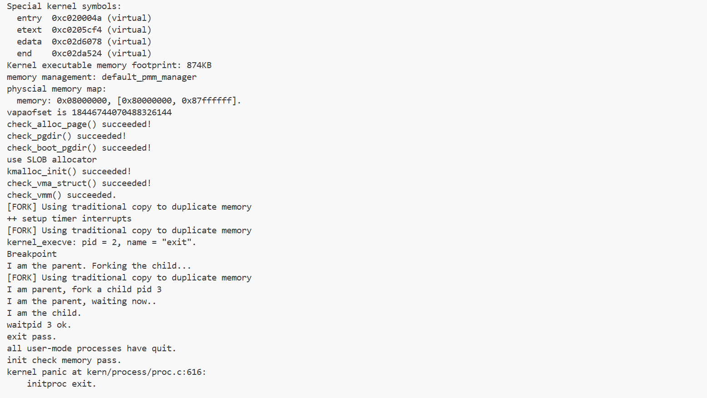
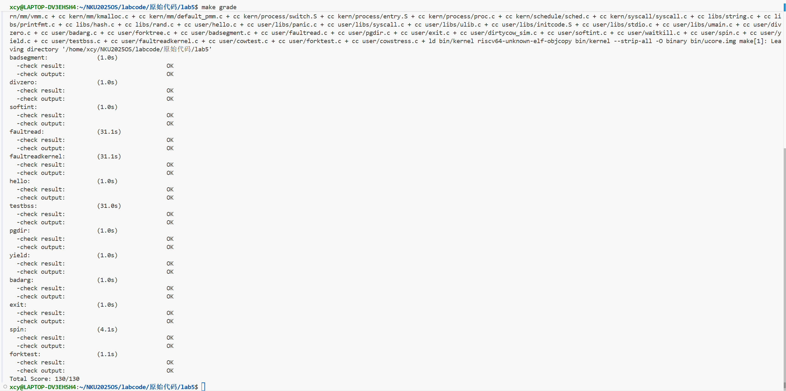
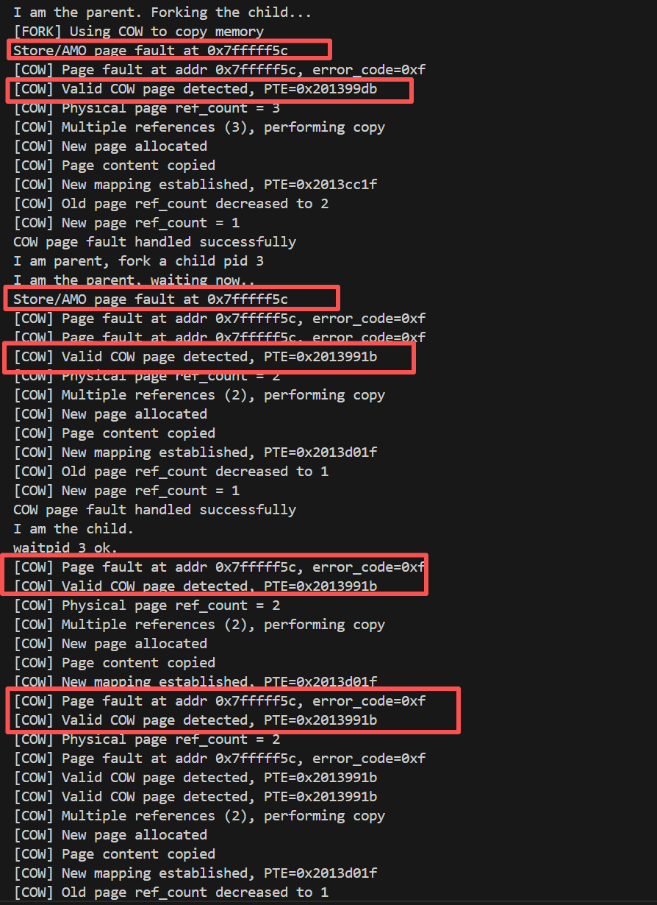
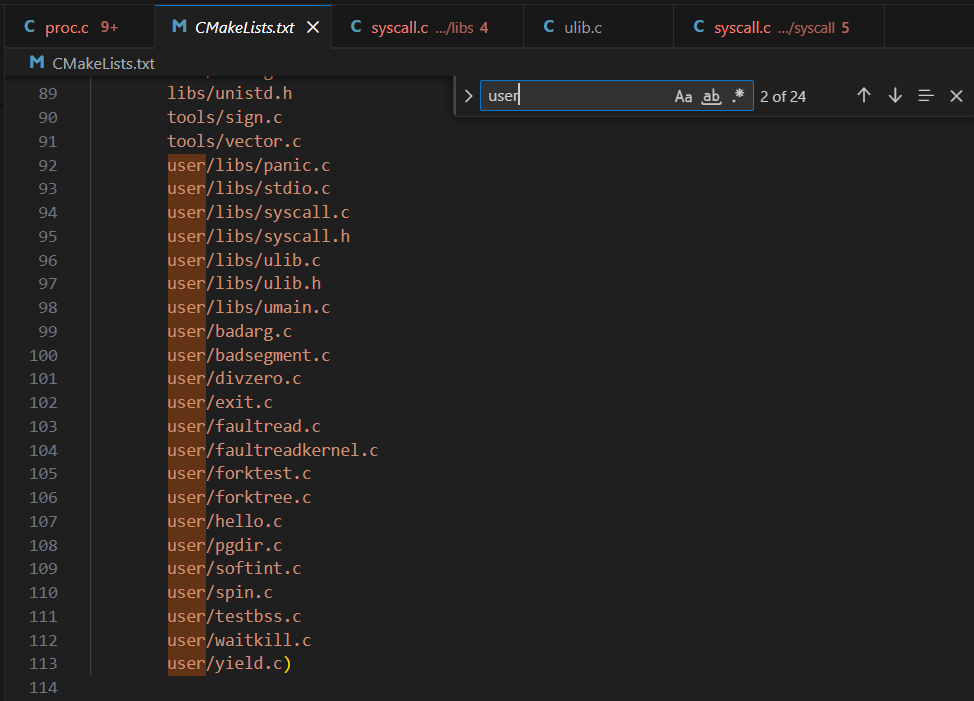
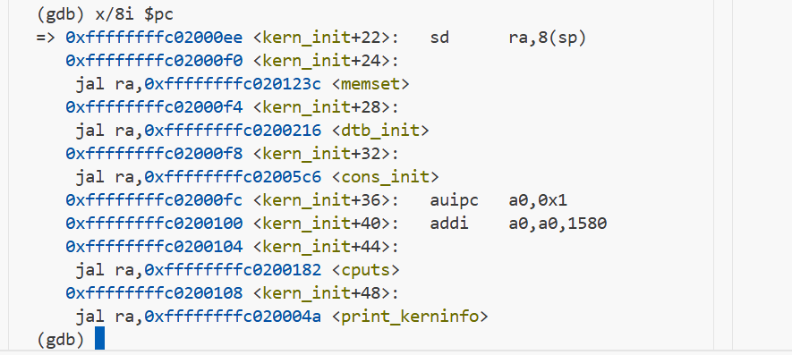
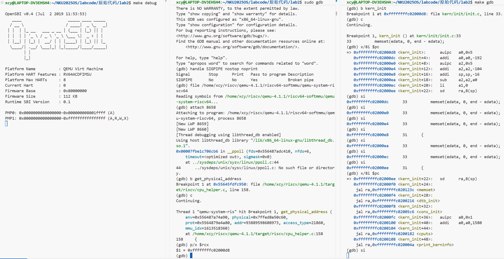
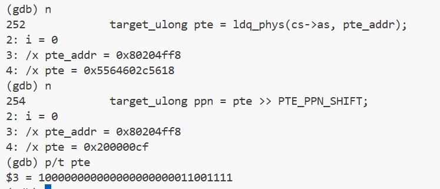
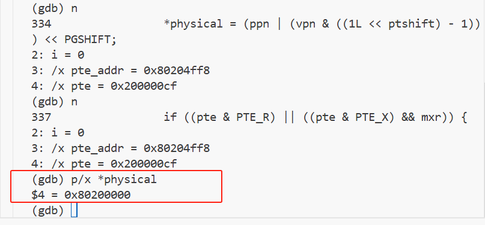
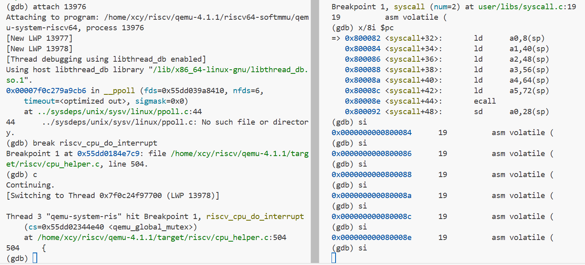

# <center>Lab5 实验报告：用户进程管理</center>

<center>2310364 柳昕彤  2313310 熊诚义  2311887 陈语童</center>

[TOC]

## 实验概述

本实验主要实现了用户进程的创建、执行、等待和退出等核心功能，通过补充`load_icode`和`copy_range`函数，使得ucore操作系统能够正确加载并运行用户态程序，以及实现父子进程间的内存空间复制。

## 练习1：加载应用程序并执行

### 1. 编写 `load_icode` 的 [第6步]

- 首先明确 `load_icode` 的整体作用：***把新的程序加载到当前进程中*** —— 将一个已经在内存中的 ELF 格式用户程序加载到当前进程中，替换地址空间，并构造正确的**用户态执行上下文**，使该进程在返回用户态后从新程序的入口地址开始执行。
  它在 `do_execve()`（销毁旧的、构建新的用户程序运行的上下文）中被调用：

```c
    //把新的程序加载到当前进程里的工作都在load_icode()函数里完成
    int ret;
    if ((ret = load_icode(binary, size)) != 0) {
        goto execve_exit;//返回不为0，则加载失败
    }
```

- `load_icode` 已经实现完成的前几步分别做什么：

  - step0：检查当前进程的旧地址空间是否已被完全释放

  - step1：为当前进程创建新的 mm（memory manager，管理进程的用户地址空间）

  - step2：创建新的 PDT（Page Directory Table，页目录表），新建的 mm 链接到新的页表根

  - step3：扫描 ELF 文件，把必要段映射到进程的虚拟地址空间、必要数据拷贝到对应物理页中。具体步骤：

    - (3.1) & (3.2)：定位 ELF 元数据

    - (3.3)：校验 ELF 文件合法性

    - (3.4)：遍历 Program Header，把 `PT_LOAD` / 需要映射进内存的段抽出

  - (3.5)：根据 Program Header 建立虚拟内存区域（VMA）

    ```c++
      if ((ret = mm_map(mm, ph->p_va, ph->p_memsz, vm_flags, NULL)) != 0)
              {
                  goto bad_cleanup_mmap;
              }
    ```

    (3.6.1)：把 TEXT/DATA 段数据拷贝到物理页中（实际做的：分配一个物理页 + 建立页表映射）

    ```c++
    if ((page = pgdir_alloc_page(mm->pgdir, la, perm)) == NULL)
                {
                    goto bad_cleanup_mmap;
                }
                
                // 计算本次复制的参数
                off = start - la;              // 在页内的偏移
                size = PGSIZE - off;           // 本页剩余空间
                la += PGSIZE;                  // 移动到下一页
                
                // 如果数据在本页内就结束了，调整复制大小
                if (end < la)
                {
                    size -= la - end;
                }
                
                // 从ELF文件复制数据到新分配的页面
                // page2kva(page)获取页面的内核虚拟地址
                memcpy(page2kva(page) + off, from, size);
                
                // 更新位置指针
                start += size;
                from += size;
                }
    ```

    (3.6.2)：构造 BSS，对 BSS 对应的内存区域进行零初始化（BSS 段：未显式初始化的全局变量和静态变量）

    ```c++
    // BSS段在文件中不占空间，但在内存中需要分配空间并清零
            end = ph->p_va + ph->p_memsz;  // 段在内存中的结束位置
            
            // 如果start < la，说明上一个页面还有空间，需要将其剩余部分清零
            if (start < la)
            {
                /* 特殊情况：ph->p_memsz == ph->p_filesz（没有BSS段） */
                if (start == end)
                {
                    continue;  // 没有BSS段，继续下一个段
                }
                
                // 计算需要清零的区域
                off = start + PGSIZE - la;  // 在当前页中需要清零的起始偏移
                size = PGSIZE - off;        // 需要清零的大小
                
                if (end < la)
                {
                    size -= la - end;
                }
                
                // 将页面的剩余部分清零（构建BSS段）
                memset(page2kva(page) + off, 0, size);
                start += size;
                
                // 确保处理正确
                assert((end < la && start == end) || (end >= la && start == la));
            }
            
            // 为剩余的BSS段分配页面并清零
            while (start < end)
            {
                // 分配新页面
                if ((page = pgdir_alloc_page(mm->pgdir, la, perm)) == NULL)
                {
                    goto bad_cleanup_mmap;
                }
                
                // 计算清零参数
                off = start - la;
                size = PGSIZE - off;
                la += PGSIZE;
                
                if (end < la)
                {
                    size -= la - end;
                }
                
                // 将新分配的页面清零
                memset(page2kva(page) + off, 0, size);
                start += size;
            }
      
    ```

  - step4：建立用户栈（分配一段虚拟地址空间给用户栈，并实际分配了 4 页物理内存 —— `pgdir_alloc_page` 函数）

    ```c++
    // 用户栈位于虚拟地址空间的高地址，向低地址增长
        vm_flags = VM_READ | VM_WRITE | VM_STACK;  // 栈的权限：可读、可写、栈标志
        
        // 在虚拟地址[USTACKTOP-USTACKSIZE, USTACKTOP)建立栈的vma
        if ((ret = mm_map(mm, USTACKTOP - USTACKSIZE, USTACKSIZE, vm_flags, NULL)) != 0)
        {
            goto bad_cleanup_mmap;
        }
        
        // 为用户栈预先分配4个物理页面（从栈顶开始）
        // 这样用户程序一开始就有16KB的栈空间可用，避免立即发生缺页异常
        assert(pgdir_alloc_page(mm->pgdir, USTACKTOP - PGSIZE, PTE_USER) != NULL);
        assert(pgdir_alloc_page(mm->pgdir, USTACKTOP - 2 * PGSIZE, PTE_USER) != NULL);
        assert(pgdir_alloc_page(mm->pgdir, USTACKTOP - 3 * PGSIZE, PTE_USER) != NULL);
        assert(pgdir_alloc_page(mm->pgdir, USTACKTOP - 4 * PGSIZE, PTE_USER) != NULL);
    ```

  - step5：切换当前进程的地址空间→刚刚新建的地址空间，包括 `satp` 写入新页表的表根。

    ```c++
     mm_count_inc(mm);               // 增加mm的引用计数
        current->mm = mm;               // 设置当前进程的mm
        current->pgdir = PADDR(mm->pgdir);  // 设置当前进程的页目录表物理地址
        lsatp(PADDR(mm->pgdir));       // 切换satp寄存器，加载新的页表，切换地址空间
    ```

  - step6 目标：构造返回用户态时要读取的 trapframe

    ```c++
    struct trapframe *tf = current->tf;
        
        // 保存当前的sstatus寄存器值（在之前可能被设置过）
        uintptr_t sstatus = tf->status;
        
        // 清空trapframe，准备重新设置
        memset(tf, 0, sizeof(struct trapframe));
    ```

- **第6步实现**
  根据提示，主要需设置三个 trapframe 信息/状态：`tf->gpr.sp` 用户栈指针，`tf->epc` 用户程序入口地址，`tf->status` 返回后的特权状态。并且它们分别应当：指向用户栈栈顶、指向新加载的用户程序的 ELF 文件入口地址、和**用户态匹配**。
  原有代码已经声明了 trapframe 结构体并初始化，我们的代码实现只需要进行上门三项的赋值：

① `tf->gpr.sp` / `sp`

```c
    // 设置用户栈指针为用户栈顶
    tf->gpr.sp = USTACKTOP;
```

`USTACKTOP` 已经预先为我们设置好，且在之前的页面分配中也用到过：

```c
#define USERTOP 0x80000000
#define USTACKTOP USERTOP
```

② `tf->epc` / `sepc`

```c
    // 设置程序入口点为ELF文件的入口地址
    tf->epc = elf->e_entry;
```

因为要从新加载的程序开始，可以直接从 ELF 文件出发，获取其 Entry Point（一般是 `_start`）：`elf->e_entry`，就会从头开始执行新加载的用户程序。

③ `tf->status` / `sstatus`

```c
    // 设置状态寄存器：
    // - 清除 SSTATUS_SPP 位，表示返回到用户态（U-mode）
    // - 设置 SSTATUS_SPIE 位，使得 sret 后中断使能
    tf->status = (sstatus & ~SSTATUS_SPP) | SSTATUS_SPIE;
```

首先最重要的，要保证 `sret` 之后执行在**用户态 U-Mode**。对应 Supervisor/User Mode 的状态位是 `SPP`，且有 `1 = S-mode, 0 = U-mode`，所以必须将 `SSTATUS_SPP` 清零。

此外，还需要考虑中断。在处理完上下文切换之后开始执行用户程序时，应当允许其被时钟中断抢占。用于保存 “返回到上一特权级后 / `sret` 之后，中断是否开启” 的状态位是 `SPIE`，且有 `1 = 允许，0 = 不允许`，所以必须将 `SSTATUS_SPIE` 置位。注意，不设置 `SIE`（当前特权级是否允许中断）而设置 `SPIE` 的原因是，在 `sret` 之后，会进行 `SIE ← SPIE` 赋值，设置 `SIE` 本质上无效。

### 2. 描述用户进程从调度到执行的经过

*——请简要描述这个用户态进程被ucore选择占用CPU执行（RUNNING态）到具体执行应用程序第一条指令的整个经过。*

整体经过轨迹：`KERNEL_EXECVE()` 等宏 → `kernel_execve()` → `syscall` → `sys_exec()` → `do_execve()`（→ `load_icode()`）→ `ret` ...... → `sret`，恢复各种参数 → `schedule()` → `proc_run()` → 取值开始执行用户程序。

*注：题目问的部分可能只涉及到从 `schedule()` 开始向后的运行过程。*

1. 外层调用。`KERNEL_EXECVE()` 或 `KERNEL_EXECVE2()` 起始，通过宏定义封装的函数向下逐级调用：`KERNEL_EXECVE() → __KERNEL_EXECVE() → kernel_execve()` 或 `KERNEL_EXECVE2() → __KERNEL_EXECVE2() → KERNEL_EXECVE() → kernel_execve()`，最终都到达 `kernel_execve()`，这是真正用来切换到用户进程的入口。宏定义如下：

```c
   // kern/process/proc.c
#define __KERNEL_EXECVE(name, binary, size) ({                          \
            cprintf("kernel_execve: pid = %d, name = \"%s\".\n",        \
                    current->pid, name);                                \
            kernel_execve(name, binary, (size_t)(size));                \
        })

#define KERNEL_EXECVE(x) ({                                             \
            extern unsigned char _binary_obj___user_##x##_out_start[],  \
                _binary_obj___user_##x##_out_size[];                    \
            __KERNEL_EXECVE(#x, _binary_obj___user_##x##_out_start,     \
                            _binary_obj___user_##x##_out_size);         \
        })

#define __KERNEL_EXECVE2(x, xstart, xsize) ({                           \
            extern unsigned char xstart[], xsize[];                     \
            __KERNEL_EXECVE(#x, xstart, (size_t)xsize);                 \
        })

#define KERNEL_EXECVE2(x, xstart, xsize)        __KERNEL_EXECVE2(x, xstart, xsize)
```

比如 `user_main` 中的调用：

```c
// user_main - kernel thread used to exec a user program
static int
user_main(void *arg) {
#ifdef TEST
    KERNEL_EXECVE2(TEST, TESTSTART, TESTSIZE);
#else
    KERNEL_EXECVE(exit);
#endif
    panic("user_main execve failed.\n");
}
```

2. 进入 `kernel_execve()`. 因为目前还在内核态/S-mode，不能通过调用 `exec()` 得到 `ecall` 产生的中断返回来进行上下文切换。解决方法是，用 `ebreak` 产生**断点中断**进行处理，并设置寄存器 `a7 = 10` 说明这不是一个普通的断点中断，而是要转发到 `syscall()`，用了一种内核态复用系统调用接口来强行切换的方法：

```c
// kern/process/proc.c
// kernel_execve - do SYS_exec syscall to exec a user program called by user_main kernel_thread
static int kernel_execve(const char *name, unsigned char *binary, size_t size) {
    int64_t ret=0, len = strlen(name);
    asm volatile(
        "li a0, %1\n"
        "lw a1, %2\n"
        "lw a2, %3\n"
        "lw a3, %4\n"
        "lw a4, %5\n"
        "li a7, 10\n"
        "ebreak\n"
        "sw a0, %0\n"
        : "=m"(ret)
        : "i"(SYS_exec), "m"(name), "m"(len), "m"(binary), "m"(size)
        : "memory"); //这里内联汇编的格式，和用户态调用ecall的格式类似，只是ecall换成了ebreak
    cprintf("ret = %d\n", ret);
    return ret;
}
```

在处理异常的时候针对异常类型进行判断，如果是断点类型且 `gpr.a7 == 10`，就要调用 `syscall()`：

```c
// kern/trap/trap.c
void exception_handler(struct trapframe *tf) {
    int ret;
    switch (tf->cause) {
        case CAUSE_BREAKPOINT:
            cprintf("Breakpoint\n");
            if(tf->gpr.a7 == 10){
                tf->epc += 4; //注意返回时要执行ebreak的下一条指令
                syscall();
            }
            break;
          /* other cases ... */
    }
}
```

3. 进入 `syscall()` 后会根据 syscall 号选择调用具体函数 —— `sys_exec()`，随后到达 `do_execve()`. 系统调用的处理 `syscall.c` 中定义了通用的 syscall 方法：

```c
void
syscall(void) {
    struct trapframe *tf = current->tf;
    uint64_t arg[5];
    int num = tf->gpr.a0;
    if (num >= 0 && num < NUM_SYSCALLS) {
        if (syscalls[num] != NULL) {
            arg[0] = tf->gpr.a1;
            arg[1] = tf->gpr.a2;
            arg[2] = tf->gpr.a3;
            arg[3] = tf->gpr.a4;
            arg[4] = tf->gpr.a5;
            tf->gpr.a0 = syscalls[num](arg);
            return ;
        }
    }
    print_trapframe(tf);
    panic("undefined syscall %d, pid = %d, name = %s.\n",
            num, current->pid, current->name);
}
```

`tf->gpr.a0 = syscalls[num](arg);` 会去前面定义的**系统调用分发表**中找 syscall 号对应的函数执行：

```c
static int (*syscalls[])(uint64_t arg[]) = {
    [SYS_exit]              sys_exit,
    [SYS_fork]              sys_fork,
    [SYS_wait]              sys_wait,
    [SYS_exec]              sys_exec,
    [SYS_yield]             sys_yield,
    [SYS_kill]              sys_kill,
    [SYS_getpid]            sys_getpid,
    [SYS_putc]              sys_putc,
    [SYS_pgdir]             sys_pgdir,
};
```

并且运行结果返回给 `tf->gpr.a0`. 这里，由于之前通过 ebreak 制造 syscall 的时候制定了 `SYS_exec` 的类型号，这里自然调用到 `sys_exec()`：

```c
static int
sys_exec(uint64_t arg[]) {
    const char *name = (const char *)arg[0];
    size_t len = (size_t)arg[1];
    unsigned char *binary = (unsigned char *)arg[2];
    size_t size = (size_t)arg[3];
    return do_execve(name, len, binary, size);
}
```

—— 调用了 `do_execve()` 函数并将其返回值作为系统调用的返回值。

4. 进入 `do_execve()`. 这个函数主要做的是清除原先的进程上下文、创建新的上下文，但不做 “切换” 操作，只是生成了相对应的资源。函数定义：

```c
// kern/process/proc.c
// do_execve - call exit_mmap(mm)&put_pgdir(mm) to reclaim memory space of current process
//           - call load_icode to setup new memory space accroding binary prog.
int do_execve(const char *name, size_t len, unsigned char *binary, size_t size) {
    struct mm_struct *mm = current->mm;
    if (!user_mem_check(mm, (uintptr_t)name, len, 0)) { //检查name的内存空间能否被访问
        return -E_INVAL;
    }
    if (len > PROC_NAME_LEN) { //进程名字的长度有上限 PROC_NAME_LEN，在proc.h定义
        len = PROC_NAME_LEN;
    }
    char local_name[PROC_NAME_LEN + 1];
    memset(local_name, 0, sizeof(local_name));
    memcpy(local_name, name, len);

    if (mm != NULL) {
        cputs("mm != NULL");
        lcr3(boot_cr3);
        if (mm_count_dec(mm) == 0) {
            exit_mmap(mm);
            put_pgdir(mm);
            mm_destroy(mm);//把进程当前占用的内存释放，之后重新分配内存
        }
        current->mm = NULL;
    }
    //把新的程序加载到当前进程里的工作都在load_icode()函数里完成
    int ret;
    if ((ret = load_icode(binary, size)) != 0) {
        goto execve_exit;//返回不为0，则加载失败
    }
    set_proc_name(current, local_name);
    //如果set_proc_name的实现不变, 为什么不能直接set_proc_name(current, name)?
    return 0;

execve_exit:
    do_exit(ret);
    panic("already exit: %e.\n", ret);
}
```

其中调用了 `load_icode()` 将**新的目标用户程序加载到当前进程**，其实现在前面已经梳理过一遍，不再进入具体分析。
*注：解释 *“如果set_proc_name的实现不变, 为什么不能直接set_proc_name(current, name)?”* —— 答：在此之前 `do_execve()` 做的事是释放旧的地址空间，而 **`name` 作为指针指向原先用户虚拟地址空间**，当原地址空间被释放它就已经**不再安全/有效**。如果再这样进行访问，会触发 page fault/读到无效数据等等错误。所以才要提前复制到 `local_name` 保真、保效。

5. 函数返回、`syscall` 返回后会执行 `sret`，将 `load_icode()` 中我们设置的所有 `sstatus` 内容一一读出，切换到一个用户态的、 `pc` 处于新用户程序起点的、中断使能被重新开启的进程状态中去，这时 `pc` 处于应用程序第一条指令。

6. 等待 `schedule()` 调度，选中此用户进程去占用 CPU 运行。`schedule()` 中调用 `proc_run()` 函数，完成进程指针、页表、上下文的切换等。注意当前本身已经处于用户态了。

7. 此后就可以进行取值，从用户程序第一条指令开始执行。

* * *

## 练习2：父进程复制内存空间给子进程

创建子进程的函数`do_fork`在执行中将拷贝当前进程（即父进程）的用户内存地址空间中的合法内容到新进程中（子进程），完成内存资源的复制。具体是通过`copy_range`函数（位于kern/mm/pmm.c中）实现的，请补充`copy_range`的实现，确保能够正确执行。

### 实验内容：

内存复制过程开始时我们需要获取源页面和目标页面的内核虚拟地址，这是因为在内核中我们不能直接使用物理地址进行内存操作。`page2kva`函数将Page结构指针转换为对应物理页面的**内核虚拟地址**，这个地址在内核的线性映射区域中，可以直接进行内存访问。

```c
// 获取源页面的内核虚拟地址
void *src_kvaddr = page2kva(page);
// 获取目标页面的内核虚拟地址
void *dst_kvaddr = page2kva(npage);
```

获取到源页面地址`src_kvaddr`和目标页面地址`dst_kvaddr`后，我们就可以使用`memcpy`函数将整个页面的内容从源地址复制到目标地址。这里复制的大小是`PGSIZE`，也就是一个完整的物理页面。我们要确保子进程获得父进程内存的完整副本，包括代码段、数据段、堆、栈等所有内容。

```c
// 复制页面内容
memcpy(dst_kvaddr, src_kvaddr, PGSIZE);
```

复制完内容后，还需要在子进程的页表中建立虚拟地址到物理地址的映射。这里我们调用`page_insert`函数，将新分配的物理页面`npage`映射到子进程页表`to`中的虚拟地址`start`处，并设置相同的权限`perm`。这个映射建立后，子进程访问虚拟地址`start`时就会访问到**新复制的物理页面**，而不是父进程的原始页面。

```c
//建立目标页面的物理地址与线性地址的映射
ret = page_insert(to, npage, start, perm);
assert(ret == 0);
```

上面这种复制方式虽然简单直接，但在性能上并不是最优的，因为**即使子进程和父进程的内存内容完全相同，我们也进行了完整的物理页面复制。**这就引出了Copy-on-Write优化机制的必要性，这部分内容将在扩展练习讲解。


## 练习3：阅读分析源代码，理解进程执行 fork/exec/wait/exit 的实现，以及系统调用的实现

### 1. fork/exec/wait/exit 函数分析

**· EXEC**

目前 exec 还没有用户态可用的封装函数，只能从内核态出发做 ebreak 的 syscall.

这导致它的调用与另外三者差别较大。其执行过程是怎样的，练习1 → “2.描述用户进程从调度到执行的经过” 节已经完整分析过。如果有还没分析到的细节，下面对于其他三者的分析中都会有重合。

**· FORK/WAIT/EXIT**

fork/wait/exit 操作对应的最高层封装函数：`fork()`，`wait()`，`exit(int)`. 它们在 `ulib.c` 中实际上表现出来都是系统调用的封装：

```c
void
exit(int error_code) {
    sys_exit(error_code);
    cprintf("BUG: exit failed.\n");
    while (1);
}

int
fork(void) {
    return sys_fork();
}

int
wait(void) {
    return sys_wait(0, NULL);
}
```

这些下一级的函数又共同指向 `/user/libs/syscall.c` 中的定义：

```c
int
sys_exit(int64_t error_code) {
    return syscall(SYS_exit, error_code);
}

int
sys_fork(void) {
    return syscall(SYS_fork);
}

int
sys_wait(int64_t pid, int *store) {
    return syscall(SYS_wait, pid, store);
}
```

当然，`syscall()` 在之前已经定义：

```c
static inline int
syscall(int64_t num, ...) {
    va_list ap;
    va_start(ap, num);
    uint64_t a[MAX_ARGS];
    int i, ret;
    for (i = 0; i < MAX_ARGS; i ++) {
        a[i] = va_arg(ap, uint64_t);
    }
    va_end(ap);

    asm volatile (
        "ld a0, %1\n"
        "ld a1, %2\n"
        "ld a2, %3\n"
        "ld a3, %4\n"
        "ld a4, %5\n"
    	"ld a5, %6\n"
        "ecall\n"
        "sd a0, %0"
        : "=m" (ret)
        : "m"(num), "m"(a[0]), "m"(a[1]), "m"(a[2]), "m"(a[3]), "m"(a[4])
        :"memory");
    return ret;
}
```

***注意！！*** 这里和 `sys_esec()` 所在的 `/kern/syscall/syscall.c` 不一样！

简单来说，`/kern/syscall/syscall.c` 的处理已经处在内核态，直接根据 syscall 类型进行**接收、分发、真正地执行系统调用**。而 `/user/libs/syscall.c` 处理的是用户态刚发出的 syscall，需要构造汇编代码去调用 `/kern/syscall/syscall.c` 的方法达到真正的 syscall 功能。

可以将上面 `/user/libs/syscall.c` 中 `syscall()` 的定义与 `kernel_execve()` 函数——也就是内核态中通过 `ebreak` 人为制造 trapframe 来达到切换到用户态进程效果的函数——的定义做对比，可以发现实现了几乎相同逻辑的**汇编代码**，只不过这里是 `ecall\n`，而 `kernel_execve()` 中是 `ebreak\n`，这是因为 `ecall` 用来申请更高级别的权限，从用户态到内核态需要这么做；而 `kernel_execve()` 调用时原本已经在内核态，syscall 的处理本身就在内核态，不可再调用 `ecall`，这也是需要用 `ebreak` 人造的根本原因。

在 `trap.c` 中处理用户态 `ecall` 的异常做法：

```c
    case CAUSE_USER_ECALL:
        // cprintf("Environment call from U-mode\n");
        tf->epc += 4;
        syscall();
        break;
```

可以看到调用了 `/kern/syscall/syscall.c`，后续处理和之前分析的 `sys_exec` 就如出一辙了。

### 2. 用户态/内核态问题

*——那么哪些操作在用户态完成，哪些在内核态完成？*

首先，无论是 exec 调用的 `ebreak` 还是 fork/wait/exit 调用的 `ecall`，都作为异常设置了跳转地址到 `__alltraps` 所指的汇编代码。之前的实验已经详细分析过了汇编代码做的事情，不再赘述。总之最终跳转到 `trap.c` 中的 `exception_handler()` 函数分情况处理异常，都调用到 `syscall()`（内核态函数）处理，处理完后还会回到汇编代码中做恢复。

目前， exec 实现只有从内核态出发在内核态处理的路径，所以 exec 的所有处理实际上**都是在内核态**的，直到最后 syscall 异常处理完跳出到 `__trapret` 段，执行了 `sret` 才转换到用户态。

对于其他三者 fork/wait/exit，它们都只能在用户态调用。而它们在调用 syscall 时生成的汇编代码是 `ecall`，这条指令会被硬件识别为特权级的提升，只有这样才能**升级到内核态**做真正的异常处理。

所以答案也很明了，目前 exec 的所有操作**都在内核态**完成；fork/wait/exit 在**用户态被调用**，执行 `ecall` 命令的一瞬间从**用户态升级到内核态**，此后的 syscall 处理均为**内核态**；exec/for/wait/exit 在内核态处理完 syscall 到达 `__trapret` 执行 `sret`，**恢复用户态**。

*——内核态执行结果是如何返回给用户程序的？*

`tf->gpr.a0 = syscalls[num](arg);` 这一句，内核把系统调用的返回值写回用户态的寄存器保存区（trapframe 中的 a0），
然后通过 `sret` 指令让 CPU 硬件恢复到用户态并继续执行用户程序。在 `sret` 执行后 `tf->gpr.a0` 的值被恢复到用户态寄存器 `a0`，用户程序可以自由读取和利用。

### 3. 给出ucore中一个用户态进程的执行状态生命周期图

```
		    kernel_execve()
      ┌─────────────────────────┐
      │                         ▼
 +-----------+            +-----------+
 |  UNINIT   | --fork()-> | RUNNABLE  | <─────────────────┐
 +-----------+            +-----------+                   |
                                 |                        |
                      schedule() -> proc_run()            |
								 |                        | 
                                 ▼                        |
                            +-----------+                 |
                            | RUNNING   |                 |
                            +-----------+                 │
                                 |                        │
           ┌─────────────────────┼────────────────────┐   │
           │                     │                    ▼   │
       do_exit()       do_wait() (/do_sleep()?)      yield()
           │                     │                      ▲
           ▼                     ▼                      │
      +-----------+        +-----------+                │
      |  ZOMBIE   |        | SLEEPING  | ---------------┘
      +-----------+        +-----------+
           |
        do_wait()
           |
           ▼
等待被父进程回收，进程结束


```

注：

1. 首个从内核态启动的用户进程的启动过程和别的不同，只有它通过 `kernel_execve()` 来启动。

2. 目前的 ucore 似乎没有实现单独的 `exec()`，只有 `fork()` 能够在用户态分支出新的进程。

3. 目前 ucore 的实现没有区分 `RUNNABLE` 和 `RUNNING` 状态，一并按 `RUNNABLE` 处理（`schedule()` 中选取状态为 `PROC_RUNNABLE` 的进程设为下一个运行的进程，而实际用 `proc_run()` 切换时也并没有做状态标识的切换；同时整个 project 也只定义了 `PROC_RUNNABLE` 没定义 `PROC_RUNNING`）。图中为显式表现进程状态的变化/切换，虚拟出一个 `RUNNING` 状态，表示进程已经被 `schedule()` 选定、调度并正在运行中。

4. 从理论设计上来说 `do_sleep()` 会导致进程进入 `SLEEPING` 状态，但目前的代码实现中暂时没有看到 `do_sleep()` 的实现和调用。


## 实验结果

### make qemu:

  如图，系统创建了进程2（exit进程）和进程3，父进程在fork后正确等待子进程，子进程也能够正常执行并退出。最后出现"kernel panic at kern/process/proc.c:616: initproc exit."是因为初始化进程退出导致的系统panic，我们所有用户进程都已执行完毕并正常退出，系统也随之终止。



### make grade:

   所有测试项目均获得满分（Total Score: 130/130），每个测试用例的检查结果和输出都标记为OK。所有测试用例的执行时间都在合理范围内（1.0s到31.1s不等），成功实现了用户进程的创建、执行、调度和资源管理等核心功能。



## Challenge1：Copy-on-Write机制完整实现

### Copy-on-Write (COW) 机制

Copy-on-Write是一种重要的优化技术，它的核心思想是延迟复制。当fork创建子进程时，**不立即复制父进程的内存页面，而是让父子进程共享同一物理页面，只有当其中一方尝试修改该页面时，才真正进行复制。**

**概要设计：**

COW机制的实现需要修改多个关键函数和数据结构。整体架构基于**页面共享和写时复制**两个核心概念。

在数据结构层面，我们需要为每个物理页面维护一个**引用计数**，记录有多少个进程共享该页面。当引用计数为1时，表示只有一个进程使用该页面，可以直接修改；当引用计数大于1时，表示多个进程共享，**需要先复制再修改**。这个引用计数可以利用现有的`Page`结构中的`ref`字段。

在fork过程中，我们不再调用`memcpy`复制页面内容，而是**让子进程的页表项指向与父进程相同的物理页面**。同时需要将父进程和子进程的该页面权限都修改为**只读**，即清除写权限位`PTE_W`。但是我们需要额外标记这些页面原本是可写的，可以使用页表项中的保留位来标记"COW页面"。

当进程尝试写入一个COW页面时，由于页面被设置为只读，会触发**页面错误异常**。异常处理程序需要检查这是否是一个**COW页面的写操作**。如果是，则分配新的物理页面，将原页面内容复制到新页面，然后更新页表项指向新页面，并恢复写权限。原页面的引用计数减1，如果减到0则释放。

### 实验内容

#### **1：定义COW标记位**

我们需要在页表项中添加一个标记位来标识COW页面。RISC-V架构的页表项中有保留位可以使用。我们在`libs/riscv.h`中添加COW标记：

```c
// 在PTE定义之后添加
#define PTE_COW 0x100  // 使用保留位标记COW页面
```

这个标记位用于区分普通的只读页面和因COW而暂时设置为只读的页面。当页面错误发生时，我们需要检查这个标记来判断是否应该执行COW复制。

#### 2：实现COW共享

在`kern/mm/pmm.c`中，我们需要修改`copy_range`函数，不再直接复制页面内容，而是让父子进程共享物理页面，并将两者的页面都设置为只读。

```c
int copy_range(pde_t *to, pde_t *from, uintptr_t start, uintptr_t end,
               bool share)
{
    assert(start % PGSIZE == 0 && end % PGSIZE == 0);
    assert(USER_ACCESS(start, end));
    
    do {
        pte_t *ptep = get_pte(from, start, 0), *nptep;
        if (ptep == NULL) {
            start = ROUNDDOWN(start + PTSIZE, PTSIZE);
            continue;
        }
        
        if (*ptep & PTE_V) {
            if ((nptep = get_pte(to, start, 1)) == NULL) {
                return -E_NO_MEM;
            }
            
            uint32_t perm = (*ptep & PTE_USER);
            struct Page *page = pte2page(*ptep);
            
            // 检查是否需要COW处理
            if (share) {
                // 直接共享页面（用于线程）
                page_insert(to, page, start, perm);
            } else {
                // COW实现：不复制页面，而是共享并标记为COW
                if (perm & PTE_W) {
                    // 原本可写的页面需要进行COW处理
                    // 修改父进程的页表项：去除写权限，添加COW标记
                    perm = (perm & ~PTE_W) | PTE_COW;
                    *ptep = pte_create(page2ppn(page), PTE_V | perm);
                    tlb_invalidate(from, start);
                }
                
                // 增加页面引用计数（父子进程共享）
                page_ref_inc(page);
                
                //子进程页表项指向同一物理页面，同样去除写权限并标记COW
                *nptep = pte_create(page2ppn(page), PTE_V | perm);
            }
        }
        start += PGSIZE;
    } while (start != 0 && start < end);
    return 0;
}
```

我们首先检查原页面是否可写，如果可写则需要进行COW处理。处理过程中，将**父进程的页表项修改为只读并添加COW标记**，然后增加物理页面的引用计数，最后设置**子进程的页表项指向同一物理页面**。这样父子进程就共享了物理页面，但都不能直接写入。

#### 3：实现页面错误处理中的COW逻辑

当进程尝试写入一个COW页面时，会触发Store/AMO Page Fault异常。我们需要在页面错误处理函数中检测这种情况并执行实际的页面复制。由于lab5中的`vmm.c`比较简单，我们需要在trap处理中添加COW处理逻辑。

```c
// 在trap.c中添加COW处理函数
static int do_cow_page_fault(struct mm_struct *mm, uint32_t error_code, uintptr_t addr) {
    if (mm == NULL) {
        return -E_INVAL;
    }
    
    // 获取页表项
    pte_t *ptep = get_pte(mm->pgdir, addr, 0);
    if (ptep == NULL || !(*ptep & PTE_V)) {
        return -E_INVAL;
    }
    
    // 检查是否是COW页面且是写操作引发的错误
    if (!(*ptep & PTE_COW) || !(error_code & 0x2)) {
        return -E_INVAL;  // 不是COW错误
    }
    
    struct Page *page = pte2page(*ptep);
    
    // 页面引用计数为1，说明只有当前进程使用
    // 可以直接恢复写权限，不需要复制
    if (page_ref(page) == 1) {
        uint32_t perm = (*ptep & PTE_USER) | PTE_W;
        perm &= ~PTE_COW;  // 清除COW标记
        *ptep = pte_create(page2ppn(page), PTE_V | perm);
        tlb_invalidate(mm->pgdir, addr);
        return 0;
    }
    
    // 多个进程共享，需要复制页面
    // 1.分配新页面
    struct Page *npage = alloc_page();
    if (npage == NULL) {
        return -E_NO_MEM;
    }
    
    // 2.复制页面内容
    void *src_kva = page2kva(page);
    void *dst_kva = page2kva(npage);
    memcpy(dst_kva, src_kva, PGSIZE);
    
    // 3.更新页表项指向新页面，恢复写权限，清除COW标记
    uint32_t perm = (*ptep & PTE_USER) | PTE_W;
    perm &= ~PTE_COW;
    
    // 4 减少原页面的引用计数
    page_ref_dec(page);
    
    // 2.5 建立新映射（这会自动增加新页面的引用计数）
    uintptr_t la = ROUNDDOWN(addr, PGSIZE);
    if (page_insert(mm->pgdir, npage, la, perm) != 0) {
        free_page(npage);
        return -E_NO_MEM;
    }
    
    return 0;
}
```

然后在异常处理的主函数中调用这个函数：

```c
// 在trap.c的exception_handler中添加
case CAUSE_STORE_PAGE_FAULT:
    cprintf("Store page fault at 0x%08x\n", tf->badvaddr);
    // 尝试进行COW处理
    if (do_cow_page_fault(current->mm, tf->cause, tf->badvaddr) == 0) {
        break;  // COW处理成功
    }
    // COW处理失败，按原有逻辑处理
    if ((ret = pgfault_handler(tf)) != 0) {
        print_trapframe(tf);
        panic("handle pgfault failed. ret=%d\n", ret);
    }
    break;
```

COW处理函数的逻辑分为两种情况。第一种情况是页面引用计数为1，说明只有当前进程在使用这个页面（可能另一个进程已经执行了COW或退出了），此时不需要复制，直接恢复写权限即可。第二种情况是引用计数大于1，说明多个进程共享该页面，需要分配新的物理页面，复制内容，然后更新当前进程的页表项指向新页面。

#### 4：修改dup_mmap函数

我们还需要在`kern/mm/vmm.c`中，修改`dup_mmap`函数，传递正确的share参数：

```c
int dup_mmap(struct mm_struct *to, struct mm_struct *from)
{
    assert(to != NULL && from != NULL);
    list_entry_t *list = &(from->mmap_list), *le = list;
    while ((le = list_prev(le)) != list)
    {
        struct vma_struct *vma, *nvma;
        vma = le2vma(le, list_link);
        nvma = vma_create(vma->vm_start, vma->vm_end, vma->vm_flags);
        if (nvma == NULL)
        {
            return -E_NO_MEM;
        }

        insert_vma_struct(to, nvma);

        // 对于普通进程使用COW（share=0），对于线程则共享（share=1）
        bool share = 0;  // 使用COW
        if (copy_range(to->pgdir, from->pgdir, vma->vm_start, vma->vm_end, share) != 0)
        {
            return -E_NO_MEM;
        }
    }
    return 0;
}
```

### COW状态转换图

COW机制中页面的状态转换可以用有限状态自动机来描述：

```
状态0：独占可写页面
[进程A: 页面X, PTE_W=1, PTE_COW=0, ref(X)=1]
        |
        | 执行fork()
        v
状态1：COW共享状态（初始）
[进程A: 页面X, PTE_W=0, PTE_COW=1, ref(X)=2] ←→ [进程B: 页面X, PTE_W=0, PTE_COW=1, ref(X)=2]
        |                                              |
        | A写入                                         | B写入
        v                                              v
状态2a：A独占新页面Y                          状态2b：B独占新页面Z
[A: Y, PTE_W=1, ref(Y)=1]                    [B: Z, PTE_W=1, ref(Z)=1]
[B: X, PTE_W=0, PTE_COW=1, ref(X)=1]        [A: X, PTE_W=0, PTE_COW=1, ref(X)=1]
        |                                              |
        | B写入                                         | A写入
        v                                              v
状态3：完全分离
[A: Y, PTE_W=1, ref(Y)=1]                    [B: Z, PTE_W=1, ref(Z)=1]
[B: Z', PTE_W=1, ref(Z')=1]                  [A: Y', PTE_W=1, ref(Y')=1]

特殊转换：如果某进程在状态1时另一进程退出
状态1 → 状态4：单进程持有COW页面
[进程A: 页面X, PTE_W=0, PTE_COW=1, ref(X)=1]
        |
        | A写入（检测到ref=1）
        v
状态0'：恢复为独占可写
[进程A: 页面X, PTE_W=1, PTE_COW=0, ref(X)=1]
```

### Dirty COW漏洞分析与防范

Dirty COW（CVE-2016-5195）是Linux内核中一个严重的**权限提升漏洞**，它利用了COW机制实现中的竞态条件。

**漏洞原理：**

Dirty COW漏洞的核心在于`get_user_pages`和内存映射解除之间的竞态条件。攻击者可以利用两个并发线程：

1. 线程1持续调用`madvise(MADV_DONTNEED)`来解除内存映射
2. 线程2持续尝试写入一个只读文件的私有映射（触发COW）

在正常的COW流程中，系统会：
- 检查页面权限（只读）
- 准备复制页面（因为是私有映射）
- 分配新页面
- 复制数据
- 更新页表

但是如果在"准备复制页面"和"更新页表"之间，线程1成功执行了`madvise(MADV_DONTNEED)`，那么原页面的映射被解除。此时线程2再次尝试访问时，可能会**重新建立到原始只读页面的映射，但COW的某些中间状态已经改变，导致可以写入原本只读的页面。**

通过精心控制时序，攻击者可以利用这个漏洞写入任意只读文件，包括系统文件，从而实现权限提升。

**ucore中的防范措施：**

在我们的ucore COW实现中，采取了以下措施来避免类似的竞态条件：

1. **原子性保护**：在`do_cow_page_fault`中，从检查页面状态到完成页面复制的整个过程应该是原子的。我们需要添加锁保护：

```c
static int do_cow_page_fault(struct mm_struct *mm, uint32_t error_code, uintptr_t addr) {
    if (mm == NULL) {
        return -E_INVAL;
    }
    
    // 获取mm的锁，保护整个COW操作
    lock_mm(mm);
    
    // 重新获取并检查页表项（double-check）
    pte_t *ptep = get_pte(mm->pgdir, addr, 0);
    if (ptep == NULL || !(*ptep & PTE_V)) {
        unlock_mm(mm);
        return -E_INVAL;
    }
    
    // 再次检查是否是COW页面（防止状态被其他线程改变）
    if (!(*ptep & PTE_COW) || !(error_code & 0x2)) {
        unlock_mm(mm);
        return -E_INVAL;
    }
    
    struct Page *page = pte2page(*ptep);
    
    if (page_ref(page) == 1) {
        uint32_t perm = (*ptep & PTE_USER) | PTE_W;
        perm &= ~PTE_COW;
        *ptep = pte_create(page2ppn(page), PTE_V | perm);
        tlb_invalidate(mm->pgdir, addr);
        unlock_mm(mm);
        return 0;
    }
    
    // 复制页面的代码...
    struct Page *npage = alloc_page();
    if (npage == NULL) {
        unlock_mm(mm);
        return -E_NO_MEM;
    }
    
    void *src_kva = page2kva(page);
    void *dst_kva = page2kva(npage);
    memcpy(dst_kva, src_kva, PGSIZE);
    
    uint32_t perm = (*ptep & PTE_USER) | PTE_W;
    perm &= ~PTE_COW;
    
    page_ref_dec(page);
    
    uintptr_t la = ROUNDDOWN(addr, PGSIZE);
    int ret = page_insert(mm->pgdir, npage, la, perm);
    
    unlock_mm(mm);
    
    if (ret != 0) {
        free_page(npage);
        return -E_NO_MEM;
    }
    
    return 0;
}
```

2. **引用计数的原子操作**：页面引用计数的增减必须是原子的，避免多个CPU同时修改。在ucore中，`page_ref_inc`和`page_ref_dec`应该使用原子操作：

```c
// 在pmm.h中修改引用计数操作为原子操作
static inline void page_ref_inc(struct Page *page) {
    __sync_add_and_fetch(&(page->ref), 1);
}

static inline void page_ref_dec(struct Page *page) {
    __sync_sub_and_fetch(&(page->ref), 1);
}
```

3. **页表项更新的顺序**：在更新页表项时，必须先完成所有准备工作（包括页面复制），最后才原子地更新页表项。不能在更新过程中被打断导致页表项处于不一致状态。

4. **TLB同步**：每次修改页表项后都必须立即刷新TLB，确保CPU使用的是最新的页表信息。

### 测试用例设计

为了全面验证COW机制的正确性和健壮性，我们设计了三个测试程序，分别测试基本功能、压力场景和安全性。

#### 1. 基础功能测试：cowtest.c

`cowtest.c`是COW机制的基础功能测试程序，包含8个测试项和1个性能对比测试，系统地验证了COW机制的各个方面。

**测试1：基础COW共享**

验证fork后父子进程共享物理页面。通过在子进程中只读访问共享变量和全局数组，确认父子进程确实在共享同一物理页面：

```c
void test_basic_cow(void) {
    int original_value = 12345;
    int *shared_var = &original_value;
    
    cprintf("Fork前: shared_var地址=0x%x, 值=%d\n", shared_var, *shared_var);
    
    int pid = fork();
    
    if (pid == 0) {
        // 子进程：只读访问
        cprintf("[子进程] shared_var地址=0x%x, 值=%d\n", shared_var, *shared_var);
        cprintf("[子进程] 读取成功，页面共享正常\n");
        exit(0);
    }
}
```

**测试2：写时复制触发**

检验写时复制机制。子进程对共享数组执行写操作，触发页面错误，COW机制分配新的物理页面并复制内容：

```c
void test_cow_write(void) {
    static int test_array[10] = {0, 1, 2, 3, 4, 5, 6, 7, 8, 9};
    
    int pid = fork();
    
    if (pid == 0) {
        // 子进程：修改数组，触发COW
        test_array[0] = 999;
        cprintf("[子进程] 修改后: test_array[0]=%d\n", test_array[0]);
        exit(0);
    } else {
        waitpid(pid, NULL);
        // 验证父进程的数据未被修改
        if (test_array[0] == 0) {
            cprintf("✓ COW成功隔离父子进程数据\n");
        }
    }
}
```

**测试3：多次写操作**

验证复制后页面的可写性。在第一次写操作触发COW后，后续多次写入应正常执行：

```c
void test_multiple_writes(void) {
    static char buffer[100] = "Original text";
    
    int pid = fork();
    
    if (pid == 0) {
        // 子进程：多次写入
        strcpy(buffer, "Modified by child 1");
        strcpy(buffer, "Modified by child 2");
        strcpy(buffer, "Modified by child 3");
        cprintf("[子进程] 最终内容: %s\n", buffer);
        exit(0);
    }
}
```

**测试4：多个子进程共享**

测试多进程共享同一物理页面。三个子进程中，前两个只读，第三个写入：

```c
void test_multiple_children(void) {
    static int shared_data = 100;
    
    int pid1 = fork();
    if (pid1 == 0) {
        // 子进程1：只读
        cprintf("[子进程1] 读取 shared_data=%d\n", shared_data);
        exit(1);
    }
    
    int pid2 = fork();
    if (pid2 == 0) {
        // 子进程2：只读
        cprintf("[子进程2] 读取 shared_data=%d\n", shared_data);
        exit(2);
    }
    
    int pid3 = fork();
    if (pid3 == 0) {
        // 子进程3：写入，触发COW
        shared_data = 300;
        cprintf("[子进程3] 修改后 shared_data=%d\n", shared_data);
        exit(3);
    }
}
```

**测试5：大量写操作**

分配4个页面的缓冲区，子进程对所有页面执行分散写操作：

```
void test_heavy_write(void) {
    static char large_buffer[PGSIZE * 4];
    
    // 初始化数据
    for (int i = 0; i < PGSIZE * 4; i++) {
        large_buffer[i] = 'A' + (i % 26);
    }
    
    int pid = fork();
    
    if (pid == 0) {
        // 子进程：写入所有页面
        for (int i = 0; i < PGSIZE * 4; i += 128) {
            large_buffer[i] = 'X';  // 每隔128字节写一次
        }
        cprintf("[子进程] 写入完成\n");
        exit(0);
    }
}
```

**测试6：递归fork**

创建三层嵌套的进程树，每层修改共享变量但不影响父进程：

```c
void test_recursive_fork(int depth) {
    if (depth <= 0) return;
    
    static int counter = 0;
    counter++;
    
    int pid = fork();
    if (pid == 0) {
        // 子进程：修改counter并继续fork
        counter += 100;
        cprintf("[深度%d子进程] counter=%d\n", depth, counter);
        test_recursive_fork(depth - 1);
        exit(0);
    } else {
        waitpid(pid, NULL);
        cprintf("[深度%d父进程] counter=%d\n", depth, counter);
    }
}
```

**测试7：内存节省验证**

子进程fork后不修改数据直接退出，页面无需复制：

```c
void test_memory_saving(void) {
    static char big_data[PGSIZE * 10];
    for (int i = 0; i < PGSIZE * 10; i++) {
        big_data[i] = i % 256;
    }
    
    int pid = fork();
    if (pid == 0) {
        // 子进程：共享数据，不修改
        int sum = 0;
        for (int i = 0; i < 100; i++) {
            sum += big_data[i];
        }
        cprintf("[子进程] 数据校验和=%d\n", sum);
        exit(0);
    }
}
```

**测试8：Fork后Exec场景**

模拟fork后立即exec的常见模式，COW页面未使用即被释放：

```c
void test_fork_exec(void) {
    static char data[] = "Data before exec";
    
    int pid = fork();
    if (pid == 0) {
        cprintf("[子进程] Fork后立即执行其他程序\n");
        cprintf("[子进程] 模拟exec：COW页面未被使用即被释放\n");
        exit(0);
    }
}
```

**性能对比测试**

对比COW与传统复制的fork开销：

```c
void performance_test(void) {
    static char perf_data[PGSIZE * 20];
    for (int i = 0; i < PGSIZE * 20; i++) {
        perf_data[i] = i % 256;
    }
    
    int pid1 = fork();
    if (pid1 == 0) {
        // 子进程：只读访问
        volatile int sum = 0;
        for (int i = 0; i < PGSIZE * 20; i += 1024) {
            sum += perf_data[i];
        }
        exit(0);
    }
    
    cprintf("COW fork+读取 完成\n");
}
```

#### 2. 压力测试：cowstress.c

`cowstress.c`是COW机制的压力测试程序，通过极端场景来检验实现的健壮性。

**压力测试1：大量Fork**

创建10个子进程共享大块内存（50个页面），一半子进程触发COW写入：

```c
void stress_test_many_forks(void) {
    static char shared_buffer[PGSIZE * 50];
    
    // 初始化共享数据
    for (int i = 0; i < PGSIZE * 50; i++) {
        shared_buffer[i] = 'S';
    }
    
    int pids[10];
    for (int i = 0; i < 10; i++) {
        int pid = fork();
        if (pid == 0) {
            // 子进程：读取所有页面
            volatile int checksum = 0;
            for (int j = 0; j < PGSIZE * 50; j += PGSIZE) {
                checksum += shared_buffer[j];
            }
            
            // 一半的子进程修改数据（触发COW）
            if (i % 2 == 0) {
                for (int j = i * 1000; j < (i + 1) * 1000; j++) {
                    shared_buffer[j] = 'C';
                }
            }
            exit(i);
        } else {
            pids[i] = pid;
        }
    }
}
```

**压力测试2：Fork树**

构造fork树结构，深度3，广度2：

```c
void stress_test_fork_tree(int depth, int breadth) {
    if (depth <= 0) return;
    
    static char tree_data[PGSIZE * 2];
    tree_data[0] = 'T';
    
    for (int i = 0; i < breadth; i++) {
        int pid = fork();
        if (pid == 0) {
            // 子进程：修改数据并递归
            tree_data[i] = 'C';
            tree_data[PGSIZE + i] = 'C';
            
            // 递归创建下一层
            stress_test_fork_tree(depth - 1, breadth);
            exit(0);
        }
    }
    
    // 等待所有子进程
    for (int i = 0; i < breadth; i++) {
        wait();
    }
}
```

**压力测试3：并发写入**

父进程和5个子进程同时对同一区域执行写操作：

```c
void stress_test_concurrent_write(void) {
    static int concurrent_data[1024];
    for (int i = 0; i < 1024; i++) {
        concurrent_data[i] = i;
    }
    
    int pids[5];
    for (int i = 0; i < 5; i++) {
        int pid = fork();
        if (pid == 0) {
            // 所有子进程写入相同区域（不同值）
            for (int j = 0; j < 1024; j++) {
                concurrent_data[j] = i * 1000 + j;
            }
            
            // 验证写入
            int errors = 0;
            for (int j = 0; j < 1024; j++) {
                if (concurrent_data[j] != i * 1000 + j) {
                    errors++;
                }
            }
            exit(i);
        } else {
            pids[i] = pid;
        }
    }
    
    // 父进程也写入
    for (int i = 0; i < 1024; i++) {
        concurrent_data[i] = 99999 + i;
    }
}
```

**压力测试4：随机访问**

使用伪随机算法访问20个页面，交替读写：

```c
void stress_test_random_access(void) {
    static char random_buffer[PGSIZE * 20];
    
    for (int i = 0; i < PGSIZE * 20; i++) {
        random_buffer[i] = (i * 7 + 13) % 256;
    }
    
    int pid = fork();
    if (pid == 0) {
        // 随机访问模式：先读后写
        for (int iter = 0; iter < 100; iter++) {
            // 伪随机位置
            int pos = (iter * 997 + 2333) % (PGSIZE * 20);
            
            // 读
            volatile char old_val = random_buffer[pos];
            // 写（第一次写会触发COW）
            random_buffer[pos] = (char)(iter % 256);
        }
        exit(0);
    }
}
```

### 3.DirtyCOW漏洞演示

`dirtycow_sim.c`是DirtyCOW漏洞（CVE-2016-5195）的教学演示程序，通过简化模拟帮助理解这个著名的COW竞态条件漏洞。

**测试1：正常COW行为**

展示正常COW作为基线对比：

```c
void test_normal_cow(void) {
    static char protected_data[PGSIZE];
    memcpy(protected_data, readonly_file_content, PGSIZE);
    
    int pid = fork();
    
    if (pid == 0) {
        // 子进程：尝试修改
        protected_data[0] = 'X';
        strcpy(protected_data + 20, "HACKED BY CHILD");
        cprintf("[子进程] 修改后: %.50s...\n", protected_data);
        exit(0);
    } else {
        waitpid(pid, NULL);
        // 父进程验证数据未被修改
        if (protected_data[0] == 'T') {
            cprintf("[父进程] ✓ 数据完整：COW正常工作\n");
        }
    }
}
```

**测试2：DirtyCOW竞态模拟**

简化模拟DirtyCOW的竞态条件：

```c
void test_dirtycow_simulation(void) {
    static char mmap_private[PGSIZE];
    memcpy(mmap_private, readonly_file_content, PGSIZE);
    
    // Fork创建两个进程模拟竞态
    int pid1 = fork();
    
    if (pid1 == 0) {
        //===== 子进程1：模拟madvise线程 =====
        for (int i = 0; i < 100; i++) {
            // 在真实DirtyCOW中，这里调用：
            // madvise(addr, len, MADV_DONTNEED);
            // 效果：清除页表项，下次访问会重新映射原文件
            
            race_flag = 1;  // 通知write线程：页面已丢弃
            
            // 模拟系统调用延迟
            for (volatile int delay = 0; delay < 1000; delay++);
            
            race_flag = 0;
        }
        exit(0);
    }
    
    int pid2 = fork();
    
    if (pid2 == 0) {
        //===== 子进程2：模拟write线程 =====
        for (int i = 0; i < 100; i++) {
            // 检查竞态窗口
            if (race_flag == 1) {
                // 竞态窗口！页面刚被丢弃
                cprintf("[write进程] !!! 检测到竞态窗口（迭代%d）\n", i);
                
                // 尝试写入（在真实情况下可能写到原文件）
                memcpy(mmap_private, "HACKED DATA - VULNERABLE!", 25);
                
                attack_success = 1;
                break;
            }
            
            // 正常写入（会触发COW）
            mmap_private[i % PGSIZE] = 'W';
        }
        exit(0);
    }
}
```

**测试3：多进程竞态放大**

创建多个进程增加竞态触发概率：

```c
void test_race_amplification(void) {
    static char race_buffer[PGSIZE];
    memcpy(race_buffer, "Original shared data", 21);
    
    int pids[5];
    
    for (int i = 0; i < 5; i++) {
        int pid = fork();
        if (pid == 0) {
            // 每个子进程快速写入
            for (int j = 0; j < 50; j++) {
                race_buffer[j % PGSIZE] = '0' + i;
                
                // 随机延迟增加竞态可能性
                for (volatile int d = 0; d < (i * 100); d++);
            }
            exit(i);
        } else {
            pids[i] = pid;
        }
    }
    
    // 父进程也参与写入
    for (int i = 0; i < 50; i++) {
        race_buffer[i % PGSIZE] = 'P';
    }
}
```

### COW机制正确性验证结果

虽然我们没有直接的测试用例来验证所有进程都在读同一个页面，但通过观察实际运行时的输出信息，可以从多个角度间接证明COW机制的正确性。



  当父进程和子进程在写入操作时触发页面错误，我们可以观察到它们触发page fault的虚拟地址是相同的。这说明父子进程的页表中，相同的虚拟地址最初确实映射到了同一个物理页面。如果不是共享同一物理页面，那么在fork之后，子进程访问该虚拟地址时就应该访问的是独立的物理页面，不会与父进程的地址有任何关联。而现在它们**在相同虚拟地址上触发页面错误，并且错误的物理地址也相同**，这直接证明了在写操作发生前，这两个进程共享的是同一块物理内存。

  在fork发生时，我们可以观察到共享页面的**引用计数从1增加到2，**表示现在有两个进程在使用这个物理页面。当**子进程对页面执行写操作触发COW后，原页面的引用计数减少1**，因为子进程已经获得了新的物理页面副本。如果创建了更多的子进程，引用计数会继续增加。这个引用计数的动态变化完全符合页面共享的预期行为。如果父子进程各自使用独立的页面，那么每个页面的引用计数应该一直保持为1，不会有这种增减的过程。

我们的间接验证方式虽然不如专门的测试用例直观，但通过多方面的证据交叉印证，同样能够充分说明COW机制的正确性。


## Challenge2：说明该用户程序是何时被预先加载到内存中的？与我们常用操作系统的加载有何区别，原因是什么？

——何时被加载？
<big>*在整个 ucore 进行编译链接生成可执行文件的时候，所有的用户程序（`[root]/user` 下的各种 `.c` 文件）就已经同步被编译、链接，并加载到内存中，而不是在要运行的时候临时加载。*</big> 

首先，在 `CMakeList.txt` 中定义可执行目标（`add_executable(lab5 ...`）的时候，就包含了所有用户程序 `.c` 文件，说明要与内核同步进行编译链接：

在实际控制编译生成可执行文件的 `Makefile` 中，先指定 user 源码目录、规定相关头文件路径：

```
USRCDIR += user
ULIBDIR += user/libs
...
UINCLUDE += user/include/ \
            user/libs/
UCFLAGS  += $(addprefix -I,$(UINCLUDE))
```

而后对所有 user/ 下 `.c` 进行编译：

```
$(call add_files_cc,$(call listf_cc,$(ULIBDIR)),ulibs,$(UCFLAGS))
$(call add_files_cc,$(call listf_cc,$(USRCDIR)),uprog,$(UCFLAGS))
```

这时候所有的 `.c` 文件已经生成链接文件 `.o`，并被归入 “`uprog` packet”。

随后，对每个 user/`*.c` 编译出的 `.o` 文件，使用 tools/`user.ld` 单独链接成一个**用户程序 ELF 文件**：

```
define uprog_ld
__user_bin__ := $$(call ubinfile,$(1))
USER_BINS += $$(__user_bin__)

$$(__user_bin__): tools/user.ld
$$(__user_bin__): $$(UOBJS)
$$(__user_bin__): $(1)
	$(LD) $(LDFLAGS) -T tools/user.ld -o $$@ $$(UOBJS) $(1)
endef
......
$(foreach p,$(call read_packet,uprog),$(eval $(call uprog_ld,$(p))))	// 对每个程序都执行
```

例如：
	`hello.c` → `__user_hello.out`
	`forktest.c` → `__user_forktest.out`
	......

最后一步是将这些生成的 ELF 嵌入 kernel 中。首先，kernel 的生成依赖所有 user 程序：

```
$(kernel): $(KOBJS) $(USER_BINS)
```

在链接 kernel 的时候嵌入这些 user 程序：

```
$(LD) $(LDFLAGS) -T tools/kernel.ld -o $@ \
    $(KOBJS) \
    --format=binary $(USER_BINS) --format=default
```

这里使用 `--format=binary` 指定操作：把 user ELF 当成**纯二进制数据**链接进 kernel. 这会按照**固定的转译规则**，指导编译器在实际文件中创建若干个**数组**，分别存放这些用户程序二进制数据的信息：

```
_binary_obj___user_x_out_start		→		用户程序 x 的二进制内容在内核镜像中的起始地址
_binary_obj___user_x_out_size		→		用户程序 x 的二进制大小（字节数）
```

这就完成了在内核编译阶段就将所有用户程序的预先装载（实际启动时，会被加载到内存）。

实际使用这些数组的例子：

```
// kern/process/proc.c
#define KERNEL_EXECVE(x) ({                                             \
            extern unsigned char _binary_obj___user_##x##_out_start[],  \
                _binary_obj___user_##x##_out_size[];                    \
            __KERNEL_EXECVE(#x, _binary_obj___user_##x##_out_start,     \
                            _binary_obj___user_##x##_out_size);         \
        })
```

`proc.c` 中的宏定义这里，定义内核进程执行第一个用户程序的入口，用到了上面提到的两个数组。传入的 `#x` 会被填入数组中的 `##x##`，这样就能找到对应用户程序的两个数组的首地址，将它们作为创建用户进程的数据来源。

///

——原因：目前的 uCore 还没有实现文件系统和磁盘的支持，不存在将 ELF 文件从磁盘读出来暂存在内存然后进行读取的方法，为了简化实现就干脆预先全部加载到内存中了。


## Lab2 分支：GDB调试页表查询过程

### 一、实验目的

1. 通过GDB调试QEMU源码，深入理解虚拟地址到物理地址的翻译过程
2. 观察QEMU模拟器中TLB查询和页表遍历的具体实现
3. 培养使用大模型辅助学习和调试的能力

### 二、实验环境配置

#### 2.1 编译带调试信息的QEMU

首先需要重新编译QEMU以获取调试信息：

```bash
# 进入QEMU源码目录
cd ~/riscv/qemu-4.1.1

# 清理之前的编译结果
make distclean

# 重新配置，启用调试选项
./configure --target-list=riscv32-softmmu,riscv64-softmmu --enable-debug

# 重新编译
make -j$(nproc)
```

编译完成后，调试版QEMU位于：`~/riscv/qemu-4.1.1/riscv64-softmmu/qemu-system-riscv64`

#### 2.2 修改Makefile

修改lab2的Makefile，使用调试版QEMU：

```makefile
QEMU := ~/riscv/qemu-4.1.1/riscv64-softmmu/qemu-system-riscv64
```

### 三、QEMU地址翻译源码分析

#### 3.1 关键调用路径

通过分析QEMU源码，地址翻译的关键调用路径如下：

```
load_helper() / store_helper()     # accel/tcg/cputlb.c
    ↓
tlb_hit() / victim_tlb_hit()       # TLB查询
    ↓ (TLB Miss)
tlb_fill()                         # accel/tcg/cputlb.c:868
    ↓
riscv_cpu_tlb_fill()              # target/riscv/cpu_helper.c:435
    ↓
get_physical_address()            # target/riscv/cpu_helper.c:155
    ↓
tlb_set_page()                    # 将映射添加到TLB
```

#### 3.2 关键源码文件

| 文件路径                    | 功能描述                    |
| --------------------------- | --------------------------- |
| `accel/tcg/cputlb.c`        | TLB管理和内存访问的主要实现 |
| `target/riscv/cpu_helper.c` | RISC-V特定的地址翻译逻辑    |

#### 3.3 TLB查询代码分析

##### 3.3.1 TLB命中检查

在 `accel/tcg/cputlb.c` 的 `load_helper()` 函数中（第1248-1280行）：

```c
static inline uint64_t __attribute__((always_inline))
load_helper(CPUArchState *env, target_ulong addr, TCGMemOpIdx oi,
            uintptr_t retaddr, size_t size, bool big_endian, bool code_read,
            FullLoadHelper *full_load)
{
    uintptr_t mmu_idx = get_mmuidx(oi);
    uintptr_t index = tlb_index(env, mmu_idx, addr);
    CPUTLBEntry *entry = tlb_entry(env, mmu_idx, addr);
    target_ulong tlb_addr = code_read ? entry->addr_code : entry->addr_read;

    // 关键分支：检查TLB是否命中
    if (!tlb_hit(tlb_addr, addr)) {
        // TLB未命中，先检查victim TLB
        if (!victim_tlb_hit(env, mmu_idx, index, tlb_off,
                            addr & TARGET_PAGE_MASK)) {
            // 都未命中，需要进行页表遍历
            tlb_fill(env_cpu(env), addr, size,
                     access_type, mmu_idx, retaddr);
        }
        // 重新获取TLB条目
        tlb_addr = code_read ? entry->addr_code : entry->addr_read;
    }
    // ...后续处理
}
```

**关键分支说明**：

1. `tlb_hit()` - 检查主TLB是否命中
2. `victim_tlb_hit()` - 检查victim TLB（二级TLB缓存）
3. 若都未命中，调用 `tlb_fill()` 进行页表遍历

##### 3.3.2 Victim TLB机制

在 `cputlb.c` 第977-1011行：

```c
static bool victim_tlb_hit(CPUArchState *env, size_t mmu_idx, size_t index,
                           size_t elt_ofs, target_ulong page)
{
    size_t vidx;

    for (vidx = 0; vidx < CPU_VTLB_SIZE; ++vidx) {
        CPUTLBEntry *vtlb = &env_tlb(env)->d[mmu_idx].vtable[vidx];
        target_ulong cmp;

        cmp = atomic_read((target_ulong *)((uintptr_t)vtlb + elt_ofs));

        if (cmp == page) {
            // 在victim TLB中找到，交换到主TLB
            CPUTLBEntry tmptlb, *tlb = &env_tlb(env)->f[mmu_idx].table[index];

            qemu_spin_lock(&env_tlb(env)->c.lock);
            copy_tlb_helper_locked(&tmptlb, tlb);
            copy_tlb_helper_locked(tlb, vtlb);
            copy_tlb_helper_locked(vtlb, &tmptlb);
            qemu_spin_unlock(&env_tlb(env)->c.lock);

            // 同时交换IOTLB条目
            CPUIOTLBEntry tmpio, *io = &env_tlb(env)->d[mmu_idx].iotlb[index];
            CPUIOTLBEntry *vio = &env_tlb(env)->d[mmu_idx].viotlb[vidx];
            tmpio = *io; *io = *vio; *vio = tmpio;
            return true;
        }
    }
    return false;
}
```

#### 3.4 页表遍历代码分析

在 `target/riscv/cpu_helper.c` 的 `get_physical_address()` 函数中（第155-353行）：

##### 3.4.1 分页模式判断

```c
static int get_physical_address(CPURISCVState *env, hwaddr *physical,
                                int *prot, target_ulong addr,
                                int access_type, int mmu_idx)
{
    int mode = mmu_idx;

    // 关键分支1：M模式下的MPRV位检查
    if (mode == PRV_M && access_type != MMU_INST_FETCH) {
        if (get_field(env->mstatus, MSTATUS_MPRV)) {
            mode = get_field(env->mstatus, MSTATUS_MPP);
        }
    }

    // 关键分支2：M模式或无MMU时直接返回物理地址
    if (mode == PRV_M || !riscv_feature(env, RISCV_FEATURE_MMU)) {
        *physical = addr;
        *prot = PAGE_READ | PAGE_WRITE | PAGE_EXEC;
        return TRANSLATE_SUCCESS;
    }
```

##### 3.4.2 SV39页表参数配置

```c
    // 从SATP寄存器获取页表基址
    base = get_field(env->satp, SATP_PPN) << PGSHIFT;
    vm = get_field(env->satp, SATP_MODE);

    // 关键分支3：根据分页模式设置参数
    switch (vm) {
    case VM_1_10_SV32:
        levels = 2; ptidxbits = 10; ptesize = 4; break;
    case VM_1_10_SV39:
        levels = 3; ptidxbits = 9; ptesize = 8; break;  // ucore使用此模式
    case VM_1_10_SV48:
        levels = 4; ptidxbits = 9; ptesize = 8; break;
    case VM_1_10_MBARE:
        // 无分页，直接返回
        *physical = addr;
        *prot = PAGE_READ | PAGE_WRITE | PAGE_EXEC;
        return TRANSLATE_SUCCESS;
    }
```

##### 3.4.3 三级页表遍历（核心循环）

```c
    int ptshift = (levels - 1) * ptidxbits;  // SV39: ptshift = 18

    for (i = 0; i < levels; i++, ptshift -= ptidxbits) {
        // 计算当前级页表索引
        target_ulong idx = (addr >> (PGSHIFT + ptshift)) &
                           ((1 << ptidxbits) - 1);

        // 计算页表项地址
        target_ulong pte_addr = base + idx * ptesize;

        // PMP权限检查
        if (riscv_feature(env, RISCV_FEATURE_PMP) &&
            !pmp_hart_has_privs(env, pte_addr, sizeof(target_ulong),
            1 << MMU_DATA_LOAD, PRV_S)) {
            return TRANSLATE_PMP_FAIL;
        }

        // 读取页表项（关键操作）
        target_ulong pte = ldq_phys(cs->as, pte_addr);
        target_ulong ppn = pte >> PTE_PPN_SHIFT;

        // 关键分支4：PTE有效位检查
        if (!(pte & PTE_V)) {
            return TRANSLATE_FAIL;  // 无效PTE
        }
        // 关键分支5：判断是叶子节点还是目录项
        else if (!(pte & (PTE_R | PTE_W | PTE_X))) {
            // 目录项，继续遍历下一级
            base = ppn << PGSHIFT;
        }
        // 关键分支6：各种权限检查
        else if ((pte & (PTE_R | PTE_W | PTE_X)) == PTE_W) {
            return TRANSLATE_FAIL;  // 保留的PTE标志
        } else if ((pte & (PTE_R | PTE_W | PTE_X)) == (PTE_W | PTE_X)) {
            return TRANSLATE_FAIL;  // 保留的PTE标志
        } else if ((pte & PTE_U) && ((mode != PRV_U) &&
                   (!sum || access_type == MMU_INST_FETCH))) {
            return TRANSLATE_FAIL;  // 用户页在非用户模式访问
        } else if (!(pte & PTE_U) && (mode != PRV_S)) {
            return TRANSLATE_FAIL;  // 内核页在非内核模式访问
        } else if (access_type == MMU_DATA_LOAD && !((pte & PTE_R) ||
                   ((pte & PTE_X) && mxr))) {
            return TRANSLATE_FAIL;  // 读权限检查失败
        } else if (access_type == MMU_DATA_STORE && !(pte & PTE_W)) {
            return TRANSLATE_FAIL;  // 写权限检查失败
        } else if (access_type == MMU_INST_FETCH && !(pte & PTE_X)) {
            return TRANSLATE_FAIL;  // 执行权限检查失败
        } else {
            // 成功找到叶子PTE，计算物理地址
            target_ulong vpn = addr >> PGSHIFT;
            *physical = (ppn | (vpn & ((1L << ptshift) - 1))) << PGSHIFT;

            // 设置权限位
            if ((pte & PTE_R) || ((pte & PTE_X) && mxr)) {
                *prot |= PAGE_READ;
            }
            if ((pte & PTE_X)) {
                *prot |= PAGE_EXEC;
            }
            if ((pte & PTE_W) &&
                    (access_type == MMU_DATA_STORE || (pte & PTE_D))) {
                *prot |= PAGE_WRITE;
            }
            return TRANSLATE_SUCCESS;
        }
    }
    return TRANSLATE_FAIL;
}
```

#### 3.5 地址翻译流程图

```
┌─────────────────────────────────────────────────────────────────┐
│                        访存指令执行                               │
└─────────────────────────────────────────────────────────────────┘
                              │
                              ▼
                    ┌─────────────────┐
                    │  查询主TLB       │
                    │  tlb_hit()      │
                    └─────────────────┘
                              │
              ┌───────────────┴───────────────┐
              │                               │
         命中 ▼                          未命中 ▼
    ┌─────────────┐                 ┌─────────────────┐
    │ 直接使用     │                 │ 查询Victim TLB   │
    │ 物理地址     │                 │ victim_tlb_hit()│
    └─────────────┘                 └─────────────────┘
                                              │
                              ┌───────────────┴───────────────┐
                              │                               │
                         命中 ▼                          未命中 ▼
                    ┌─────────────┐              ┌─────────────────┐
                    │ 交换到主TLB  │              │ 页表遍历         │
                    │ 使用物理地址  │              │ get_physical_   │
                    └─────────────┘              │ address()       │
                                                 └─────────────────┘
                                                          │
                                                          ▼
                                                 ┌─────────────────┐
                                                 │ 三级页表遍历      │
                                                 │ (SV39模式)       │
                                                 └─────────────────┘
                                                          │
                                                          ▼
                                                 ┌─────────────────┐
                                                 │ 添加到TLB        │
                                                 │ tlb_set_page()  │
                                                 └─────────────────┘
```

### 四、调试步骤详解

我们将使用：

- **终端 3 (Guest)**：调试 ucore 操作系统代码（发起者）。
- **终端 2 (Host)**：调试 QEMU 模拟器代码（观察者）。

------

#### 第一阶段：在终端 3 (ucore) 寻找“诱饵”

我们需要先让 ucore 停在一个即将执行 **访存指令（读取或写入内存）** 的位置。

1. **启动调试**： 在终端 3 进入 lab 代码目录，启动 GDB：

   Bash

   ```bash
   make gdb
   ```

2. **连接并运行到入口**：

   代码段

   ```bash
   target remote :1234
   b kern_init
   c
   ```

   *此时 ucore 应该停在 `kern_init` 函数的入口。*

3. **寻找访存指令**： 输入以下命令查看汇编代码：

   代码段

   ```bash
   x/8i $pc
   ```

   - **寻找目标**：在输出中，找到箭头 `=>` 下方的第一条 `ld` (load) 或 `sd` (store) 指令。
   - *示例*：假设你看到 `0x80200010: ld a0, 0(sp)`。

4. **走到指令门前**： 使用 `si` 命令单步执行汇编，直到箭头 `=>` **正好指向** 那条 `ld` 或 `sd` 指令。

   代码段

   ```bash
   si
   # 重复输入 si 并回车，直到 disas 显示箭头指向访存指令
   ```

   **关键点**：千万不要执行这条指令！停在它前面。

   

------

#### 第二阶段：在终端 2 (QEMU) 布置“陷阱”

现在切换到终端 2，我们需要在 QEMU 的地址翻译函数处设置埋伏。

1. **附加到 QEMU 进程**： 根据你之前的截图，先找PID

   ```bash
   sudo gdb
   # 如果提示输入密码，输入 sudo 密码
   ```

   在 GDB 内部：

   代码段

   ```bash
   # 忽略管道信号干扰（非常重要！）
   handle SIGPIPE nostop noprint
   
   # 加载符号表
   file ~/riscv/qemu-4.1.1/riscv64-softmmu/qemu-system-riscv64
   # 如果提示 "A program is being debugged already", 输入 n
   
   # 附加进程
   attach <PID>
   ```

2. **设置核心断点**： 我们在 `get_physical_address` 处打断点，这是你在报告中分析的核心函数。

   代码段

   ```
   b get_physical_address
   ```

3. **暂时禁用断点**： 这步至关重要。QEMU 每秒都在疯狂查表，为了不被无关的断点淹没，我们先禁用它。

   代码段

   ```
   disable 1
   # 假设断点编号是 1，如果不是，请用实际编号
   ```

4. **让 QEMU 继续运行**：

   代码段

   ```
   c
   ```

   *状态检查：此时终端 2 的 GDB 应该显示 `Continuing.`，处于运行状态。但因为 ucore (终端 3) 是暂停的，所以 QEMU 实际上在空转等待。*

------

#### 第三阶段：协同触发（最关键的一步）

现在我们要同步两个终端的操作。

1. **暂停 QEMU (终端 2)**： 在终端 2 界面，按下 `Ctrl + C`。 *GDB 会提示 `Thread ... received signal SIGINT`，程序暂停。*

2. **开启陷阱 (终端 2)**： 现在 ucore 马上就要访存了，我们开启断点：

   代码段

   ```
   enable 1
   c
   ```

   *终端 2 再次进入 `Continuing` 状态。*

3. **触发陷阱 (终端 3)**： 迅速切换回 ucore 的终端 3，执行那条访存指令：

   代码段

   ```
   si
   ```

   **现象**：当你按下回车后，终端 3 会**直接卡住**（没有出现 `(gdb)` 提示符）。这是正常的！因为它在等待 QEMU 完成模拟。

4. **捕获成功 (终端 2)**： 看回终端 2，你应该发现 GDB 已经自动断下来了！

   ```
   Breakpoint 1, get_physical_address (env=..., physical=..., addr=..., ...)
   ```



#### 第四阶段：在 QEMU 中单步观察 (终端 2)

下面是针对 **Terminal 2 (QEMU GDB)** 的详细单步操作指南，观察 SV39 页表遍历的全过程。

#### 第一步：准备观测仪表盘

在开始单步调试之前，先设置好自动显示变量，这样每走一步 GDB 都会自动告诉你关键数据的变化。

在 **Terminal 2** 输入：

```
# 1. 自动显示当前的页表层级 (2->1->0)
display i

# 2. 自动显示当前计算出的页表项物理地址
display/x pte_addr

# 3. 自动显示读取到的页表项内容
display/x pte
```

#### 第二步：单步执行与核心逻辑观测

现在不断输入 **`n`** (next) 并回车，根据代码行号观察以下几个关键阶段：

#### 1. 初始化阶段 (SATP 读取)

当看到代码执行到读取 `env->satp` 附近时：

```c
base = get_field(env->satp, SATP_PPN) << PGSHIFT;
```

- **动作**：输入 `n` 执行过这一行。
- **观测**：输入 `p/x base`。
  - 这是**根页表**的物理基地址。QEMU 刚刚模拟了硬件读取 `satp` 寄存器的动作。


#### 2. 进入循环 (The Walk)

代码会进入 `for` 循环：

```c
for (i = 0; i < levels; i++, ptshift -= ptidxbits) { ... }
```

- **说明**：这就是 SV39 的三级页表遍历。`levels` 通常为 3。
- **动作**：输入 `n` 进入循环内部。

#### 3. 计算 PTE 地址 (Index Calculation)

代码执行到：

```c
target_ulong idx = (addr >> (PGSHIFT + ptshift)) & ((1 << ptidxbits) - 1);
target_ulong pte_addr = base + idx * ptesize;
```

- **动作**：`n` 执行完这两行。
- **观测**：看 GDB 自动输出的 `pte_addr`。
  - QEMU 正在通过 `虚拟地址 VPN段 + 基址` 计算当前这一级页表项在物理内存中的位置。

#### 4. 读取物理内存 (模拟硬件 IO) [关键!]

这是最重要的一行：

```c
target_ulong pte = ldq_phys(cs->as, pte_addr);
```

- **解释**：`ldq_phys` (Load Quad Physical) 是 QEMU 模拟“物理内存读取”的函数。
- **动作**：`n` 执行这一行。
- **观测**：看 GDB 自动输出的 `pte`。
  - **这就是页表项的值**。
  - **手动验证**：你可以输入 `p/t pte` (二进制打印)。
    - 查看最低位（Valid位）：应该是 1。
    - 查看 R/W/X 位：
      - 如果 R=0, W=0, X=0：这是**目录项**（指向下一级页表）。
      - 如果 R/W/X 有一个是1：这是**叶子项**（找到物理页了，循环将结束）。



#### 5. 循环跳转或结束

- **如果它是目录项**： 代码会执行 `base = ppn << PGSHIFT;`。这意味着 `base` 被更新为下一级页表的基址。 继续输入 `n`，你会发现代码回到了 `for` 循环的开头，`i` 变成了 1 (或者 2)。 *(这对应了图解中的箭头指向下一级页表)*
- **如果它是叶子项**： 代码会进入 `else` 分支，开始计算最终的 `*physical`。

#### 第三步：见证最终结果

当循环结束或找到叶子节点后，代码会执行到计算 `*physical` 的地方：

```C
*physical = (ppn | (vpn & ((1L << ptshift) - 1))) << PGSHIFT;
```

- **动作**：`n` 执行完这一行。

- **观测**：

  ```
  p/x *physical
  ```

  这个值就是 `ucore` 在终端 3 里那条指令真正访问的**物理地址**。



#### 第四步：放行 (Let it go)

观察结束后，不要一直卡在这里，否则终端 3 会一直动不了。 在 **Terminal 2** 输入：

代码段

```
c
```

此时，**Terminal 3** 的 `si` 命令将瞬间完成，箭头指向下一条汇编指令。

------

#### 总结：你在看什么？

刚才在 Terminal 2 里的操作，实际上是在**以微秒级的慢动作，从上帝视角观察 RISC-V 硬件电路（由 C 语言模拟）是如何一步步解析虚拟地址的。**

- `ldq_phys` 函数的每一次调用，都对应着真实硬件在总线上发起的一次内存读请求。
- 如果 `get_physical_address` 被调用，就证明**硬件 TLB (QEMU 的 `tlb_hit`) 刚才失效了**，捕捉到了因为 TLB Miss 而引发的 Page Table Walk 现场。

#### 条件断点设置

为了观察特定地址的翻译过程，可以设置条件断点：

```gdb
# 在get_physical_address处设置条件断点
# 例如，监控kern_init入口地址0x80200000的翻译
(gdb) b get_physical_address if addr == 0x80200000

# 或监控特定虚拟地址范围
(gdb) b get_physical_address if addr >= 0x80200000 && addr < 0x80210000
```

#### 关键调试命令

```gdb
# 查看当前虚拟地址
(gdb) p/x addr

# 查看SATP寄存器值
(gdb) p/x env->satp

# 查看页表基址
(gdb) p/x (env->satp & 0xFFFFFFFFFFF) << 12

# 查看页表项
(gdb) p/x pte

# 查看翻译结果
(gdb) p/x *physical

# 单步执行页表遍历循环
(gdb) n
```

### 五、QEMU TLB与真实CPU TLB的区别

#### 5.1 结构差异

| 特性       | QEMU软件TLB            | 真实CPU TLB               |
| ---------- | ---------------------- | ------------------------- |
| 实现方式   | 软件数据结构（哈希表） | 硬件CAM（内容寻址存储器） |
| 查找方式   | 索引计算 + 比较        | 并行匹配                  |
| 容量       | 可动态调整             | 固定大小                  |
| 访问延迟   | 数百CPU周期            | 1-2 CPU周期               |
| Victim TLB | 软件维护的数组         | 硬件实现（部分CPU有）     |

#### 5.2 功能差异

**QEMU TLB的特点**：

1. **软件模拟**：完全用C代码实现，便于调试和观察
2. **无ASID支持**：简化的实现，每次上下文切换需要刷新TLB
3. **统一处理**：不区分ITLB和DTLB
4. **动态大小**：根据使用率自动调整TLB大小

**真实CPU TLB的特点**：

1. **硬件实现**：全相联或组相联结构
2. **ASID支持**：避免上下文切换时刷新TLB
3. **分离设计**：独立的ITLB和DTLB
4. **固定容量**：设计时确定

#### 5.3 开启/关闭虚拟地址空间对比

通过调试可以观察到：

**未开启虚拟地址空间（MBARE模式）**：

```
get_physical_address()
  → 检测到 VM_1_10_MBARE
  → 直接返回 *physical = addr
  → 不进行页表遍历
```

**开启虚拟地址空间（SV39模式）**：

```
get_physical_address()
  → 检测到 VM_1_10_SV39
  → 从SATP获取页表基址
  → 三级页表遍历
  → 返回翻译后的物理地址
```

### 六、调试过程中的有趣发现

#### 6.1 TLB动态调整机制

QEMU实现了智能的TLB大小调整策略（`tlb_mmu_resize_locked()`）：

- 使用率 > 70%：TLB大小翻倍
- 使用率 < 30% 且时间窗口过期：缩小TLB
- 目标使用率：30%-70%

这是一种权衡策略，太大的TLB虽然命中率高，但刷新开销大。

#### 6.2 原子操作保护

在多线程TCG（MTTCG）环境下，页表更新使用原子操作：

```c
target_ulong old_pte = atomic_cmpxchg(pte_pa, pte, updated_pte);
if (old_pte != pte) {
    goto restart;  // PTE被修改，重新遍历
}
```

#### 6.3 大页支持的简化处理

QEMU的TLB不直接支持大页，而是记录大页区域，在刷新时整体处理：

```c
static void tlb_add_large_page(CPUArchState *env, int mmu_idx,
                               target_ulong vaddr, target_ulong size)
{
    // 记录大页地址和掩码，便于后续刷新
    env_tlb(env)->d[mmu_idx].large_page_addr = lp_addr & lp_mask;
    env_tlb(env)->d[mmu_idx].large_page_mask = lp_mask;
}
```

### 七、大模型辅助调试记录

#### 7.1 问题1：如何找到地址翻译相关代码

**提问**：我需要调试QEMU中RISC-V的地址翻译代码，应该关注哪些源文件？

**大模型回答要点**：

- `target/riscv/cpu_helper.c` - RISC-V特定的MMU实现
- `accel/tcg/cputlb.c` - 通用TLB管理
- 关键函数：`get_physical_address()`、`riscv_cpu_tlb_fill()`

#### 7.2 问题2：SIGPIPE信号处理

**场景**：GDB附加到QEMU后频繁收到SIGPIPE信号

**提问**：为什么会收到SIGPIPE，如何处理？

**大模型解释**：

- QEMU使用管道进行进程间通信
- 当管道的读端关闭而写端继续写入时产生SIGPIPE
- 解决方案：`handle SIGPIPE nostop noprint`

#### 7.3 问题3：条件断点语法

**提问**：如何设置只在特定地址翻译时触发的断点？

**大模型回答**：

```gdb
# 基本条件断点
b get_physical_address if addr == 0x80200000

# 范围条件
b get_physical_address if addr >= 0x80200000 && addr < 0x80300000

# 组合条件
b get_physical_address if addr == 0x80200000 && access_type == 2
```


## Lab5分支：GDB 调试系统调用以及返回

为了完成这个任务，我们需要开启三个终端窗口，分别用于运行 QEMU、调试内核 (Kernel GDB)、以及调试 QEMU 本身 (QEMU GDB)。

以下是详细的操作步骤：

### 准备工作

确保已经编译好了 Lab 5 的代码，并且生成了用户程序的 `__user_exit.out` 文件。

### 第一阶段：环境启动与符号加载

在这个阶段，我们将启动 ucore，并让 Kernel GDB 正确识别用户态的代码。

**终端 1：运行 QEMU** 在 ucore 根目录下，启动 QEMU 并让其等待 GDB 连接。

Bash

```
make debug
```

**终端 2：启动 Kernel GDB (调试 ucore)** 这是你平时做实验用的 GDB。

Bash

```
make gdb
```

在进入 GDB 界面后，ucore 会暂停在入口处。**此时千万不要急着 continue。** 我们需要先解决“鸡同鸭讲”的问题——加载用户程序的符号表。

正如文档中所述，用户程序是“链接进内核”的，但 GDB 默认只加载了内核的符号表。我们需要手动加载 `exit` 程序的符号表。

在 **终端 2 (Kernel GDB)** 中输入：

代码段

```
(gdb) add-symbol-file obj/__user_exit.out
# 当提示 "y or n" 时，输入 y 确认
```

### 第二阶段：捕捉 `ecall` (系统调用触发)

现在我们要让 ucore 运行到用户态发起系统调用的那一刻。

**终端 2 (Kernel GDB)** 操作：

1. **打断点**：我们需要在用户库的系统调用入口处打断点。

   代码段

   ```
   (gdb) break user/libs/syscall.c:18
   # 注意：具体行号可能是 syscall 函数内 asm volatile 所在的位置，建议先 list 查看一下
   ```

2. **继续执行**：让内核跑起来，直到命中这个断点。

   代码段

   ```
   (gdb) continue
   ```

   *此时，GDB 会提示断点触发，停在 `syscall` 函数内部。*

3. **定位 `ecall`**：我们需要精确停在 `ecall` 指令执行**之前**。

   代码段

   ```
   (gdb) x/8i $pc
   (gdb) si              # 单步执行汇编 (step instruction)
   # 重复输入 si，直到你看到的指令是 ecall
   # 箭头 => 应该指向 0x..... : ecall
   ```

**关键时刻**：此时 CPU (QEMU) 正准备执行 `ecall`。我们需要在这里暂停，去看看 QEMU 内部是怎么处理这个指令的。

### 第三阶段：双重调试 (调试 QEMU)

现在我们需要启动另一个 GDB 来调试 QEMU 进程本身。

**终端 3：启动 QEMU GDB**

1. **找到 QEMU 的 PID**：

   ```
   pgrep -f qemu-system-riscv64
   ```

   找到对应的进程 ID (PID)。

2. **Attach 到 QEMU**：

   Bash

   ```
   sudo gdb -p <PID>
   ```

   *此时终端 1 中的 QEMU 界面会彻底卡死，因为它被挂起了。*

3. **寻找 QEMU 的处理函数**： 我们需要找到 QEMU 中负责处理 RISC-V 异常或 `ecall` 的函数。在 QEMU 源码（TCG模式）中，这通常涉及 `helper` 函数。 可以询问大模型：“QEMU RISC-V TCG 中处理 ecall 或异常的 C 函数名叫什么？” 通常是 `helper_raise_exception` 或者具体到 `trans_ecall` (翻译阶段)。为了观察运行时行为，我们尝试断在异常辅助函数上：

   代码段

   ```
   (gdb) break riscv_cpu_do_interrupt
   # 取决于具体的 QEMU 版本，可以使用 info functions helper_raise* 查看
   ```

4. **准备捕捉**： 让 QEMU GDB 继续运行，等待来自 ucore 的触发。

   代码段

   ```
   (gdb) continue
   ```

**回到 终端 2 (Kernel GDB)**： 执行那条万众瞩目的 `ecall` 指令。

代码段

```
(gdb) si
```

**现象**：当按下回车的一瞬间，**终端 2 会卡住**（因为它在等待 QEMU 执行完指令），而 **终端 3 (QEMU GDB) 会触发断点**！

**在 终端 3 (QEMU GDB) 中观察**： 我们现在处于 QEMU 的 C 代码中。可以使用 `bt` (backtrace) 查看函数调用栈，观察 QEMU 是如何模拟出“异常”这个概念的。可以看到它正在设置 CPU 的 `cause` 寄存器（`scause`），并准备跳转到 `stvec` 指向的地址。这就是软件模拟硬件的魅力。

观察完毕后，在终端 3 执行 `continue` 让 QEMU 继续跑下去。此时终端 2 的 `si` 命令才会完成。



### 第四阶段：捕捉 `sret` (返回用户态)

系统调用处理完后，内核需要通过 `sret` 指令返回用户态。

**终端 2 (Kernel GDB)** 操作：

1. **定位返回点**：根据文档，中断返回的汇编代码在 `trapentry.S` 的 `__trapret` 标签处，最后一句是 `sret`。

   代码段

   ```
   (gdb) break kern/trap/trapentry.S:133
   (gdb) continue
   ```

2. **单步到 `sret`**： 当断点触发后，使用 `si` 单步执行，直到 `=>` 指向 `sret` 指令。

**终端 3 (QEMU GDB) 操作**：

1. **中断 QEMU**：此时 QEMU 正在运行（虽然被 ucore 暂停在指令间隙），我们需要在终端 3 按 `Ctrl+C` 暂停 QEMU。

2. **寻找 `sret` 处理函数**： QEMU 中处理 `sret` 的函数通常叫 `helper_sret`。

   代码段

   ```
   (gdb) break helper_sret
   (gdb) continue
   ```

**回到 终端 2 (Kernel GDB)**： 执行 `sret` 指令。

代码段

```
(gdb) si
```

此时，**终端 3 (QEMU GDB)** 应该会再次断下。可以观察 `helper_sret` 函数，看看它是如何恢复 `sepc` 到 `pc`，并切换特权级状态位（`sstatus`）的。

------

### 关于 TCG (Tiny Code Generator) 的思考

在调试中可能会发现，QEMU 的断点并不是每次都在指令执行时立即触发，或者调用栈看起来很奇怪（比如在大段的 `code_gen_buffer` 中）。

**这里需要向大模型提问：**

> "我发现在调试 QEMU 时，它似乎并不是逐条解释执行汇编指令，而是有一层 Translation。能否解释一下 QEMU 的 TCG 是如何将 RISC-V 的 ecall 指令翻译成宿主机代码的？为什么说这涉及到了 Basic Block 的缓存？"

**简单解释：** QEMU 不是单纯的解释器。它使用 TCG (Tiny Code Generator) 将目标代码（RISC-V 的 `ecall`）动态编译（JIT）成宿主机代码（你电脑 CPU 的汇编）。

- 当你第一次执行一段代码时，QEMU 的 `trans_xxx` 函数会运行，生成对应的宿主机二进制代码并缓存起来。
- 之后再执行时，直接运行缓存的代码，不再经过翻译函数。
- 但是，像 `ecall` 和 `sret` 这种涉及特权级切换的指令，通常比较复杂，TCG 会选择调用 C 语言编写的 `helper` 函数（如 `helper_sret`）来处理，这也是为什么我们能在这些 helper 函数上打断点的原因。


在双重调试中，请记住这个口诀：

> **一边动，另一边才能动。** 如果这边卡住不动了，一定是那边没放行。


## 实验总结

本实验通过实现用户进程的加载和内存复制两个核心功能，深入理解了操作系统的进程管理机制。`load_icode` 的 `trapframe` 设置是进程从内核态正确返回用户态的关键，而 `copy_range` 的内存复制是 `fork` 实现的基础。通过分析 `fork`、`exec`、`wait`、`exit` 四个系统调用的完整流程，我们看到了用户态和内核态如何通过异常和中断机制协同工作，理解了进程在不同状态之间的转换过程。

Copy-on-Write 机制的完整实现展示了操作系统如何通过巧妙的优化提高性能。从简单的内存复制到延迟复制再到写时复制，我们看到了性能优化的层层递进。COW 机制的状态转换图清晰地展示了页面在不同状态间的流转，而 Dirty COW 漏洞的分析让我们认识到并发环境下的安全隐患以及防范措施的重要性。

**基于此，通过两次深入的 GDB 双重调试任务，我们将抽象的操作系统机制与 QEMU 模拟的底层硬件行为紧密结合：**

1. **页表查询过程 GDB 验证**：我们通过单步跟踪 QEMU 源码中的 `get_physical_address()` 函数，观察到 TLB 未命中后触发的 RISC-V SV39 **三级页表遍历**细节。这清晰地验证了虚拟地址是如何被逐级解析，并通过调用 **`ldq_phys()`** 模拟硬件 I/O 最终翻译成物理地址的，为进程内存映射的理解提供了微观层面的支撑。
2. **系统调用/返回 GDB 验证**：我们从 QEMU 模拟器层面观察了特权级切换的关键瞬间。我们见证了用户态 `ecall` 指令被捕获、设置 `scause` 寄存器并跳转到内核异常入口的过程，以及内核如何通过 **`sret`** 指令安全地恢复用户态 PC 并降级特权级。这不仅巩固了对 **`trapframe`** 设置和**异常/中断机制**的理解，也让我们认识到 QEMU TCG **指令翻译机制**是如何将复杂指令转化为底层辅助函数调用的。

用户程序的预加载机制虽然简化，但体现了教学实验循序渐进的设计思想。这些知识为后续学习更复杂的操作系统特性打下了坚实的基础。

通过本实验和扩展练习，不仅掌握了进程管理的实现细节，更重要的是培养了系统级编程的思维方式，理解了硬件、内核和用户程序三者之间的协作关系。COW 机制的实现更让我们体会到操作系统设计中性能与安全的权衡，以及如何通过精巧的机制设计来解决实际问题。这对于深入理解计算机系统的工作原理具有重要意义。