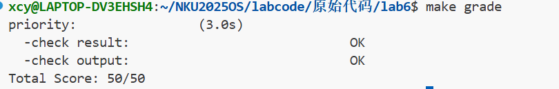
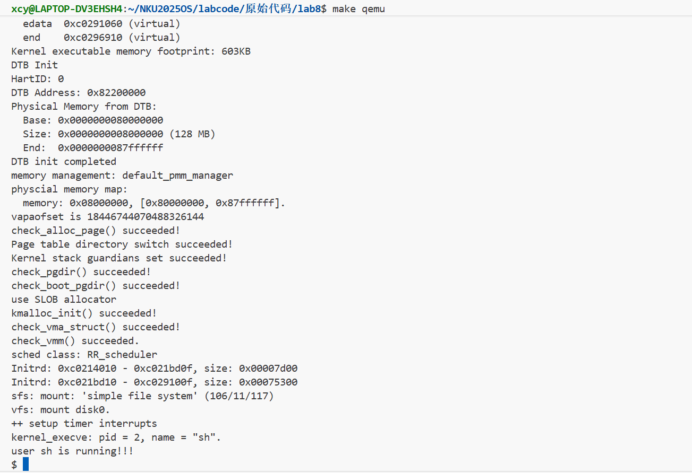
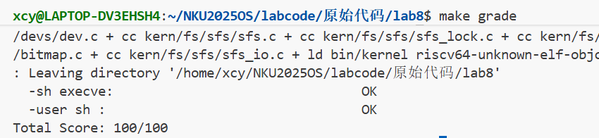
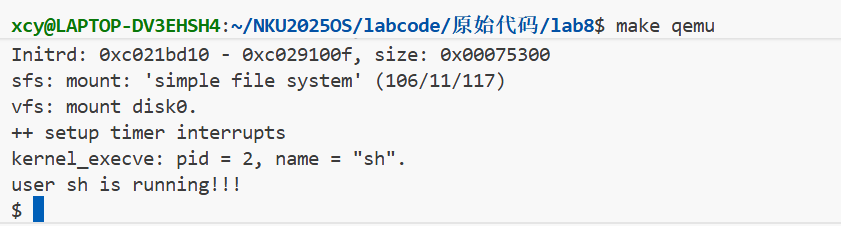
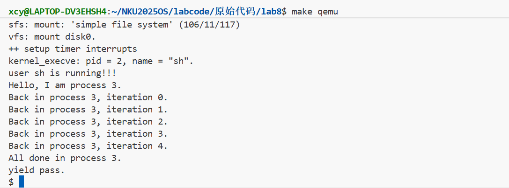
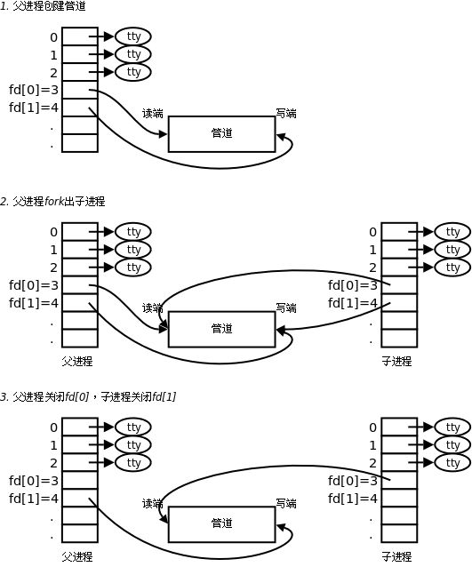

# <center>Lab6 & 8 实验报告</center>

<center>2310364  柳昕彤  2313310  熊诚义  2311887  陈语童</center>

[TOC]

## **Lab6实验内容**

## 练习1: 理解调度器框架的实现

### 1.1 调度类结构体 sched_class 的分析

`sched_class` 结构体定义在 `kern/schedule/sched.h` 中：

```c
// kern/schedule/sched.h
struct sched_class {
    const char *name;                          // 调度器名称
    void (*init)(struct run_queue *rq);        // 初始化运行队列
    void (*enqueue)(struct run_queue *rq, struct proc_struct *proc);  // 入队
    void (*dequeue)(struct run_queue *rq, struct proc_struct *proc);  // 出队
    struct proc_struct *(*pick_next)(struct run_queue *rq);           // 选择下一个进程
    void (*proc_tick)(struct run_queue *rq, struct proc_struct *proc); // 时钟tick处理
};
```

| 函数指针    | 函数功能                                                     | 调用时机                                                     |
| ----------- | ------------------------------------------------------------ | ------------------------------------------------------------ |
| `init`      | 初始化当前调度策略所需要的**运行队列数据结构**（如 RR 用 `run_list` 链表、Stride 用 `run_pool` 斜堆） | 内核初始化 `init.c` → 调用 `sched_init()` 初始化调度算法 → 函数内调用 `sched_class->init(rq)` |
| `enqueue`   | 把一个 **“就绪态 / 可运行态”** （`PROC_RUNNABLE`）的进程**放入就绪队列**（`run_queue`），并维护元数据（`proc_num`、`time_slice`、`proc->rq` 等） | `sched.c` 中：<br>1. **进程被唤醒：**`wakeup_proc()` 中对于非就绪态的进程设置为就绪态；如果唤醒的不是当前正在 CPU 上跑的进程，通过调用 `sched_class_enqueue(proc)` 加入就绪队列，等待被 `schedule()` 选中。<br>2. **时间片用完重新入队：** 当前进程时间片轮转到时，`schedule()` 函数进行调度，如果当前进程为可运行态，调用 `sched_class_enqueue(current)` 将其重新放入就绪队列。<br> |
| `dequeue`   | 把一个进程从**就绪队列移除**（`run_queue`）并维护元数据      | `sched.c` 的 `schedule()` 函数中，选出下一个调度执行的进程 `next` 以后立即调用 `sched_class_dequeue(next)` → 函数内 `sched_class->dequeue(rq, proc)`， 确保其不再留在就绪队列里，避免重复调度。 |
| `pick_next` | 按当前调度策略，从就绪队列中选择 **“下一个调度并运行” 的进程**并返回；找不到返回 `NULL` | `sched.c` 的 `schedule()` 函数中，在将当前到时的进程入列后，紧接着通过 `next = sched_class_pick_next()` → 函数内 `return sched_class->pick_next(rq)` 获取下一个可调度进程 |
| `proc_tick` | 处理时钟中断，更新时间片                                     | `trap.c` 中处理中断类型的函数 `interrupt_handler()` 中对于中断类型为`IRQ_S_TIMER` 时钟中断的情况，调用 `sched_class_proc_tick(current)` → 函数内，对于非 `idleproc` 调用 `sched_class->proc_tick(rq, proc);` 处理；对 `idleproc` 对 `need_resched` 置位表示需要调度运行新的进程 → `trap.c` 中在返回用户态的时候检查 `current->need_resched`，如果被置位就要调用 `schedule()` |

可以看到，所有函数指针都在 `sched.h/.c` 中进行了进一步封装便于调用。

**为什么使用函数指针而不是直接实现函数？**

-  **多态性：** 允许不同调度算法（RR、Stride等）使用相同的函数接口，只需要修改 `sched_class` 赋值为不同的算法结构体，就可以完成调度策略的切换，操作便捷高效。
-  **解耦合：** 外层调度框架与内部具体算法分离，易于各自代码的独立维护，提升代码安全性。
-  **简洁化：** 避免大量条件编译和重复代码，如果写死函数，`schedule()` 里会充斥 `#ifdef STRIDE / #ifdef RR` 或复制两套 `schedule_*` 函数，导致维护成本高、难以保持代码一致性。
-  **可拓展性：** 添加新算法只需实现接口，无需修改框架代码，可逐步完善。比如 `sched.h` 里已经预留了 SMP 的扩展点。

例如，在调度框架中选择下一个进程时，代码统一写为：

```c
// kern/schedule/sched.c
// 框架代码，适用于所有调度算法
static inline struct proc_struct *sched_class_pick_next(void) {
    return sched_class->pick_next(rq);  // 通过函数指针调用
}

void schedule(void) {
    // ...
    next = sched_class_pick_next();  // 无需关心具体算法
    // ...
}
```

而不同的调度算法只需实现各自的`pick_next`函数：

```c
// kern/schedule/default_sched.c
// RR调度器的实现
static struct proc_struct *RR_pick_next(struct run_queue *rq) {
    list_entry_t *le = list_next(&(rq->run_list));
    if (le != &(rq->run_list)) {
        return le2proc(le, run_link);  // 返回队首进程
    }
    return NULL;
}

// kern/schedule/default_sched_stride.c
// Stride调度器的实现
static struct proc_struct *stride_pick_next(struct run_queue *rq) {
    if (rq->lab6_run_pool == NULL) return NULL;
    struct proc_struct *p = le2proc(rq->lab6_run_pool, lab6_run_pool);
    p->lab6_stride += BIG_STRIDE / p->lab6_priority;  // 更新stride
    return p;  // 返回stride最小的进程
}
```

这种设计的可扩展性非常强。当需要添加新的调度算法时，只需创建新的函数实现并组装成新的`sched_class`结构体，然后在`sched_init()`中修改一行代码即可完成切换：

```c
// kern/schedule/sched.c
void sched_init(void) {
    list_init(&timer_list);
    
    // 只需修改这一行就能切换调度算法
    // sched_class = &default_sched_class;  // 使用RR调度器
    sched_class = &stride_sched_class;      // 使用Stride调度器
    // sched_class = &cfs_sched_class;      // 未来可以添加CFS调度器
    
    rq = &__rq;
    rq->max_time_slice = MAX_TIME_SLICE;
    sched_class->init(rq);  // 调用对应调度器的初始化函数
}
```

这种设计不仅便于维护（修改某个调度算法不会影响其他算法），也支持运行时动态切换调度策略，为操作系统提供了极大的灵活性。

### 1.2 运行队列结构体 run_queue 的分析

```c
// kern/schedule/sched.h
struct run_queue {
    list_entry_t run_list;          // 链表头（RR算法使用）
    unsigned int proc_num;          // 就绪进程数量
    int max_time_slice;             // 最大时间片
    skew_heap_entry_t *lab6_run_pool; // 斜堆根节点（Stride算法使用）
};
```

**lab5与lab6的区别：**

- lab5：只有简单的链表结构
- lab6：增加了`lab6_run_pool`斜堆支持

**为什么需要两种数据结构？**

1. **RR算法**：使用链表，O(1)入队出队，FIFO顺序
2. **Stride算法**：使用斜堆（优先队列），O(log n)获取最小stride的进程

不同调度算法有不同的数据结构需求，框架需要同时支持。

| **特性**       | **RR算法**                                 | **Stride算法**                                         |
| -------------- | ------------------------------------------ | ------------------------------------------------------ |
| **基本思想**   | 循环轮流分配时间片，公平调度               | 根据进程的优先级，按步幅进行调度                       |
| **时间片分配** | 固定时间片（`time_quantum`），每个进程相等 | 基于进程权重计算步幅，权重较大的进程步幅较小，优先执行 |
| **进程队列**   | *FIFO队列*，队列头部是当前执行的进程       | *优先级队列（最小堆）*，虚拟时间最小的进程优先         |
| **上下文切换** | 每个时间片结束时发生上下文切换             | 每次执行时更新虚拟时间，最小虚拟时间进程优先           |

实验中采用的是 “斜堆”，大致是一种 **支持高效合并操作、不要求平衡**（非完全二叉树结构）的最小堆实现。在空间足够的情况下，斜堆的合并操作可能带来更高的效率。

### 1.3 调度器框架函数分析

**sched_init()函数：**

```c
// kern/schedule/sched.c
void sched_init(void) {
    list_init(&timer_list);
    sched_class = &default_sched_class;  // 设置默认调度类
    rq = &__rq;
    rq->max_time_slice = MAX_TIME_SLICE;
    sched_class->init(rq);               // 调用具体算法的init
}
```

此函数功能是**对调度系统作初始化**。包括：

- 初始化时钟列表（用于时钟中断）；
- 选择**调度策略 / 算法**；
- 设置该运行队列允许的最大时间片长度；
- 调用所选调度策略对应的的初始化函数，完成该算法所需要的队列结构初始化（RR→链表，Stride→斜堆）。

**wakeup_proc()函数：**

```c
// kern/schedule/sched.c
void wakeup_proc(struct proc_struct *proc) {
    if (proc->state != PROC_RUNNABLE) {
        proc->state = PROC_RUNNABLE;
        proc->wait_state = 0;
        if (proc != current) {
            sched_class_enqueue(proc);  // 通过框架函数入队
        }
    }
}
```

此函数功能是**唤醒一个进程**。

Lab6 新增的代码部分已经标出。这一段代码的作用是，将唤醒后的进程（如果不是当前运行的进程）加入到运行调度队列，`schedule()` 将从中选取进程调度。

分析 Lab5 中没有此段代码的原因是，Lab5 还没有实现 RR 算法的调度队列和函数接口，其对于进程的调度不经过任何中间函数，直接检查记录所有进程的**双向链表**，选择进程进行调度（在 `schedule()` 中实现）。

在 Lab6 中实现了 RR 算法后，新增了**调度队列** `run_list`，与原先实现的进程双向链表共用同一数据结构和相关成员函数。这一队列的作用就是单独记录所有可以参与调度的进程供 `schedule()` 选择，与原先只用来记录进程信息的链表在本体上是分离的，通过 `run_link` 关联。这里新增的 `sched_class_enqueue()`（实际上会调用相应调度算法的实际 enqueue 方法，比如 RR 算法的会去向所维护的 `run_list` 中添加进程），就是对于新增的调度队列附属编写的一系列管理方法函数中的一员。类似地，对于 **Stride 算法**，因为调度策略不同，维护的是新增的 `run_pool` **斜堆**，那么它就会通过 `sched_class_enqueue()` 去向所维护的 `run_pool` 中添加进程。

**schedule()函数：**

```c
// kern/schedule/sched.c
void schedule(void) {
    local_intr_save(intr_flag);
    current->need_resched = 0;
    if (current->state == PROC_RUNNABLE) {
        sched_class_enqueue(current);   // 当前进程重新入队
    }
    next = sched_class_pick_next();     // 选择下一个进程
    if (next != NULL) {
        sched_class_dequeue(next);      // 从队列移除
    }
    proc_run(next);                     // 切换到新进程
    local_intr_restore(intr_flag);
}
```

对比lab5的实现：

```c
void schedule(void)
{
    bool intr_flag;
    list_entry_t *le, *last;
    struct proc_struct *next = NULL;
    local_intr_save(intr_flag);
    {
        current->need_resched = 0;
        last = (current == idleproc) ? &proc_list : &(current->list_link);
        le = last;
        do
        {
            if ((le = list_next(le)) != &proc_list)
            {
                next = le2proc(le, list_link);
                if (next->state == PROC_RUNNABLE)
                {
                    break;
                }
            }
        } while (le != last);
        if (next == NULL || next->state != PROC_RUNNABLE)
        {
            next = idleproc;
        }
        next->runs++;
        if (next != current)
        {
            proc_run(next);
        }
    }
    local_intr_restore(intr_flag);
}
```

区别主要在：
(1) Lab5 通过直接在进程双向链表中查找 `PROC_RUNNABLE` 的进程进行调度，而 Lab6 通过调用 `sched_class_pick_next()` 封装函数来查找合适的进程；
(2) Lab6 需要调用新增函数来维护**可运行**进程的链表（RR）或者斜堆（Stride）结构，Lab5 不需要。

——这两个区别的来源和上条分析 `wakeup_proc()` 时所述是同理的——Lab5 还没有实现独立的调度列表，以及相应调度算法的管理方法函数（包括这里的 `sched_class_enqueue()`，`sched_class_pick_next()`，`sched_class_dequeue()`，其内部因使用到函数指针会调用到相应算法的具体函数方法）；而 Lab6 实现了这些，所以使用新的方法来查找合适进程，进行进程调度。

关于这些函数与具体调度算法的解耦，回到前面对于 `sched_class` 的分析。这三个函数中所有与维护可运行进程列表的操作都是通过调用 `sched_class` 中函数指针来实现的，任一`sched_class_*()` 函数的内部实现都是 `sched_class->函数指针`。调度框架要求实现入列、出列、查找等操作，只需要调用这些封装好的函数，并不知道具体实现用的是哪种算法；而函数指针会在系统初始化时被赋给以选定算法的具体函数——比如 `enqueue` 指针在选用 RR 算法的时候被赋给 `RR_enqueue` 函数，那么封装函数被调用时指针指向的函数就会运作。指针所赋的值不是初始知晓的，对于调度框架未知，这就实现了这些函数与具体调度算法的解耦。

**解耦设计**：框架函数通过`sched_class`指针调用具体算法实现，无需知道具体算法细节。

### 1.4 调度类的初始化流程

```
kern_init()
    └─> sched_init()
            └─> sched_class = &default_sched_class
            └─> sched_class->init(rq)  // RR_init或stride_init
    └─> proc_init()
            └─> 创建idleproc和initproc
    └─> clock_init() + intr_enable()
            └─> 开始时钟中断，调度器开始工作
```

### 1.5 进程调度流程图

```
时钟中断触发
      │
      ▼
trap_dispatch()
      │
      ▼
IRQ_S_TIMER处理
      │
      ├─> clock_set_next_event()
      │
      ▼
sched_class_proc_tick(current)
      │
      ▼
RR_proc_tick() / stride_proc_tick()
      │
      ├─> time_slice--
      │
      ▼
time_slice == 0 ?
      │
      ├─ Yes ─> need_resched = 1
      │
      ▼
trap返回前检查need_resched
      │
      ├─ need_resched == 1
      │
      ▼
schedule()
      │
      ├─> enqueue(current)      // 当前进程入队
      │
      ├─> pick_next()           // 选择下一个进程
      │
      ├─> dequeue(next)         // 出队
      │
      ▼
proc_run(next)                  // 上下文切换
```

**need_resched标志位的作用**：

- 标记当前进程是否需要被调度
- 时间片用完时设置为1
- 在陷阱返回用户态前检查，决定是否调用schedule()

### 1.6 调度算法的切换机制

**添加新调度算法需要修改：**

1. 创建新文件（如`new_sched.c`），实现`sched_class`接口的5个函数
2. 在`sched_init()`中修改`sched_class`指针指向新的调度类

```c
// kern/schedule/sched.c
void sched_init(void) {
    // sched_class = &default_sched_class;  // RR
    sched_class = &stride_sched_class;      // Stride
    // sched_class = &new_sched_class;      // 新算法
    ...
}
```

**为什么切换容易？**

- 统一的接口定义（`sched_class`结构体）
- 框架与算法解耦
- 只需修改一行指针赋值即可切换

---

## 练习2: 实现 Round Robin 调度算法

### 2.1 lab5与lab6函数差异分析

以`wakeup_proc()`为例：

**lab5版本：**

```c
// lab5/kern/process/proc.c
void wakeup_proc(struct proc_struct *proc) {
    if (proc->state != PROC_RUNNABLE) {
        proc->state = PROC_RUNNABLE;
        proc->wait_state = 0;
    }
}
```

**lab6版本：**

```c
// lab6/kern/schedule/sched.c
void wakeup_proc(struct proc_struct *proc) {
    if (proc->state != PROC_RUNNABLE) {
        proc->state = PROC_RUNNABLE;
        proc->wait_state = 0;
        if (proc != current) {
            sched_class_enqueue(proc);  // 新增：加入调度队列
        }
    }
}
```

**改动原因：**

- lab5没有调度框架，进程直接切换
- lab6需要通过调度队列管理就绪进程
- 不做改动会导致进程无法被调度器发现

### 2.2 RR算法实现

#### RR_init - 初始化运行队列

```c
// kern/schedule/default_sched.c
static void RR_init(struct run_queue *rq) {
    list_init(&(rq->run_list));  // 初始化链表为空
    rq->proc_num = 0;            // 进程数为0
}
```

#### RR_enqueue - 进程入队

```c
// kern/schedule/default_sched.c
static void RR_enqueue(struct run_queue *rq, struct proc_struct *proc) {
    assert(list_empty(&(proc->run_link)));  // 确保进程不在队列中
    list_add_before(&(rq->run_list), &(proc->run_link)); // 加入队尾(FIFO)
    if (proc->time_slice == 0 || proc->time_slice > rq->max_time_slice) {
        proc->time_slice = rq->max_time_slice;  // 重置时间片
    }
    proc->rq = rq;
    rq->proc_num++;
}
```

**选择`list_add_before`的原因**：

- `run_list`是哨兵节点，`list_add_before(&run_list, ...)`将元素加到链表尾部
- 实现FIFO顺序：新进程从尾部入队，老进程从头部出队

#### RR_dequeue - 进程出队

```c
// kern/schedule/default_sched.c
static void RR_dequeue(struct run_queue *rq, struct proc_struct *proc) {
    assert(!list_empty(&(proc->run_link)) && proc->rq == rq);
    list_del_init(&(proc->run_link));  // 从链表删除并重新初始化
    rq->proc_num--;
}
```

#### RR_pick_next - 选择下一个进程

```c
// kern/schedule/default_sched.c
static struct proc_struct *RR_pick_next(struct run_queue *rq) {
    list_entry_t *le = list_next(&(rq->run_list));
    if (le != &(rq->run_list)) {
        return le2proc(le, run_link);  // 返回队首进程
    }
    return NULL;
}
```

#### RR_proc_tick - 时钟tick处理

```c
// kern/schedule/default_sched.c
static void RR_proc_tick(struct run_queue *rq, struct proc_struct *proc) {
    if (proc->time_slice > 0) {
        proc->time_slice--;  // 减少时间片
    }
    if (proc->time_slice == 0) {
        proc->need_resched = 1;  // 时间片用完，标记需要调度
    }
}
```

### 2.3 测试结果

```
make qemu输出:
sched class: RR_scheduler
++ setup timer interrupts
kernel_execve: pid = 2, name = "priority".
set priority to 6
main: fork ok,now need to wait pids.
set priority to 1
set priority to 2
set priority to 3
set priority to 4
set priority to 5
```

所有进程都被正确调度执行。

### 2.4 RR算法优缺点分析

**优点：**

- 实现简单，易于理解
- 公平性好，每个进程获得相同时间片
- 响应时间可预测

**缺点：**

- 不区分进程优先级
- 时间片大小难以确定
  - 太小：上下文切换开销大
  - 太大：响应时间变长
- 不适合I/O密集型和CPU密集型混合场景

**need_resched标志的必要性：**

- 时钟中断处理在内核态，不能直接调用schedule()
- need_resched作为延迟标记，在安全点（陷阱返回前）才检查并调度

### 2.5 扩展思考

**优先级RR实现：**

- 维护多个队列，每个优先级一个
- pick_next时从最高优先级非空队列选择
- 或者修改enqueue按优先级排序插入

**多核调度支持：**
当前不支持多核，需要：

- 每个CPU核心一个运行队列
- 添加自旋锁保护共享数据
- 实现负载均衡机制

---

## 扩展练习 Challenge 1: Stride Scheduling

### 3.1 Stride调度算法原理

#### 3.1.1 算法基本思想

Stride调度算法是一种确定性的比例份额（Proportional Share）调度算法，其核心思想：

1. **为每个进程维护两个关键属性：**
   - `stride`（步幅值）：表示进程当前的调度权，初始为0
   - `pass`（步长值）：表示进程每次被调度后stride的增量，`pass = BIG_STRIDE / priority`

2. **调度策略：**
   - 每次从就绪进程中选择stride值最小的进程调度
   - 该进程运行后，`stride += pass`
   - 优先级高的进程pass小，stride增长慢，更容易再次被选中

3. **算法特点：**
   - **可控性**：进程获得的CPU时间与优先级成正比
   - **确定性**：调度顺序可预测，便于分析和调试
   - **公平性**：严格按比例分配CPU时间

#### 3.1.2 BIG_STRIDE常量的设计

```c
// kern/schedule/default_sched_stride.c
#define BIG_STRIDE 0x7FFFFFFF  // 2^31 - 1
```

**选择这个值的原因：**

1. **处理溢出**：使用有符号32位比较，利用补码特性处理stride溢出
2. **保证精度**：足够大的值使得不同优先级的差异能够体现
3. **避免除零**：确保 `BIG_STRIDE / priority` 有意义（priority >= 1）

### 3.2 Stride调度器接口实现

#### 3.2.1 init - 初始化调度器

```c
// kern/schedule/default_sched_stride.c
/*
 * stride_init - 初始化运行队列
 * @rq: 运行队列指针
 * 
 * 功能：
 * 1. 初始化运行队列为空的数据结构（斜堆或链表）
 * 2. 设置进程数量为0
 */
static void stride_init(struct run_queue *rq) {
    /* 初始化运行队列链表为空 */
    list_init(&(rq->run_list));
    
    /* 初始化斜堆根节点为NULL（斜堆为空） */
    rq->lab6_run_pool = NULL;
    
    /* 初始化进程数量为0 */
    rq->proc_num = 0;
}
```

**设计说明：**

- 虽然使用斜堆作为主要数据结构，但仍保留`run_list`以兼容框架
- 斜堆初始为空（NULL），后续插入操作会构建堆结构
- `proc_num`用于快速获取就绪进程数量

#### 3.2.2 enqueue - 进程入队

```c
// kern/schedule/default_sched_stride.c
/*
 * stride_enqueue - 将进程插入运行队列
 * @rq: 运行队列指针
 * @proc: 要插入的进程
 * 
 * 功能：
 * 1. 初始化进程的stride属性（新进程stride保持原值，通常为0）
 * 2. 将进程插入斜堆（自动维护最小堆性质）
 * 3. 重置进程的时间片
 * 4. 更新运行队列元数据
 */
static void stride_enqueue(struct run_queue *rq, struct proc_struct *proc) {
#if USE_SKEW_HEAP
    /* 使用斜堆实现：将进程插入斜堆，保持最小堆性质 */
    rq->lab6_run_pool = skew_heap_insert(
        rq->lab6_run_pool,           // 当前堆根节点
        &(proc->lab6_run_pool),      // 新进程的堆节点
        proc_stride_comp_f           // 比较函数（基于stride比较）
    );
#else
    /* 使用链表实现：直接插入队尾 */
    assert(list_empty(&(proc->run_link)));
    list_add_before(&(rq->run_list), &(proc->run_link));
#endif
    
    /* 重置时间片为最大时间片 */
    if (proc->time_slice == 0 || proc->time_slice > rq->max_time_slice) {
        proc->time_slice = rq->max_time_slice;
    }
    
    /* 设置进程所属的运行队列 */
    proc->rq = rq;
    
    /* 增加运行队列的进程计数 */
    rq->proc_num++;
}
```

**设计说明：**

- **新进程stride初始化**：新进程的stride保持创建时的值（通常为0），这样新进程会优先获得调度机会
- **斜堆插入**：O(log n)时间复杂度，自动维护最小堆性质
- **时间片重置**：确保进程有完整的时间片可用

#### 3.2.3 dequeue - 进程出队

```c
// kern/schedule/default_sched_stride.c
/*
 * stride_dequeue - 从运行队列中删除进程
 * @rq: 运行队列指针
 * @proc: 要删除的进程
 * 
 * 功能：
 * 1. 从斜堆中删除对应进程节点
 * 2. 更新运行队列元数据
 */
static void stride_dequeue(struct run_queue *rq, struct proc_struct *proc) {
#if USE_SKEW_HEAP
    /* 从斜堆中删除进程节点，返回新的堆根节点 */
    rq->lab6_run_pool = skew_heap_remove(
        rq->lab6_run_pool,           // 当前堆根节点
        &(proc->lab6_run_pool),      // 要删除的节点
        proc_stride_comp_f           // 比较函数
    );
#else
    /* 使用链表实现：从链表删除 */
    assert(!list_empty(&(proc->run_link)) && proc->rq == rq);
    list_del_init(&(proc->run_link));
#endif
    
    /* 减少运行队列的进程计数 */
    rq->proc_num--;
}
```

**设计说明：**

- 斜堆删除操作：O(log n)时间复杂度
- 删除后自动维护堆的性质
- 不需要修改进程的stride值（保留状态）

#### 3.2.4 pick_next - 选择下一个进程

```c
// kern/schedule/default_sched_stride.c
/*
 * stride_pick_next - 选择stride值最小的进程
 * @rq: 运行队列指针
 * @return: stride最小的进程指针，无进程时返回NULL
 * 
 * 功能：
 * 1. 从斜堆根节点获取stride最小的进程（最小堆的根）
 * 2. 更新该进程的stride值：stride += BIG_STRIDE / priority
 * 3. 返回该进程指针
 */
static struct proc_struct *stride_pick_next(struct run_queue *rq) {
#if USE_SKEW_HEAP
    /* 检查堆是否为空 */
    if (rq->lab6_run_pool == NULL) {
        return NULL;
    }
    
    /* 从斜堆根节点获取stride最小的进程 */
    struct proc_struct *p = le2proc(rq->lab6_run_pool, lab6_run_pool);
    
#else
    /* 使用链表实现：需要遍历整个链表找到stride最小的进程 */
    list_entry_t *le = list_next(&(rq->run_list));
    
    /* 空链表检查 */
    if (le == &(rq->run_list)) {
        return NULL;
    }
    
    /* 假设第一个进程stride最小 */
    struct proc_struct *p = le2proc(le, run_link);
    le = list_next(le);
    
    /* 遍历链表找到stride最小的进程 */
    while (le != &(rq->run_list)) {
        struct proc_struct *q = le2proc(le, run_link);
        
        /* 使用有符号比较处理溢出 */
        if ((int32_t)(q->lab6_stride - p->lab6_stride) < 0) {
            p = q;
        }
        le = list_next(le);
    }
#endif
    
    /* 更新进程的stride值 */
    if (p->lab6_priority == 0) {
        /* 优先级为0的特殊处理（避免除零） */
        p->lab6_stride += BIG_STRIDE;
    } else {
        /* 正常情况：stride增加pass值 */
        p->lab6_stride += BIG_STRIDE / p->lab6_priority;
    }
    
    return p;
}
```

**设计说明：**

- **斜堆实现**：O(1)获取最小值（根节点）
- **链表实现**：O(n)遍历查找，效率较低
- **stride更新时机**：在选择进程时立即更新，而非执行完后更新
- **有符号比较**：`(int32_t)(q->lab6_stride - p->lab6_stride) < 0` 能正确处理溢出

#### 3.2.5 proc_tick - 时钟tick处理

```c
// kern/schedule/default_sched_stride.c
/*
 * stride_proc_tick - 处理时钟中断
 * @rq: 运行队列指针
 * @proc: 当前运行的进程
 * 
 * 功能：
 * 1. 递减当前进程的时间片
 * 2. 如果时间片用完，设置need_resched标志触发调度
 */
static void stride_proc_tick(struct run_queue *rq, struct proc_struct *proc) {
    /* 时间片递减 */
    if (proc->time_slice > 0) {
        proc->time_slice--;
    }
    
    /* 时间片用完，设置需要调度标志 */
    if (proc->time_slice == 0) {
        proc->need_resched = 1;
    }
}
```

**设计说明：**

- 每个时钟tick（通常10ms）递减时间片
- 时间片用完时设置`need_resched`标志
- 实际调度在trap返回前检查`need_resched`时触发
- 不在这里直接调用`schedule()`，避免在中断处理中进行复杂操作

#### 3.2.6 比较函数 - proc_stride_comp_f

```c
// kern/schedule/default_sched_stride.c
/*
 * proc_stride_comp_f - 比较两个进程的stride值
 * @a: 进程A的堆节点
 * @b: 进程B的堆节点
 * @return: 1(A>B), 0(A==B), -1(A<B)
 * 
 * 功能：用于斜堆维护最小堆性质的比较函数
 */
static int proc_stride_comp_f(void *a, void *b) {
    struct proc_struct *p = le2proc(a, lab6_run_pool);
    struct proc_struct *q = le2proc(b, lab6_run_pool);
    
    /* 使用有符号差值比较，处理溢出问题 */
    int32_t c = p->lab6_stride - q->lab6_stride;
    
    if (c > 0)
        return 1;   // p的stride更大
    else if (c == 0)
        return 0;   // stride相等
    else
        return -1;  // p的stride更小
}
```

**设计说明：**

- 使用有符号整数差值比较，而非直接比较无符号值
- 利用补码特性正确处理stride溢出情况

### 3.3 Stride溢出问题深入分析

#### 3.3.1 溢出问题的产生

**问题场景：**

假设stride使用16位无符号整数存储，当前有两个进程A和B：

| 时刻 | 进程A stride | 进程B stride | 理论上应选择   |
| ---- | ------------ | ------------ | -------------- |
| t1   | 65535        | 100          | B (stride更小) |

如果使用简单的无符号比较：`A.stride < B.stride` → `65535 < 100` → False

这会错误地选择A，而实际上B的stride更小。

**进一步的例子：**

初始队列状态（A优先级5，B优先级1，BIG_STRIDE=1000）：

```
A: stride=65530, pass=200
B: stride=100,   pass=1000
```

此时理论上应选择B（stride=100最小），但65530作为无符号数确实大于100。

选择B运行后：

```
A: stride=65530
B: stride=1100
```

再次选择A运行后（A的stride发生溢出）：

```
A: stride=65730 → 溢出 → 实际存储为 65730 % 65536 = 194
B: stride=1100
```

此时如果用无符号比较：`194 < 1100` → True，会选择A
但理论上A的stride是65730，应该选择B！

#### 3.3.2 溢出问题的理论分析

**提问1的证明：对于任意时刻，STRIDE_MAX - STRIDE_MIN <= PASS_MAX**

**证明：**

**定义：**

- 设当前有n个进程 `P_1, P_2, ..., P_n`
- `stride_i(t)` 表示进程 `P_i` 在时刻t的stride值
- $pass_i = \frac{BIG\_STRIDE}{priority_i}$ 表示进程 $P_i$ 的步长
- $STRIDE_{MAX}(t) = \max_i\{stride_i(t)\}$
- $STRIDE_{MIN}(t) = \min_i\{stride_i(t)\}$
- $PASS_{MAX} = \max_i\{pass_i\}$

**归纳证明：**

*基础情况（t=0）：*
所有进程stride初始化为0，因此：
$$STRIDE_{MAX}(0) - STRIDE_{MIN}(0) = 0 \leq PASS_{MAX}$$

*归纳假设：*
假设在时刻t成立：$STRIDE_{MAX}(t) - STRIDE_{MIN}(t) \leq PASS_{MAX}$

*归纳步骤：*
在时刻t，调度器选择stride最小的进程 $P_k$，使得 $stride_k(t) = STRIDE_{MIN}(t)$

执行后，$stride_k(t+1) = stride_k(t) + pass_k$，其他进程stride不变。

**情况1**：如果 $P_k$ 不是stride最大的进程

- $STRIDE_{MAX}(t+1) = STRIDE_{MAX}(t)$（最大值不变）
- $STRIDE_{MIN}(t+1) \geq STRIDE_{MIN}(t)$（最小值可能增大）

新的最小值要么仍是 $P_k$，要么是其他进程。

**子情况1a**：$stride_k(t+1) = stride_k(t) + pass_k$ 仍是最小
$$STRIDE_{MAX}(t+1) - STRIDE_{MIN}(t+1) = STRIDE_{MAX}(t) - (STRIDE_{MIN}(t) + pass_k)$$
$$= (STRIDE_{MAX}(t) - STRIDE_{MIN}(t)) - pass_k \leq PASS_{MAX} - pass_k \leq PASS_{MAX}$$

**子情况1b**：$P_j$（$j \neq k$）的stride成为新的最小值
设 $stride_j(t)$ 是除 $P_k$ 外的最小stride，则：

- $STRIDE_{MIN}(t) \leq stride_j(t) \leq STRIDE_{MAX}(t)$

$$STRIDE_{MAX}(t+1) - STRIDE_{MIN}(t+1) = STRIDE_{MAX}(t) - stride_j(t)$$
$$\leq STRIDE_{MAX}(t) - STRIDE_{MIN}(t) \leq PASS_{MAX}$$

**情况2**：如果 $P_k$ 同时是stride最小和最大的进程（只有一个进程）
显然成立，差值为0。

**情况3**：$P_k$ 更新后成为stride最大的进程
此时 $stride_k(t+1) = STRIDE_{MAX}(t+1)$

设 $P_m$ 在时刻t的stride是次小值（第二小），则：

- 在t时刻：$stride_k(t) \leq stride_m(t)$
- 在t+1时刻：$STRIDE_{MIN}(t+1) = stride_m(t)$（$P_m$的stride未变）

$$STRIDE_{MAX}(t+1) - STRIDE_{MIN}(t+1) = stride_k(t+1) - stride_m(t)$$
$$= stride_k(t) + pass_k - stride_m(t)$$
$$\leq stride_m(t) + pass_k - stride_m(t) = pass_k \leq PASS_{MAX}$$

综合所有情况，归纳假设在 $t+1$ 时刻仍然成立。

**结论：** 
对于任意时刻t，都有 $STRIDE_{MAX}(t) - STRIDE_{MIN}(t) \leq PASS_{MAX}$

证毕。□

**推论：**

由于 $priority_i \geq 1$（优先级至少为1），因此：
$$PASS_{MAX} = \max_i\left\{\frac{BIG\_STRIDE}{priority_i}\right\} = \frac{BIG\_STRIDE}{\min_i\{priority_i\}} \leq BIG\_STRIDE$$

所以有：
$$STRIDE_{MAX} - STRIDE_{MIN} \leq PASS_{MAX} \leq BIG\_STRIDE$$

这意味着任意两个进程的stride差值不会超过BIG_STRIDE。

#### 3.3.3 利用有符号比较处理溢出

**提问2的回答：ucore中BIG_STRIDE应该取多少？**

**答案：`BIG_STRIDE = 0x7FFFFFFF`（即 $2^{31} - 1$）**

**详细分析：**

ucore使用32位无符号整数存储stride，我们需要通过有符号比较来判断stride的大小关系。

**核心技巧：有符号差值比较**

对于两个stride值 $s_1$ 和 $s_2$（作为无符号32位整数），我们不直接比较它们，而是计算：
$$diff = (int32\_t)(s_1 - s_2)$$

将差值解释为有符号32位整数。

**原理：**

- 如果 $s_1$ 和 $s_2$ 的差值在 $[-2^{31}, 2^{31}-1]$ 范围内
- 那么即使发生了无符号溢出，有符号差值的符号仍能正确反映大小关系

**示例：**

假设16位整数（便于演示），$BIG\_STRIDE = 2^{15} - 1 = 32767$

```
进程A: stride = 65530 (二进制: 1111 1111 1111 1010)
进程B: stride = 100   (二进制: 0000 0000 0110 0100)
```

无符号比较：65530 > 100 ✗（错误结论）

有符号差值比较：

```
diff = (int16_t)(65530 - 100) 
     = (int16_t)(65430)
     = (int16_t)(1111 1111 1010 0110)  // 补码表示
     = -106
```

因为 $diff < 0$，所以 $A.stride < B.stride$ ✓（正确！）

**为什么取 $BIG\_STRIDE = 2^{31} - 1$？**

由推论我们知道：
$$STRIDE_{MAX} - STRIDE_{MIN} \leq BIG\_STRIDE$$

要使有符号比较正确，需要任意两个stride的差值在有符号32位整数范围内：
$$|s_1 - s_2| \leq 2^{31} - 1$$

因此，BIG_STRIDE的最大安全值为：
$$BIG\_STRIDE_{max} = 2^{31} - 1 = 0x7FFFFFFF$$

**如果取更大的值会怎样？**

假设 $BIG\_STRIDE = 2^{32} - 1$（无符号32位最大值）：

```
进程A: priority=1, pass=2^32-1
进程B: priority=2, pass=2^31

A执行一次: strideA = 2^32 - 1 = 0xFFFFFFFF (溢出到4294967295)
B执行一次: strideB = 2^31     = 0x80000000 (2147483648)

diff = (int32_t)(strideA - strideB)
     = (int32_t)(0xFFFFFFFF - 0x80000000)
     = (int32_t)(0x7FFFFFFF)
     = 2147483647 > 0
```

这种情况下仍能正常工作（A的stride确实更大）。

但考虑边界情况：

```
strideA = 0 (刚溢出归零)
strideB = 2^31 + 1

diff = (int32_t)(0 - (2^31+1))
     = (int32_t)(-2^31 - 1)  // 超出int32_t范围！
     = 溢出，结果未定义
```

**结论：**

- **保守选择**：$BIG\_STRIDE = 2^{31} - 1 = 0x7FFFFFFF$
- **保证**：任意两个stride差值绝对值 $\leq BIG\_STRIDE \leq 2^{31}-1$
- **安全性**：有符号比较始终正确

**实现代码：**

```c
// kern/schedule/default_sched_stride.c
/* 正确的stride比较方式 */
int32_t diff = p1->lab6_stride - p2->lab6_stride;
if (diff < 0) {
    // p1的stride更小
} else if (diff > 0) {
    // p2的stride更小
} else {
    // stride相等
}
```

#### 3.3.4 完整测试make grade



### 3.4 多级反馈队列调度算法详细设计

#### 3.4.1 概要设计

多级反馈队列（Multi-Level Feedback Queue, MLFQ）是一种动态调度算法，能够自适应不同类型的进程。

**核心思想：**

1. **多级优先级队列**：系统维护多个优先级不同的就绪队列
2. **动态优先级调整**：根据进程行为动态调整其优先级
3. **区分进程类型**：自动识别I/O密集型和CPU密集型进程
4. **防止饥饿**：通过周期性提升机制保证低优先级进程能被执行

**MLFQ的三条基本规则：**

- **规则1**：优先级高的队列优先调度
- **规则2**：同一队列内使用RR调度
- **规则3**：新进程进入最高优先级队列

**进程降级规则：**

- **规则4a**：进程用完时间片，降低一级优先级
- **规则4b**：进程主动放弃CPU（I/O等待），保持优先级

**防止饥饿规则：**

- **规则5**：经过时间S后，将所有进程提升到最高优先级队列

#### 3.4.2 数据结构设计

```c
// MLFQ调度器设计（伪代码）
#define NUM_QUEUES 8          // 优先级队列数量
#define BASE_TIME_SLICE 5     // 基础时间片
#define BOOST_TIME 100        // 提升周期（ticks）

// 扩展的运行队列
struct mlfq_run_queue {
    list_entry_t queues[NUM_QUEUES];    // 多个优先级队列
    unsigned int proc_nums[NUM_QUEUES]; // 各队列进程数
    int time_slices[NUM_QUEUES];        // 各队列时间片大小
    int global_ticks;                    // 全局时钟计数（用于周期性提升）
};

// 扩展的进程控制块
struct proc_struct {
    ...
    int priority_level;      // 当前所在队列优先级（0最高）
    int wait_ticks;          // 在当前队列等待的tick数
    int total_ticks;         // 累计运行的tick数
    ...
};
```

#### 3.4.3 详细设计与实现

**（1）初始化函数 - mlfq_init**

```c
// MLFQ调度器设计（伪代码）
static void mlfq_init(struct run_queue *rq) {
    struct mlfq_run_queue *mlfq_rq = (struct mlfq_run_queue *)rq;
    
    // 初始化各级队列
    for (int i = 0; i < NUM_QUEUES; i++) {
        list_init(&(mlfq_rq->queues[i]));
        mlfq_rq->proc_nums[i] = 0;
        // 时间片随优先级降低而增加：2^i * BASE_TIME_SLICE
        mlfq_rq->time_slices[i] = BASE_TIME_SLICE * (1 << i);
    }
    
    mlfq_rq->global_ticks = 0;
}
```

**设计说明：**

- 高优先级队列时间片小（5 ticks），响应快，适合I/O密集型
- 低优先级队列时间片大（640 ticks），减少切换开销，适合CPU密集型
- 使用2的幂次增长，简化计算且效果好

**（2）入队函数 - mlfq_enqueue**

```c
// MLFQ调度器设计（伪代码）
static void mlfq_enqueue(struct run_queue *rq, struct proc_struct *proc) {
    struct mlfq_run_queue *mlfq_rq = (struct mlfq_run_queue *)rq;
    
    // 确定进程的优先级队列
    int level = proc->priority_level;
    
    // 新进程进入最高优先级队列
    if (proc->total_ticks == 0) {
        level = 0;
        proc->priority_level = 0;
    }
    
    // 将进程加入对应队列的末尾
    list_add_before(&(mlfq_rq->queues[level]), &(proc->run_link));
    mlfq_rq->proc_nums[level]++;
    
    // 设置时间片
    proc->time_slice = mlfq_rq->time_slices[level];
    proc->wait_ticks = 0;
    proc->rq = rq;
}
```

**设计说明：**

- 新进程假设为I/O密集型，给予高优先级快速响应
- 如果实际为CPU密集型，会逐渐降级
- 实现了"乐观"策略

**（3）出队函数 - mlfq_dequeue**

```c
// MLFQ调度器设计（伪代码）
static void mlfq_dequeue(struct run_queue *rq, struct proc_struct *proc) {
    struct mlfq_run_queue *mlfq_rq = (struct mlfq_run_queue *)rq;
    int level = proc->priority_level;
    
    assert(!list_empty(&(proc->run_link)));
    list_del_init(&(proc->run_link));
    mlfq_rq->proc_nums[level]--;
}
```

**（4）选择下一个进程 - mlfq_pick_next**

```c
// MLFQ调度器设计（伪代码）
static struct proc_struct *mlfq_pick_next(struct run_queue *rq) {
    struct mlfq_run_queue *mlfq_rq = (struct mlfq_run_queue *)rq;
    
    // 从最高优先级队列开始查找
    for (int i = 0; i < NUM_QUEUES; i++) {
        if (mlfq_rq->proc_nums[i] > 0) {
            list_entry_t *le = list_next(&(mlfq_rq->queues[i]));
            if (le != &(mlfq_rq->queues[i])) {
                return le2proc(le, run_link);
            }
        }
    }
    
    return NULL;  // 无就绪进程
}
```

**设计说明：**

- 严格的优先级调度：只有高优先级队列为空，才调度低优先级
- 保证I/O密集型进程获得快速响应
- 同级队列内按FIFO顺序（RR）

**（5）时钟tick处理 - mlfq_proc_tick**

```c
// MLFQ调度器设计（伪代码）
static void mlfq_proc_tick(struct run_queue *rq, struct proc_struct *proc) {
    struct mlfq_run_queue *mlfq_rq = (struct mlfq_run_queue *)rq;
    
    // 全局时钟递增
    mlfq_rq->global_ticks++;
    
    // 周期性提升所有进程（防止饥饿）
    if (mlfq_rq->global_ticks >= BOOST_TIME) {
        mlfq_boost_all_processes(rq);
        mlfq_rq->global_ticks = 0;
    }
    
    // 当前进程时间片递减
    if (proc->time_slice > 0) {
        proc->time_slice--;
        proc->total_ticks++;
    }
    
    // 时间片用完
    if (proc->time_slice == 0) {
        proc->need_resched = 1;
        
        // 降低优先级（除非已经是最低级）
        if (proc->priority_level < NUM_QUEUES - 1) {
            proc->priority_level++;
        }
    }
}
```

**关键设计点：**

1. **动态降级**：CPU密集型进程会因为持续用完时间片而降级
2. **周期性提升**：防止低优先级进程饥饿
3. **自适应性**：I/O密集型进程因主动放弃CPU而保持高优先级

**（6）周期性提升函数**

```c
// MLFQ调度器设计（伪代码）
static void mlfq_boost_all_processes(struct run_queue *rq) {
    struct mlfq_run_queue *mlfq_rq = (struct mlfq_run_queue *)rq;
    
    // 将所有非最高优先级队列的进程移到最高优先级队列
    for (int i = 1; i < NUM_QUEUES; i++) {
        while (!list_empty(&(mlfq_rq->queues[i]))) {
            list_entry_t *le = list_next(&(mlfq_rq->queues[i]));
            struct proc_struct *proc = le2proc(le, run_link);
            
            // 从当前队列移除
            list_del_init(&(proc->run_link));
            mlfq_rq->proc_nums[i]--;
            
            // 加入最高优先级队列
            proc->priority_level = 0;
            list_add_before(&(mlfq_rq->queues[0]), &(proc->run_link));
            mlfq_rq->proc_nums[0]++;
            proc->time_slice = mlfq_rq->time_slices[0];
        }
    }
}
```

#### 3.4.4 MLFQ算法特性分析

**优点：**

1. **自适应性**：无需预先知道进程类型，自动调整
2. **响应性好**：I/O密集型进程保持高优先级，快速响应
3. **公平性**：CPU密集型进程虽降级但获得更长时间片
4. **防止饥饿**：周期性提升保证所有进程都能执行

**缺点：**

1. **复杂度高**：需要维护多个队列和额外状态
2. **参数敏感**：队列数量、时间片大小、提升周期需要调优
3. **Gaming风险**：恶意进程可能在时间片即将用完时主动放弃CPU

**与Stride算法对比：**

| 特性   | MLFQ           | Stride           |
| ------ | -------------- | ---------------- |
| 优先级 | 动态调整       | 静态设定         |
| 复杂度 | O(N)选择       | O(log N)选择     |
| 公平性 | 近似公平       | 严格按比例       |
| 适应性 | 自适应进程行为 | 需人工设定优先级 |
| 实时性 | 较弱           | 可预测           |

#### 3.4.5 完整的sched_class定义

```c
// MLFQ调度器设计（伪代码）
struct sched_class mlfq_sched_class = {
    .name = "mlfq_scheduler",
    .init = mlfq_init,
    .enqueue = mlfq_enqueue,
    .dequeue = mlfq_dequeue,
    .pick_next = mlfq_pick_next,
    .proc_tick = mlfq_proc_tick,
};
```

### 3.5 Stride算法正确性的数学证明

**命题**：在Stride调度算法中，经过足够长时间后，每个进程获得的CPU时间与其优先级成正比。

**证明：**

设系统中有n个进程，进程 $P_i$ 的优先级为 $p_i$（$p_i > 0$）。

**定义：**

- $stride_i(t)$：进程 $P_i$ 在时刻t的stride值
- $pass_i = \frac{BIG\_STRIDE}{p_i}$：进程 $P_i$ 每次执行的stride增量
- $N_i(T)$：在时间段 $[0, T]$ 内进程 $P_i$ 被调度执行的次数

**算法规则：**

1. 每次选择stride值最小的进程执行
2. 进程 $P_i$ 执行后：$stride_i \leftarrow stride_i + pass_i$

**引理1（稳态特性）**：在稳态下，所有进程的stride值近似相等。

*证明*：
假设某时刻进程 $P_i$ 的stride远小于进程 $P_j$，则 $P_i$ 会被连续调度，直到其stride增长到与 $P_j$ 相近。因此长期来看，各进程stride会趋于接近。

**主要证明：**

在时间段 $[0, T]$ 内，设每个进程的总stride增长为：
$$stride_i(T) - stride_i(0) = N_i(T) \cdot pass_i = N_i(T) \cdot \frac{BIG\_STRIDE}{p_i}$$

由引理1，稳态下各进程stride值近似相等：
$$stride_1(T) \approx stride_2(T) \approx ... \approx stride_n(T)$$

即：
$$N_1(T) \cdot \frac{BIG\_STRIDE}{p_1} \approx N_2(T) \cdot \frac{BIG\_STRIDE}{p_2}$$

化简得：
$$\frac{N_1(T)}{p_1} \approx \frac{N_2(T)}{p_2}$$

因此：
$$\frac{N_1(T)}{N_2(T)} \approx \frac{p_1}{p_2}$$

即进程执行次数之比等于优先级之比。

假设每个进程每次执行的时间片相同（均为 $\Delta t$），则：
$$\frac{CPU\_time_1}{CPU\_time_2} = \frac{N_1(T) \cdot \Delta t}{N_2(T) \cdot \Delta t} = \frac{N_1(T)}{N_2(T)} \approx \frac{p_1}{p_2}$$

**推广到多进程：**

对于任意进程 $P_i$ 和 $P_j$：
$$\frac{CPU\_time_i}{CPU\_time_j} \approx \frac{p_i}{p_j}$$

因此，每个进程获得的CPU时间与其优先级成正比。证毕。

**误差分析：**

实际误差来源于：

1. **离散性误差**：stride值不能完全相等，存在 $\pm pass_{max}$ 的误差
2. **时间片误差**：如果不同进程时间片不同，会引入额外误差

设 $pass_{max} = \max_i(pass_i) = \frac{BIG\_STRIDE}{p_{min}}$

最大相对误差：
$$\epsilon = \frac{pass_{max}}{stride} \approx \frac{1}{N \cdot p_{min}}$$

其中N为总调度次数。当N足够大时，误差趋于0。

**BIG_STRIDE的选择依据：**

选择 $BIG\_STRIDE = 2^{31} - 1$ 的原因：

1. **防止溢出**：使用32位有符号整数比较，$stride_i - stride_j$ 的差值不会超过 $BIG\_STRIDE$
2. **足够大**：确保优先级差异能够体现，即使最小优先级为1，stride增量也不会太大
3. **有符号比较**：利用补码特性处理环形比较（类似TCP序列号）

**示例：**

设有3个进程，优先级分别为5、3、2，$BIG\_STRIDE = 1000$：

| 调度次数 | P1(p=5) | P2(p=3) | P3(p=2) | 被选中 |
| -------- | ------- | ------- | ------- | ------ |
| 初始     | 0       | 0       | 0       | -      |
| 1        | 200     | 0       | 0       | P1     |
| 2        | 200     | 333     | 0       | P3     |
| 3        | 200     | 333     | 500     | P1     |
| 4        | 400     | 333     | 500     | P2     |
| ...      | ...     | ...     | ...     | ...    |
| 30       | 1200    | 1333    | 1500    | -      |

30次调度后：

- P1执行6次：$1200 = 6 \times 200$
- P2执行4次：$1333 \approx 4 \times 333$
- P3执行3次：$1500 = 3 \times 500$

执行次数比 = 6:4:3 ≈ 5:3:2 = 优先级比 ✓

**结论：**

Stride算法通过维护stride值，使得优先级高的进程stride增长慢，从而获得更多调度机会，最终实现CPU时间按优先级比例分配。这是一种确定性的公平调度算法。


## **Lab8实验内容**

## 练习0：填写已有实验

我们已经完成了LAB2-LAB7 在 lab8 中需要/已填充的文件与修改，下面主要讲解对前面实验内容做出的改动。

### LAB4（进程管理）

修改/实现要点：
- `alloc_proc()`：初始化 `struct proc_struct` 所有字段（包括 `pid`, `kstack`, `runs`, `context`, `tf`, `pgdir`, `flags`, `name`，以及 lab5/lab6 扩展字段如 `filesp`, `rq`, `run_link`, `time_slice` 等）。
- `proc_run()`：进程切换逻辑 —— 禁用中断、更新 `current`、切换页目录（`lsatp(current->pgdir)`）、刷新 TLB（`flush_tlb()`）并调用 `switch_to()` 完成上下文切换，最后恢复中断。
- `do_fork()`：创建子进程的完整流程：`alloc_proc()`、`setup_kstack()`、`copy_mm()`（或 COW）、`copy_files()`、`copy_thread()`、`hash_proc()`、`set_links()`、`wakeup_proc()` 并返回子 pid。处理失败时清理已分配资源。

我们在这里把 `files_struct` 的引用计数与 `kstack`/`context` 的初始化细节补全，避免 fork 后文件表引用错误或内核栈未初始化引发崩溃。

```c
struct proc_struct *alloc_proc(void) {
    struct proc_struct *p = kmalloc(sizeof(*p));
    memset(p,0,sizeof(*p));
    p->pid = alloc_pid();
    p->kstack = alloc_kstack();
    p->runs = 0;
    init_list(&p->run_link);
    p->filesp = files_create(); /* filesp 初始化并计数 */
    p->time_slice = DEFAULT_TIME_SLICE;
    return p;
}

void proc_run(struct proc_struct *proc) {
    bool intr = intr_get();
    local_intr_disable();
    struct proc_struct *prev = current;
    current = proc;
    lsatp(PADDR(proc->pgdir));
    flush_tlb();
    switch_to(&prev->context, &proc->context);
    if (intr) local_intr_enable();
}

int do_fork(...) {
    struct proc_struct *child = alloc_proc();
    if (!child) return -E_NO_MEM;
    setup_kstack(child);
    copy_mm(parent, child);
    copy_files(parent->filesp, child->filesp);
    copy_thread(parent, child);
    hash_proc(child);
    wakeup_proc(child);
}
```

### LAB5（用户进程与内存复制 / exec）

修改/实现要点：

- `copy_range`/`dup_mmap` 等（在 pmm/vmm）以在 fork 时为子进程复制/拷贝页（或实现 COW 机制）。在 lab8 中已补上复制页面并插入新页表映射的代码，确保页数据被正确复制。
- `do_execve` 和 `load_icode` 在 lab8 中进行了**改动**，从内存加载改为从文件系统加载 ELF 程序。

#### LAB5 与 LAB8 中 `load_icode` 的关键差异

| 对比项 | LAB5 | LAB8 |
|--------|------|------|
| **函数签名** | `load_icode(unsigned char *binary, size_t size)` | `load_icode(int fd, int argc, char **kargv)` |
| **数据来源** | 内存中的二进制数据指针 | 文件系统中的文件（通过 fd 读取） |
| **ELF头读取** | 直接指针访问 `(struct elfhdr *)binary` | 通过 `load_icode_read(fd, elf, ...)` 按需读取 |
| **程序段加载** | `memcpy` 从内存复制 | `load_icode_read` 从文件读取 |
| **参数传递** | 无命令行参数支持 | 支持 `argc/argv` 参数传递到用户栈 |

#### `do_execve` 修改要点

LAB8 中 `do_execve` 的主要变化：
1. **打开文件**：通过 `sysfile_open(path, O_RDONLY)` 打开可执行文件获取 fd
2. **参数复制**：使用 `copy_kargv` 将用户空间的 argv 复制到内核空间
3. **清理旧资源**：关闭所有已打开文件 `files_closeall(current->filesp)`，释放旧 mm
4. **调用 load_icode**：传入 fd 和 argc/kargv

```c
// do_execve - LAB8 实现（从文件系统加载程序）
int do_execve(const char *name, int argc, const char **argv) {
    struct mm_struct *mm = current->mm;
    char local_name[PROC_NAME_LEN + 1];
    char *kargv[EXEC_MAX_ARG_NUM];
    const char *path;
    int ret = -E_INVAL;

    lock_mm(mm);
    // 复制进程名和参数到内核空间
    if (name != NULL) {
        copy_string(mm, local_name, name, sizeof(local_name));
    }
    if ((ret = copy_kargv(mm, argc, kargv, argv)) != 0) {
        unlock_mm(mm);
        return ret;
    }
    path = argv[0];
    unlock_mm(mm);
    
    // 关闭当前进程的所有已打开文件
    files_closeall(current->filesp);

    // 打开可执行文件，获取文件描述符
    int fd;
    if ((ret = fd = sysfile_open(path, O_RDONLY)) < 0) {
        goto execve_exit;
    }
    
    // 清理旧的内存管理结构
    if (mm != NULL) {
        lsatp(boot_pgdir_pa);  // 切换到内核页表
        if (mm_count_dec(mm) == 0) {
            exit_mmap(mm);
            put_pgdir(mm);
            mm_destroy(mm);
        }
        current->mm = NULL;
    }
    
    // 从文件加载新程序
    if ((ret = load_icode(fd, argc, kargv)) != 0) {
        goto execve_exit;
    }
    put_kargv(argc, kargv);
    set_proc_name(current, local_name);
    return 0;

execve_exit:
    put_kargv(argc, kargv);
    do_exit(ret);
}
```

#### `load_icode` 修改要点

LAB8 中的 `load_icode` 刚开始还是创建新的 mm 和页目录，接下来是**从文件读取 ELF 头**（使用 `load_icode_read`），接着**遍历程序头表，加载每个 PT_LOAD 段**：建立 VMA 映射（`mm_map`）、分配物理页并从文件读取数据、BSS 段清零，之后添加了**设置用户栈并放置 argc/argv**的逻辑，最后设置 trapframe 返回用户态，详细代码逻辑我们在练习2中展示。

#### `copy_range` 实现（fork 时复制页面）

```c
/* copy_range: 为 child 分配新页并复制父页内容 */
int copy_range(struct mm_struct *to, struct mm_struct *from) {
    foreach_vma(vma, from) {
        for (addr = vma->start; addr < vma->end; addr += PGSIZE) {
            struct Page *p = page_lookup(from->pgdir, addr);
            struct Page *np = pgdir_alloc_page(to->pgdir, addr, PTE_U | (p->flags&PTE_W?PTE_W:0));
            memcpy(page2kva(np), page2kva(p), PGSIZE);
        }
    }
    return 0;
}
```

这里我们改为从内存指针改为文件描述符，使用 `load_icode_read` 按需读取。新增了 `argc/argv` 参数，在用户栈中构建参数结构，用户栈中按 `argv[i]` 字符串 → `argv` 指针数组的顺序放置。这里注意BSS必须正确清零，否则 `divzero/testbss` 等测试会失败。

---

## 练习1：完成读文件操作的实现（`sfs_io_nolock`）

### 实验原理

  我们知道文件系统按固定均匀块组织数据，文件在逻辑上由连续的块号序列表示。对任意偏移的读写操作可以拆解为：**头部可能是不完整的块（需要对块内偏移读写）、中间可能是若干个完整块（直接按块读写以提高效率）、尾部可能也是不完整块**。sfs 的映射函数 `sfs_bmap_load_nolock` 将文件的逻辑块号映射到磁盘物理块号；对块的部分读写需要在内存缓冲或块缓存上操作。由于 `sfs_io_nolock` 在内层不持 inode 锁，它假定调用方已做好同步；实现时我们要保证边界检查、错误传播以及对 inode 大小更新的原子语义。

### 设计思路

`sfs_io_nolock` 负责在不加外部 inode 锁的前提下读写文件的指定区间（内核在外层会加锁）。主要处理三类区段：

1. 起始块不对齐的部分（首块）—— 我们先使用 `sfs_bmap_load_nolock` 获得物理块号，然后使用 `sfs_rbuf`（或 `sfs_wbuf`）读取/写入部分块数据。
2. 中间对齐的整块 —— 我们使用 `sfs_bmap_load_nolock` 获取块号并用 `sfs_rblock`/`sfs_wblock` 一次读写整块。
3. 末尾块不对齐的部分（尾块）—— 同首块类似，使用 `sfs_rbuf`/`sfs_wbuf` 读写部分内容。

**注意**：读取时不能超过 `din->size`，写入时需要扩展 `din->size` 并标记 inode dirty。

### 代码实现

  代码实现的函数原型为 `sfs_io_nolock(struct sfs_fs *sfs, struct sfs_inode *sin, void *buf, off_t offset, size_t *alenp, bool write)`，先说明参数：

`sfs` 为文件系统上下文，`sin` 为内存 inode，`buf` 为用户提供的缓冲区，`offset` 为文件内偏移，`alenp` 指示希望处理的字节数并返回实际处理字节数，`write` 标志读/写方向。

函数的核心流程是：

第一段：我们先根据 `offset` 与 `*alenp` 计算 `endpos`，进行越界修正（读时不超过 `din->size`，写时受 SFS 最大文件大小限制），并把 `*alenp` 清零用于逐步累积已处理字节。

第二段：根据 `write` 选择合适的块级与缓冲级操作函数指针（`sfs_rbuf`/`sfs_wbuf`、`sfs_rblock`/`sfs_wblock`），以统一调用接口，处理首块/中间整块/尾块三类情况。

第三段：**若 `offset` 在块内有偏移，先处理首块的部分数据**：通过 `sfs_bmap_load_nolock` 得到物理块号，再调用缓冲读写函数处理 `blkoff` 到块末的长度（或到 `endpos`）。处理后移动 `buf` 指针并更新已处理字节计数与块号计数。

第四段：**对于整块对齐部分使用 `sfs_rblock`/`sfs_wblock` 一次性处理整块，**提高效率，同时保持对返回错误的检查与早退出。

第五段：若仍有剩余字节，按首块类似方式把剩余部分读写到最后一块中的起始处（偏移 0），并更新 inode 的 `size`（写入时）与 `dirty` 标志。

对于错误处理，我们设定任何子调用返回非 0 错误码时立即跳转到 `out`，并将已处理字节写回 `*alenp`，上层可据此进行恢复或重试。

```c
static int
sfs_io_nolock(struct sfs_fs *sfs, struct sfs_inode *sin, void *buf, off_t offset, size_t *alenp, bool write) {
    struct sfs_disk_inode *din = sin->din;
    off_t endpos = offset + *alenp;
    *alenp = 0;
    // 参数检查与边界修正，endpos 不超过 SFS_MAX_FILE_SIZE

    int (*sfs_buf_op)(struct sfs_fs*, void*, size_t, uint32_t, off_t);
    int (*sfs_block_op)(struct sfs_fs*, void*, uint32_t, uint32_t);
    if (write) { sfs_buf_op = sfs_wbuf; sfs_block_op = sfs_wblock; }
    else { sfs_buf_op = sfs_rbuf; sfs_block_op = sfs_rblock; }

    uint32_t blkno = offset / SFS_BLKSIZE;
    uint32_t nblks = endpos / SFS_BLKSIZE - blkno;
    off_t blkoff = offset % SFS_BLKSIZE;
    size_t alen = 0, size;
    uint32_t ino; int ret = 0;

    // 首块（不对齐）处理
    if (blkoff != 0) {
        size = (nblks != 0) ? (SFS_BLKSIZE - blkoff) : (endpos - offset);
        if ((ret = sfs_bmap_load_nolock(sfs, sin, blkno, &ino)) != 0) goto out;
        if ((ret = sfs_buf_op(sfs, buf, size, ino, blkoff)) != 0) goto out;
        alen += size; buf = (char*)buf + size; blkno++; if (nblks>0) nblks--;
    }

    // 中间完整块
    while (nblks > 0) {
        if ((ret = sfs_bmap_load_nolock(sfs, sin, blkno, &ino)) != 0) goto out;
        if ((ret = sfs_block_op(sfs, buf, ino, 1)) != 0) goto out;
        alen += SFS_BLKSIZE; buf = (char*)buf + SFS_BLKSIZE; blkno++; nblks--;
    }

    // 尾块（不对齐）处理
    if (alen < endpos - offset) {
        size = endpos - offset - alen;
        if ((ret = sfs_bmap_load_nolock(sfs, sin, blkno, &ino)) != 0) goto out;
        if ((ret = sfs_buf_op(sfs, buf, size, ino, 0)) != 0) goto out;
        alen += size;
    }

out:
    *alenp = alen;
    if (offset + alen > sin->din->size) {
        sin->din->size = offset + alen;
        sin->dirty = 1;
    }
    return ret;
}
```

> 注：实现中使用 `sfs_bmap_load_nolock` 获取逻辑块对应的物理块号；`sfs_rbuf`/`sfs_wbuf` 读写缓冲区内部分块；`sfs_rblock`/`sfs_wblock` 读写整块。细节处理了 `offset` 越界、读时不得超出文件已存在数据、写时更新 inode 大小与 dirty 标志等。

---

## 练习2：基于文件系统的执行程序机制（`load_icode`）

### 实验原理

#### 1. ELF 文件格式深入解析

ELF（Executable and Linkable Format）是 Unix/Linux 系统中可执行文件的标准格式。一个 ELF 文件由以下部分组成：

```
+------------------+
|    ELF Header    |  <- 文件头，描述整个文件的基本信息
+------------------+
| Program Headers  |  <- 程序头表，描述如何加载到内存
+------------------+
|    .text段       |  <- 代码段（可执行指令）
+------------------+
|    .rodata段     |  <- 只读数据段
+------------------+
|    .data段       |  <- 已初始化的全局/静态变量
+------------------+
|    .bss段        |  <- 未初始化的全局/静态变量（文件中不占空间）
+------------------+
| Section Headers  |  <- 节头表（链接时使用）
+------------------+
```

**关键数据结构：**

```c
// ELF 文件头结构
struct elfhdr {
    uint32_t e_magic;     // 魔数 0x7F454C46 ("\x7FELF")
    uint8_t  e_elf[12];   // ELF 标识信息
    uint16_t e_type;      // 文件类型（可执行、共享库等）
    uint16_t e_machine;   // 目标机器架构
    uint32_t e_version;   // ELF 版本
    uint64_t e_entry;     // 程序入口点虚拟地址 ★
    uint64_t e_phoff;     // 程序头表在文件中的偏移 ★
    uint64_t e_shoff;     // 节头表在文件中的偏移
    uint32_t e_flags;     // 处理器特定标志
    uint16_t e_ehsize;    // ELF 头大小
    uint16_t e_phentsize; // 程序头表项大小
    uint16_t e_phnum;     // 程序头表项数目 ★重要★
    ...
};

// 程序头结构（描述一个可加载段）
struct proghdr {
    uint32_t p_type;      // 段类型（PT_LOAD=1 表示需要加载）
    uint32_t p_flags;     // 段权限标志（PF_X=1, PF_W=2, PF_R=4）
    uint64_t p_offset;    // 段在文件中的偏移 ★
    uint64_t p_va;        // 段的虚拟地址 ★
    uint64_t p_pa;        // 段的物理地址（通常与 p_va 相同）
    uint64_t p_filesz;    // 段在文件中的大小 ★
    uint64_t p_memsz;     // 段在内存中的大小 ★（>= p_filesz）
    uint64_t p_align;     // 段对齐要求
};
```

#### 2. 段加载的核心问题：页对齐与 BSS 处理

**问题1：段起始地址不一定页对齐**

ELF 段的虚拟地址 `p_va` 可能不是 `PGSIZE` 的整数倍，但物理页分配必须以页为单位。因此需要：
- 使用 `ROUNDDOWN(p_va, PGSIZE)` 得到段所在的第一个页的起始地址
- 计算页内偏移 `off = p_va - ROUNDDOWN(p_va, PGSIZE)`

```
         页边界        p_va         页边界
            |           |              |
            v           v              v
    +-------+===========+==============+-------+
    |  空闲 |   段数据   |    段数据    |  空闲 |
    +-------+===========+==============+-------+
            <-- off --> <---- 有效数据 ---->
```

**问题2：BSS 段的特殊处理**

BSS 段是未初始化的全局变量区域，在 ELF 文件中不占空间（`p_filesz < p_memsz`）。加载时必须：
1. 先从文件读取 `p_filesz` 字节的数据（TEXT/DATA）
2. 将 `p_memsz - p_filesz` 字节的 BSS 区域清零

```
    p_va                   p_va + p_filesz        p_va + p_memsz
      |                          |                       |
      v                          v                       v
      +==========================+-----------------------+
      |    从文件读取的数据      |    BSS（必须清零）    |
      +==========================+-----------------------+
      <-------- p_filesz -------><-- p_memsz-p_filesz -->
```

#### 3. 用户栈与参数传递机制

用户程序的 `main(int argc, char *argv[])` 需要从栈上获取参数。加载器必须在用户栈中构建正确的参数结构：

```
                USTACKTOP (高地址)
                    |
                    v
    +---------------+---------------+
    |  argv[0] 字符串 "program"      |
    +-------------------------------+
    |  argv[1] 字符串 "arg1"         |
    +-------------------------------+
    |  argv[2] 字符串 "arg2"         |
    +-------------------------------+
    |  ...                          |
    +-------------------------------+
    |  argv[argc-1] 字符串           |
    +---------------+---------------+
    |  argv[0] 指针 --> "program"   |
    +-------------------------------+
    |  argv[1] 指针 --> "arg1"      |
    +-------------------------------+
    |  ...                          |
    +-------------------------------+
    |  argv[argc-1] 指针            |
    +---------------+---------------+  <-- a1 寄存器指向这里
    |  (预留空间)                    |
    +---------------+---------------+  <-- sp 寄存器指向这里
                    |
                    v
              (栈向下增长)
```

#### 4. trapframe 与用户态返回

`trapframe` 保存了进程的用户态上下文。设置完成后，通过 `sret` 指令返回用户态：

| 寄存器 | 用途 | 设置值 |
|--------|------|--------|
| `epc` | 返回地址（程序计数器） | `elf->e_entry`（ELF 入口点） |
| `sp` | 栈指针 | 用户栈顶（放置参数后的位置） |
| `a0` | 第1个参数 | `argc` |
| `a1` | 第2个参数 | `argv` 数组的地址 |
| `status` | 状态寄存器 | 清除 SPP（返回用户态）、设置 SPIE（启用中断） |

### 设计思路

我们的目标是给当前进程建立一个新的地址空间并把指定 ELF 格式的用户程序加载进来，最终返回到用户态执行。总体步骤：

1. **创建内存管理结构**：调用 `mm_create()` 创建新的 `mm_struct`，调用 `setup_pgdir()` 为其设置页目录。
2. **读取 ELF 头**：从文件系统（通过文件描述符）使用 `load_icode_read` 读取 ELF 头，验证魔数。
3. **加载程序段**：对于每个 `PT_LOAD` 程序段：
   - 调用 `mm_map()` 建立 VMA 映射
   - 为段占用的每个页面调用 `pgdir_alloc_page()` 分配物理页
   - 从文件读取 `p_filesz` 字节复制到对应页
   - 对 BSS 区域（`p_memsz - p_filesz`）做 `memset` 清零
4. **建立用户栈**：调用 `mm_map()` 映射用户栈区域，分配若干栈页。
5. **切换地址空间**：更新 `current->mm`、`current->pgdir`，调用 `lsatp()` 切换页表。
6. **构建参数**：将 `argc/argv` 复制到用户栈，构建 `argv` 指针数组。
7. **设置 trapframe**：设置 `epc`、`sp`、`a0`、`a1`、`status` 等，准备返回用户态。

### 代码实现

#### 辅助函数：`load_icode_read`

```c
/*
 * load_icode_read - 从文件中读取数据到缓冲区
 * @fd:     文件描述符
 * @buf:    目标缓冲区地址
 * @len:    要读取的字节数
 * @offset: 文件中的起始偏移量
 * @return: 0-成功, 错误码-失败
 */
static int load_icode_read(int fd, void *buf, size_t len, off_t offset) {
    int ret;
    // 步骤1：将文件指针移动到指定偏移
    if ((ret = sysfile_seek(fd, offset, LSEEK_SET)) != 0) {
        return ret;
    }
    // 步骤2：读取指定长度的数据
    if ((ret = sysfile_read(fd, buf, len)) != len) {
        return (ret < 0) ? ret : -1;  // 读取不完整视为错误
    }
    return 0;
}
```

#### 主函数：`load_icode`

```c
static int load_icode(int fd, int argc, char **kargv) {
    if (current->mm != NULL) {
        panic("load_icode: current->mm must be empty.\n");
    }

    int ret = -E_NO_MEM;
    struct mm_struct *mm;

    if ((mm = mm_create()) == NULL) {
        goto bad_mm;
    }
    
    // 创建页目录表，并复制内核映射
    if (setup_pgdir(mm) != 0) {
        goto bad_pgdir_cleanup_mm;
    }

    struct Page *page;
    struct elfhdr __elf, *elf = &__elf;
    
    if ((ret = load_icode_read(fd, elf, sizeof(struct elfhdr), 0)) != 0) {
        goto bad_elf_cleanup_pgdir;
    }
    
    // 验证 ELF 魔数
    if (elf->e_magic != ELF_MAGIC) {
        ret = -E_INVAL_ELF;
        goto bad_elf_cleanup_pgdir;
    }

    struct proghdr __ph, *ph = &__ph;
    uint32_t vm_flags, perm, phnum;
    off_t phoff = elf->e_phoff;
    
    for (phnum = 0; phnum < elf->e_phnum; phnum++, phoff += sizeof(struct proghdr)) {
        // 读取程序头
        if ((ret = load_icode_read(fd, ph, sizeof(struct proghdr), phoff)) != 0) {
            goto bad_cleanup_mmap;
        }
        
        // 只处理 PT_LOAD 类型的段
        if (ph->p_type != ELF_PT_LOAD) {
            continue;
        }
        
        // 验证段有效性：文件大小不能大于内存大小
        if (ph->p_filesz > ph->p_memsz) {
            ret = -E_INVAL_ELF;
            goto bad_cleanup_mmap;
        }
        
        // -----------------------------------------------------------------
        // 步骤(3.1): 根据段标志设置权限
        // -----------------------------------------------------------------
        vm_flags = 0;
        perm = PTE_U | PTE_V;  // 用户可访问 + 有效位
        
        if (ph->p_flags & ELF_PF_X) vm_flags |= VM_EXEC;   // 可执行
        if (ph->p_flags & ELF_PF_W) vm_flags |= VM_WRITE;  // 可写
        if (ph->p_flags & ELF_PF_R) vm_flags |= VM_READ;   // 可读
        
        // 转换为页表权限位
        if (vm_flags & VM_READ)  perm |= PTE_R;
        if (vm_flags & VM_WRITE) perm |= (PTE_W | PTE_R);  // RISC-V: W 必须配合 R
        if (vm_flags & VM_EXEC)  perm |= PTE_X;
        
        // -----------------------------------------------------------------
        // 步骤(3.2): 建立 VMA 映射
        // -----------------------------------------------------------------
        if ((ret = mm_map(mm, ph->p_va, ph->p_memsz, vm_flags, NULL)) != 0) {
            goto bad_cleanup_mmap;
        }
        
        // -----------------------------------------------------------------
        // 步骤(3.3): 分配页面并从文件读取 TEXT/DATA 段
        // -----------------------------------------------------------------
        off_t offset = ph->p_offset;           // 段在文件中的偏移
        size_t off, size;
        uintptr_t start = ph->p_va;            // 段的起始虚拟地址
        uintptr_t end = ph->p_va + ph->p_filesz;  // 文件数据的结束地址
        uintptr_t la = ROUNDDOWN(start, PGSIZE);  // 对齐到页边界
        
        ret = -E_NO_MEM;
        
        // 循环分配页面，读取文件数据
        while (start < end) {
            // 分配物理页并建立映射
            if ((page = pgdir_alloc_page(mm->pgdir, la, perm)) == NULL) {
                ret = -E_NO_MEM;
                goto bad_cleanup_mmap;
            }
            
            // 计算本次读取的范围
            off = start - la;           // 数据在页内的偏移
            size = PGSIZE - off;        // 从偏移到页末尾的大小
            la += PGSIZE;               // 移动到下一页
            
            if (end < la) {
                size -= la - end;       // 如果数据在当前页内结束，调整大小
            }
            
            // 从文件读取数据到物理页
            if ((ret = load_icode_read(fd, page2kva(page) + off, size, offset)) != 0) {
                goto bad_cleanup_mmap;
            }
            
            start += size;
            offset += size;
        }
        
        // -----------------------------------------------------------------
        // 步骤(3.4): 处理 BSS 段（清零）
        // -----------------------------------------------------------------
        end = ph->p_va + ph->p_memsz;  // 段的总结束地址（包括 BSS）
        
        // 处理与 DATA 段共享的最后一页中的 BSS 部分
        if (start < la) {
            if (start == end) {
                continue;  // 没有 BSS 部分
            }
            off = start - la + PGSIZE;  // BSS 在当前页的偏移
            size = PGSIZE - off;
            if (end < la) {
                size -= la - end;
            }
            // 清零 BSS 部分（page 在上一步已分配）
            memset(page2kva(page) + off, 0, size);
            start += size;
        }
        
        // 为剩余的 BSS 段分配新页面并清零
        while (start < end) {
            if ((page = pgdir_alloc_page(mm->pgdir, la, perm)) == NULL) {
                ret = -E_NO_MEM;
                goto bad_cleanup_mmap;
            }
            off = start - la;
            size = PGSIZE - off;
            la += PGSIZE;
            if (end < la) {
                size -= la - end;
            }
            // 清零整页（或部分页）
            memset(page2kva(page) + off, 0, size);
            start += size;
        }
    }
    
    sysfile_close(fd);
    
    // =========================================================================
    // 步骤(4): 设置用户栈
    // =========================================================================
    vm_flags = VM_READ | VM_WRITE | VM_STACK;
    if ((ret = mm_map(mm, USTACKTOP - USTACKSIZE, USTACKSIZE, vm_flags, NULL)) != 0) {
        goto bad_cleanup_mmap;
    }
    
    // 预分配 4 页栈空间（避免启动时缺页）
    assert(pgdir_alloc_page(mm->pgdir, USTACKTOP - PGSIZE, PTE_USER) != NULL);
    assert(pgdir_alloc_page(mm->pgdir, USTACKTOP - 2 * PGSIZE, PTE_USER) != NULL);
    assert(pgdir_alloc_page(mm->pgdir, USTACKTOP - 3 * PGSIZE, PTE_USER) != NULL);
    assert(pgdir_alloc_page(mm->pgdir, USTACKTOP - 4 * PGSIZE, PTE_USER) != NULL);
    
    // =========================================================================
    // 步骤(5): 切换到新的地址空间
    // =========================================================================
    mm_count_inc(mm);                   // 增加 mm 引用计数
    current->mm = mm;                    // 设置进程的 mm
    current->pgdir = PADDR(mm->pgdir);   // 设置页目录物理地址
    lsatp(PADDR(mm->pgdir));            // 切换页表（更新 SATP 寄存器）
    
    // =========================================================================
    // 步骤(6): 将 argc/argv 放入用户栈
    // =========================================================================
    uintptr_t stacktop = USTACKTOP;
    
    // 为 argv 指针数组预留空间
    uintptr_t *argv = (uintptr_t *)(stacktop - argc * sizeof(uintptr_t));
    
    // 从后向前放置参数字符串
    int i;
    for (i = argc - 1; i >= 0; i--) {
        size_t len = strlen(kargv[i]) + 1;   // 包含 '\0'
        stacktop -= len;
        stacktop = ROUNDDOWN(stacktop, sizeof(uintptr_t));  // 对齐
        strcpy((char *)stacktop, kargv[i]);  // 复制字符串
        argv[i] = stacktop;                   // 设置指针
    }
    
    // 调整栈顶
    stacktop = (uintptr_t)argv - sizeof(uintptr_t);
    
    // =========================================================================
    // 步骤(7): 设置 trapframe，准备返回用户态
    // =========================================================================
    struct trapframe *tf = current->tf;
    uintptr_t sstatus = tf->status;
    
    memset(tf, 0, sizeof(struct trapframe));
    
    tf->gpr.sp = stacktop;               // 栈指针
    tf->gpr.a0 = argc;                   // 第1个参数：argc
    tf->gpr.a1 = (uintptr_t)argv;        // 第2个参数：argv
    tf->epc = elf->e_entry;              // 程序入口地址
    tf->status = (sstatus & ~SSTATUS_SPP) | SSTATUS_SPIE;  // 返回用户态，启用中断
    
    ret = 0;
out:
    return ret;
bad_cleanup_mmap:
    exit_mmap(mm);
bad_elf_cleanup_pgdir:
    put_pgdir(mm);
bad_pgdir_cleanup_mm:
    mm_destroy(mm);
bad_mm:
    goto out;
}
```

#### 权限位的映射关系

| ELF 标志 | VMA 标志 | PTE 权限位 |
|----------|----------|------------|
| `ELF_PF_R` | `VM_READ` | `PTE_R` |
| `ELF_PF_W` | `VM_WRITE` | `PTE_W \| PTE_R` |
| `ELF_PF_X` | `VM_EXEC` | `PTE_X` |

> **注意**：RISC-V 架构要求 `PTE_W` 必须配合 `PTE_R` 使用。

### 参数传递与栈布局

加载完程序后，我们需要把 `kargv` 中保存的参数字符串拷贝到用户栈：

1. **预留 argv 数组空间**：`argv = stacktop - argc * sizeof(uintptr_t)`
2. **逆序放置字符串**：从 `argv[argc-1]` 到 `argv[0]`，每个字符串对齐到指针边界
3. **设置 argv 指针**：每个 `argv[i]` 指向对应的字符串地址
4. **设置寄存器**：`a0 = argc`，`a1 = argv`

```
栈布局示例（argc=3, argv=["ls", "-l", "/"]）:

    USTACKTOP = 0x80000000
        +------------------+
        |  "/"  \0         |  <- argv[2] 指向这里
        +------------------+
        |  "-l" \0         |  <- argv[1] 指向这里
        +------------------+
        |  "ls" \0         |  <- argv[0] 指向这里
        +------------------+
        |  argv[0] 指针    |
        +------------------+
        |  argv[1] 指针    |
        +------------------+
        |  argv[2] 指针    |  <- a1 寄存器 = 这个地址
        +------------------+
        |  (预留)          |  <- sp 寄存器 = 这个地址
        +------------------+
```

---

## 测试结果

### 1. 编译与运行

```bash
cd /mnt/d/CZXT/CZXT1215/NKU2025OS/labcode/原始代码/lab8
make clean
make -j8
make qemu
```

`make qemu` 会启动 QEMU，并在内核初始化完毕后自动运行 `sh`（若一切正常，你会看到 `user sh is running!!!` 与 shell 提示符 `$`）。



测试`make grade`：

```
make grade
```



### 2. 在 sh 中测试典型用例

```
$ hello
```


```
$ forktree
```


```
$ yield
```



---

## Challenge1： “UNIX的PIPE机制” 设计方案

*有一定参考于：https://blog.csdn.net/cheng_lin0201/article/details/129949364 ；
https://blog.csdn.net/weixin_74078718/article/details/130442260*

### 1. 概述

UNIX 管道（Pipe）是一个在进程间传递数据的机制。它允许**一个进程的输出直接作为另一个进程的输入**，通常用于**进程间通信**。管道是一种**单向**的数据流，数据从管道的写端（write-end）输出，进入读端（read-end）供另一个进程读取。UNIX 中的管道本质上是一个**内核缓冲区**，具有以下特点：

- 单向通信：数据从写端流向读端
- 有限缓冲：缓冲区满时写阻塞，空时读阻塞
- 自动同步：内核负责生产者-消费者同步
- 两种不同实现——匿名管道（Anonymous Pipe）/ 命名管道（Named Pipe）：
  - **匿名管道**：**基于内存**的管道，没有与文件系统中的任何文件相关联，通常用于父子进程之间的通信。匿名管道在创建时，默认读写端都是打开的。
  - **命名管道（FIFO语义）**：带有名字、**基于文件系统**的管道，允许无关的进程间进行通信。它通过文件系统中的特殊文件来实现，可被多个进程打开和使用，用于在不同的进程之间传递数据。命名管道在打开文件阶段会被卡住，只有读/写端都被手动打开后，才能继续向下运行。

对于匿名管道，父进程创建子进程并向子进程单向传输信息的管道建连过程示例：


### 2. 数据结构设计

(1) 定义 Pipe 类
在新的 `pipe.h/.c` 中定义 Pipe 类型的 inode 存储基本信息、构建缓存区、定义处理同步互斥需要用的同步量。

```
#define PIPE_BUF_SIZE 4096

struct pipe_inode {
    /* 环形缓冲区 */
    char   *buf;
    size_t  rpos, wpos, used;   // used: 当前缓冲区中字节数

    /* 端点计数：决定 EOF / broken pipe */
    int readers;
    int writers;
    int refcnt;

    /* 同步互斥：保护以上字段，并实现阻塞读/写 */
    semaphore_t  lock;
    wait_queue_t rwait;
    wait_queue_t wwait;
};
```

这个 `pipe_inode` 只存在于内存中，是运行时信息，不落盘。

对于新的 inode，扩展 `inode.h` 的 `in_info` union，以及相应 enum：

```
struct inode {
    union {
        struct device __device_info;
        struct sfs_inode __sfs_inode_info;
		struct pipe_inode __pipe_inode_info;	// 新增 for Pipe
    } in_info;
    enum {
        inode_type_device_info = 0x1234,
        inode_type_sfs_inode_info,
		inode_type_pipe_inode_info,		// 新增 for Pipe
    } in_type;
	// ... 其余不变
}
```

(2) 文件系统层面的 FIFO 特殊实现
对于命名管道/FIFO管道，它需要被作为一种特殊的文件类型被处理，所以在 `sfs.h` 中新增 `SFS_TYPE_FIFO`，让 SFS 能够识别它：

```
/* file types */
#define SFS_TYPE_INVAL                              0       /* Should not appear on disk */
#define SFS_TYPE_FILE                               1
#define SFS_TYPE_DIR                                2
#define SFS_TYPE_LINK                               3
#define SFS_TYPE_PIPE                               4	    // 新增 for FIFO Pipe
```

这样命名 FIFO 会被作为 `sfs_inode` 被处理，包含 `inode_type_sfs_inode_info` 信息落盘。

但这样处理还存在一个问题，就是 FIFO 现在通过 `sfs_inode` 存信息，当它实际被启动时，需要创建一个 pipe 实例来存储缓冲区、读写指针位置、端点计数等信息。按照现在的实现，只能够在 `sfs_inode` 中添加一个仅 FIFO 可用的字段来实现运行时信息的挂载：

```
struct sfs_inode {
    uint32_t type;          // SFS_TYPE_FILE / DIR / PIPE
    uint32_t size;
    // ... 原有字段

    /* === FIFO runtime === */
    struct pipe_inode *pipe;    // 仅当 type == SFS_TYPE_PIPE 时使用
};
```

### 3. 接口设计

(1) Pipe 核心处理方法函数
对于 Pipe 的打开、关闭、读和写等基础操作，需要在 `pipe.c` 写针对于 Pipe 类型的实例方法函数，主要有下面这些：

```
/* 分配/释放 pipe 对象（创建缓冲、初始化锁与等待队列） */
struct pipe *pipe_create(pipe_type_t type, const char *name_or_null);
void pipe_destroy(struct pipe *p);

/* 打开一个读或者写端口；FIFO 的第一次打开需要创建相应的 pipe 对象 */	
int pipe_open(struct inode *node, uint32_t open_flags);

/* 读：空且writers>0则阻塞；空且writers==0则返回0(EOF) */
int pipe_read(struct pipe *p, void *dst, size_t len, size_t *copied);

/* 写：readers==0则返回-E_PIPE；满则阻塞；写入后唤醒读者 */
int pipe_write(struct pipe *p, const void *src, size_t len, size_t *copied);

/* 关闭某一端：更新readers/writers；做必要唤醒；引用归零时销毁 */
int pipe_close(int fd);

```

在实际实现中，由于匿名 Pipe 和命名 Pipe 分别通过 `pipe_inode` 和 `sfs_inode` 存取信息，read 和 write 中的操作可能需要调用不同的结构，所以部分函数可能需要两套实现。

实现函数之后，分别为匿名 Pipe 和命名 FIFO 各构造一套操作表：

```
// 匿名 Pipe 操作表，写在 pipe.c 中就可以
static const struct inode_ops anon_pipe_inode_ops {
    .vop_magic                      = VOP_MAGIC,
    .vop_open                       = pipe_open,
    .vop_close                      = pipe_close,
	.vop_read                       = pipe_read,
	.vop_write                      = pipe_write
	... ... // 可能还需要实现其他方法函数，具体实现再看
}
```

```
// 命名 FIFO 操作表，要写在 sfs_inode 中，并且 #include "pipe.c"
static const struct inode_ops fifo_pipe_inode_ops {
    .vop_magic                      = VOP_MAGIC,
    .vop_open                       = fifo_open,        // 也许可复用 pipe_open
    .vop_close                      = fifo_close,       // 也许可复用 pipe_close
    .vop_read                       = fifo_read,    	// 也许可复用 pipe_read
    .vop_write                      = fifo_write,   	// 也许可复用 pipe_write
    .vop_fstat                      = sfs_fstat,    	// 直接复用 SFS
    .vop_fsync                      = sfs_fsync,    	// 直接复用 SFS
    .vop_reclaim                    = fifo_reclaim,
    .vop_gettype                    = sfs_gettype,  	// 复用
    .vop_tryseek                    = sfs_tryseek,  	// 复用或返回 -E_INVAL
    .vop_truncate                   = sfs_truncate, 	// 返回 -E_INVAL
};
```

FIFO 由于通过 SFS 落盘，部分操作复用 SFS 中的即可。此外，匿名 pipe 和命名 FIFO 有的函数是可以复用的，这里为了分辨全部用了不同名称标识。

(2) 匿名 Pipe 的创建
在上层调用 `pipe()` 的时候进行匿名 Pipe 的创建，包括 inode 创建、两个 fd 的获取和返回。

在 `pipe()` 中，需要调用一个新增函数 `pipe_create_inode`：

```
int pipe_create_inode(struct inode **node_store);
```

用来创建新的 `pipe_inode`。这当中要调用 `vop_init`，对操作表指定（`pipe()` 中定义的 Pipe 类型函数表）。

(3) 命名 FIFO 的创建
调用 `mkfifo()` 的时候，只需要复用原来就有的 `sfs_create_inode()` 函数在磁盘上创建一个 `sfs_inode` 让 FIFO 落盘即可。这个过程需要调用 `vop_init` 指定 FIFO 的操作表。

对于一个 FIFO，第一次调用了 `open()` 打开端口的时候，就要 “创建管道实例”，也就是去分配 `sfs_inode` 中的一个 `pipe_inode` 结构体指针 `pipe`，来存运行时信息。

(4) 上层调用链
对于匿名/命名 Pipe 的创建、open/close、read/write，这些接口发现原先代码框架中已经在上层有部分定义（不过还未具体实现），包括：

- user/libs/`file.h/.c`，用户态 API
- user/libs/`syscall.c`，将用户态 API 请求转换成系统调用
- kern/syscall/`syscall.c`，内核态处理用户发起的系统调用
- kern/fs/`sysfile.h/.c`，处理上层发来的系统调用，分解步骤，向下层分发实际操作任务
- kern/fs/`file.h/.c`，管理每个进程的 fd 表，将 `sysfile.h/.c` 中下发的请求翻译成对 inode 的操作
- kern/fs/vfs/`vfsfile.c`，VFS层，做解析目录、文件名等的操作，可能同时被 `sysfile` 和 `file` 中的方法调用

从上至下层次地处理文件系统处理的系统调用。其中上层接口，即用户态的 API，已经添加了管道实现特有的两个函数：`pipe()`、`mkfifo()`——分别对应匿名 Pipe 的 inode 和 pipe 对象创建、命名 FIFO 在 SFS 上 inode 的创建。下层接口对照着新增、实现即可。

真正实现的时候就用这些接口组成的调用链来实现与用户态的交互即可。注意 `pipe()` 和 `open()`（分别针对于匿名 Pipe 和命名 Pipe 的 fd 获取）的函数实现需要指定创建的 fd 是可读还是可写，这样后续进行 read 和 write 操作的时候才能够进行检查，防止读写操作错误。

### 4. 同步互斥处理

在 pipe/FIFO 的场景下，主要涉及的 同步互斥问题 有：

- 多个读端和写端同时访问缓冲区（读/写）
- 缓冲区为空/满的阻塞处理（满时写阻塞，空时读阻塞）
- 读写端计数变化的原子性
- 避免死锁 / 竞争条件（多进程同时打开/关闭）

下面简单分析一下目前实现方案对于同步互斥问题的处理：

(1) `struct pipe_inode` 结构体

- `lock`：保护**缓冲区和计数字段**的原子访问
  - 读/写时，任何对 `rpos/wpos/used` 或 `readers/writers` 的修改都应该先 `down(lock)`，操作结束后 `up(lock)`，保证多个进程同时访问 pipe 的互斥。
- `rwait / wwait`：等待队列
  - 读端空阻塞 → `rwait`
  - 写端满阻塞 → `wwait`
- `readers / writers` 计数
  - 决定 `EOF / broken pipe`
  - 更新需在锁保护下完成 → 避免竞争条件


(2) `pipe_read` / `pipe_write` 函数实现
虽然没有实际实现代码，但在实际实现是中需要将 `pipe_inode` 中定义的机制投入使用的。例如有：

- 互斥地访问缓冲区：调用 `down(lock) / up(lock)`
- 条件同步：
  - 空缓冲 → 阻塞读，`sleep_on(&p->rwait, &p->lock)`
  - 满缓冲 → 阻塞写，`sleep_on(&p->wwait, &p->lock)`
- 唤醒对端：
  - 写完唤醒读端，`wake_up(&p->rwait)`
  - 读完唤醒写端，`wake_up(&p->wwait)`


(3) `pipe_open / pipe_close` 函数实现
实际代码实现需要做到：

- 对读写端计数的原子更新
- EOF / broken pipe 的正确唤醒
- 创建 / 销毁 pipe runtime 信息结构体的互斥处理

## Challenge2： “UNIX的软连接和硬连接机制” 设计方案

*有一定参考于：https://blog.csdn.net/weixin_37800531/article/details/142055117*

### 1. 概述

i. 软连接

- 软连接是一种特殊类型的文件，包含另一个文件或目录的路径名。访问软连接时，系统会通过该路径名找到并访问目标文件或目录。
- 软链接类似于Windows系统中的**快捷方式**，它存储的是目标文件的路径，而**不是文件本身的数据**。这意味着如果目标文件被移动、重命名或删除，软链接将会**失效**。
- 特点：
  - 独立性：软连接是一个独立的文件，有自己的 inode 号，并占用少量的存储空间（通常仅几个字节）。
  - 可跨文件系统：软连接可以跨越不同的文件系统，将一个文件或目录链接到另一个文件系统中。
  - 可链接目录：与硬链接不同，软连接可以链接到**目录**。
  - 目标文件依赖性：如果目标文件或目录被移动、重命名或删除，软连接将会失效，成为 **“死链接”**。

ii. 硬连接

- 硬链接直接指向**文件的数据**所在的位置，而不是文件名。多个硬链接实际上是共享**同一存储空间**的文件名，它们具有**相同的 inode 号**，相当于同时对这个 inode 的引用。
- 硬链接只能在**同一个文件系统**中创建，不能跨文件系统。
- 特点：
  - 无独立性：硬链接并不是独立的文件，它不会增加目标文件的 inode 数或存储空间占用。
  - 不可跨文件系统：硬链接不能跨越不同的文件系统，因为每个文件系统都有自己独立的 inode 空间。
  - 不可链接目录：在大多数 Unix-like 系统中，**不能为目录**创建硬链接。
  - 目标文件无关性：删除具有多个硬链接的文件（即，其链接数大于 1 的文件）只会**减少其链接数**，而不会从文件系统中**删除该文件**，也不影响其他硬连接的访问，直到链接数减至 0 为止才删除文件。

### 2. 数据结构

基本的数据结构，在原先的代码架构中已经提供，在 `sfs.h` 中：

```
/* file types */
#define SFS_TYPE_INVAL                              0     
#define SFS_TYPE_FILE                               1
#define SFS_TYPE_DIR                                2
#define SFS_TYPE_LINK                               3		/* 软连接——新文件类型 */		
```

```
/* inode (on disk) */
struct sfs_disk_inode {
    uint32_t size;
    uint16_t type; 
    uint16_t nlinks;                                /* 指向此文件的硬连接数量 */
    uint32_t blocks;                         
    uint32_t direct[SFS_NDIRECT];              
    uint32_t indirect;   
//    uint32_t db_indirect;
//   unused
};
```

说明：

- `type == SFS_TYPE_LINK` 表示这是一个软连接
- `link_count` 用于硬链接计数，所有硬盘上文件 inode 均有初始 `link_count = 1`


### 3. 接口设计

根据实现 PIPE 机制时分析的调用链逻辑，目前的代码框架对于**硬连接**操作在 `sysfile` 层面已经实现，下一层的 `vfsfile.c` 中没有实现，但相关接口已经声明：

```
/*
 * VFS layer high-level operations on pathnames
 * Because namei may destroy pathnames, these all may too.
 *
 *    ... ...
 *    vfs_link         - Create a hard link to a file.
 *    vfs_unlink       - Delete a file/directory.
 *    ... ...
 *
 */
int vfs_link(char *old_path, char *new_path);
int vfs_unlink(char *path);


// unimplement
int
vfs_unlink(char *path) {
    return -E_UNIMP;
}

// unimplement
int
vfs_link(char *old_path, char *new_path) {
    return -E_UNIMP;
}
```

同样地，**软连接**相关的也是处于已声明未实现状态：

```
/*
 * VFS layer high-level operations on pathnames
 * Because namei may destroy pathnames, these all may too.
 *
 *    ... ...
 *    vfs_symlink      - Create a symlink PATH containing contents CONTENTS.
 *    vfs_readlink     - Read contents of a symlink into a uio.
 *    ... ...
 *
 */
int vfs_symlink(char *old_path, char *new_path);
int vfs_readlink(char *path, struct iobuf *iob);


// unimplement
int
vfs_symlink(char *old_path, char *new_path) {
    return -E_UNIMP;
}

// unimplement
int
vfs_readlink(char *path, struct iobuf *iob) {
    return -E_UNIMP;
}
```

看到 `sysfile` 层还缺少下面两个函数接口实现需要补齐：

```
int sysfile_symlink(const char *contents, const char *newpath);
ssize_t sysfile_readlink(const char *path, void *buf, size_t buflen);
```

——用于软连接操作。

跟高层地，一直到用户态的 `syscall`，发现相应的接口似乎都有缺失。参照已有的接口实现改一下函数名后缀、参照内核函数的参数表，即可新建与软硬连接相关的上层接口。

为了和普通的文件操作分离，保持语义清晰，在**操作表**中应当加入与软/硬连接对应的四种新的**函数指针**，并且要在每个不同的 fs 中单独实现相应的函数实例：

```
int (*vop_readlink)(struct inode *node, struct iobuf *iob);
int (*vop_link)(struct inode *dir, const char *name, struct inode *target);
int (*vop_symlink)(struct inode *dir, const char *name, const char *target);
int (*vop_unlink)(struct inode *dir, const char *name);
```

接口添加完毕后对未实现/新增的函数进行实现：

(1) VFS 层：做路径解析、参数检查和锁管理

- `vfs_link(old_path, new_path)`（硬连接建立）
  - 查找 old_path 的 inode（`vfs_lookup`）
  - 查找 new_path 的父目录 inode（`vfs_lookup_parent`）
  - 检查权限、类型等（例如目录禁止硬链接）
  - **调用：`parent_inode->ops->vop_link(parent_inode, name, target_inode)`**
  - 管理锁和引用计数

- `vfs_unlink(path)`（硬连接解除）
  - 查找 inode 和父目录 inode
  - **调用 `parent_inode->ops->vop_unlink(parent_inode, name)`**
  - 处理引用计数、解锁、返回值

- `vfs_symlink(target, linkpath)`（软连接建立）
  - 查找 linkpath 的父目录 inode
  - 参数检查
  - **调用 `parent_inode->ops->vop_symlink(parent_inode, name, target)`**
  - 管理锁和引用计数

- `vfs_readlink(path, iob)`（软连接读取）
  - 查找 inode
  - 检查 inode 类型是否为 `SFS_TYPE_LINK`
  - **调用 `inode->ops->vop_readlink(inode, iob)`**


(2) vop 操作表函数：做具体文件系统操作

- `vop_link(dir, name, target_inode)`（硬连接建立）
  - 在 dir 目录项表里添加一个新条目指向 `target_inode`
  - 增加 `target_inode->link_count`
  - 加锁保护目录和 inode

- `vop_unlink(dir, name)`（硬连接解除）
  - 删除目录中的条目
  - 如果 inode 是普通文件/软链接/硬链接，减少 `link_count`
  - `link_count == 0` 时释放 inode 和数据
  - 加锁保护目录和 inode

- `vop_symlink(dir, name, target_path)`（软连接建立）
  - 分配新的 inode（type = `SFS_TYPE_LINK`）
  - 在 inode 内容区写入 `target_path`
  - 在目录 dir 中添加条目
  - 加锁保护 inode 和目录

- `vop_readlink(inode, iob)`（软连接读取）
  - 检查 inode 类型
  - 读取 inode 内容到 `iobuf`
  - 加锁保护

(3) 更上层 `syscall/filesys` ...
更上层的函数接口，大多是对用户态传来的信息进行封装或者解析，以及做参数校验，最终把有效内容传给 `vfs` 这一层做实际的操作。对于这些接口就不再详述实现方案了。


### 4. 同步互斥处理

在上面简述函数接口的具体实现时已经写明了要加锁的地方，体现了同步互斥处理。

可以单独再简单描述一下相关处理。

在软/硬链接的实现里，主要需要保护的资源有：

- 目录 inode
- 目标 inode（硬链接）
- 软链接 inode

对于这些资源，具体操作中的同步点有：

(1) 创建硬链接（`link`）

- 锁住父目录 inode：防止其他线程同时在同一目录创建或删除条目
- 锁住目标 inode：防止同步发生的 unlink 影响或其他来源修改 `link_count`
- 操作顺序：锁目录 → 锁 inode → 添加目录项 → `inode->link_count++` → 解锁

(2) 创建软链接（`symlink`）

- 锁住父目录 inode：防止其他线程同时创建或删除条目
- 锁住新创建 inode：写入目标路径
- 软链接不需要锁目标 inode，因为它只存路径字符串不用动 inode

(3) 读取软链接（`readlink`）

- 锁住 inode：确保路径读取过程中 inode 没被删除或内容被修改

(4) 删除硬链接 （`unlink`）

- 锁住父目录 inode：删除目录项
- 锁住 inode：减少 `link_count`，若为 0 要回收 inode/data 资源
- 操作顺序：锁目录 → 锁 inode（避免死锁）

---

## 实验知识点与 OS 原理知识点

### 1. 实验中的重要知识点与 OS 原理对应

| 实验知识点 | 对应的 OS 原理知识点 | 含义、关系与差异 |
| :--- | :--- | :--- |
| **VFS (Virtual File System)** | **文件系统抽象层 / VFS** | **含义**：VFS 是内核中的一个抽象层，允许内核使用统一的接口（如 `open`, `read`, `write`）访问不同的具体文件系统（如 SFS, FAT, ext4）和设备。<br>**关系**：实验中实现的 `vfs_` 系列函数（`vfs_lookup`, `vfs_open` 等）以及 `inode_ops`, `file_ops` 结构体正是 OS 原理中 VFS 概念的具体落地。它屏蔽了底层 SFS 和设备文件的差异。<br>**差异**：实验中的 VFS 较为简化，主要支持 SFS 和设备文件，而现代 OS 的 VFS 支持网络文件系统、伪文件系统等更复杂的类型，且有更复杂的缓存机制。 |
| **SFS (Simple File System)** | **文件系统实现 (File System Implementation)** | **含义**：SFS 是实验中设计的一种简单的基于磁盘的文件系统，包含 Superblock, Root Dir, Inode, Data Block 等基本要素。<br>**关系**：SFS 对应于 OS 原理中具体文件系统的实现（如 Unix FFS, Linux ext2/3/4）。它展示了文件数据如何在磁盘块上组织和索引。<br>**差异**：SFS 极其简化，没有日志（Journaling）、没有复杂的权限控制（ACL）、没有多级索引（仅支持直接和一级间接索引），也不支持动态调整分区大小。 |
| **`load_icode` / ELF Loading** | **程序加载与执行 (Program Loading / Exec)** | **含义**：`load_icode` 函数负责解析 ELF 格式的可执行文件，将其代码段、数据段加载到内存，并建立用户栈。<br>**关系**：这是 OS 原理中 `exec` 系统调用的核心部分。原理课通常讲“加载器将程序读入内存”，实验则展示了如何解析 ELF Header、Program Header 并进行内存映射的具体过程。<br>**差异**：实验中手动解析 ELF 并通过 `mm_map` 建立映射，而实际 OS 可能利用缺页中断机制实现“按需加载”（Demand Paging）的更懒惰版本（虽然实验中也用了缺页中断，但 `load_icode` 的逻辑是显式的）。 |
| **文件描述符 (File Descriptor, fd)** | **进程打开文件表 (Open File Table)** | **含义**：`fd` 是进程内用于标识打开文件的整数索引。<br>**关系**：实验中 `proc_struct` 里的 `files_struct` 和 `fd_array` 对应 OS 原理中进程控制块（PCB）里的打开文件表。它实现了进程与系统级打开文件表（System-wide Open File Table）的解耦。<br>**差异**：原理上通常区分“进程打开文件表”和“系统打开文件表”，实验中通过 `file` 结构体和 `inode` 结构体的引用计数也体现了这一点。 |
| **设备文件 (stdin/stdout)** | **设备管理 / "一切皆文件"** | **含义**：实验中将键盘输入和屏幕输出封装为文件操作（`stdin`, `stdout`）。<br>**关系**：体现了 Unix/Linux "Everything is a file" 的核心设计哲学。通过 VFS 接口统一管理硬件设备和普通文件。<br>**差异**：实验中的设备驱动较为简单，没有涉及复杂的缓冲 I/O、DMA 或异步 I/O 模型。 |
| **调度框架 (`sched_class`)** | **CPU 调度机制 (CPU Scheduling)** | **含义**：决定下一个占用 CPU 的进程。<br>**关系**：实验通过 `sched_class` 接口实现了策略模式，支持 RR 和 Stride 算法，对应 OS 原理中的时间片轮转和比例份额调度。<br>**差异**：uCore 的调度器较为基础，Linux CFS 使用红黑树管理运行队列以达到 $O(\log N)$ 复杂度，而实验中多使用链表或斜堆，且未涉及多核负载均衡。 |
| **时钟中断与时间片 (Timer Tick)** | **抢占式多任务 (Preemptive Multitasking)** | **含义**：利用硬件时钟强制中断当前进程，剥夺 CPU 使用权。<br>**关系**：实验中的 `trap_dispatch` 响应时钟中断并减少 `current->time_slice`，耗尽时触发 `schedule()`，这是现代 OS 实现并发的核心机制。<br>**差异**：实验使用固定的周期性 Tick，而现代 OS 支持 Tickless (NO_HZ) 模式以节能，且有更高精度的计时器。 |

### 2. OS 原理中重要但实验中未涉及的知识点

1.  **文件系统日志与崩溃恢复 (Journaling & Crash Recovery)**：
    *   **原理**：现代文件系统（如 ext4, NTFS）使用日志技术（Journaling）来保证在系统崩溃（断电）时文件系统的一致性。通过预写日志（Write-ahead logging），系统可以快速恢复未完成的元数据操作。
    *   **缺失**：SFS 是一个简单的文件系统，没有日志机制。如果系统在写文件时崩溃，可能会导致文件系统损坏（如 inode 分配了但目录项未更新），且只能通过全盘扫描（类似 fsck）来尝试修复，效率极低。

2.  **文件系统缓存 (Buffer Cache / Page Cache) 的复杂管理**：
    *   **原理**：OS 利用内存作为磁盘数据的缓存，以减少慢速磁盘 I/O。涉及复杂的替换算法（LRU, Clock 等）和回写策略（Write-back vs Write-through）。
    *   **缺失**：虽然 uCore 利用了页机制作为缓存，但实验中没有深入探讨专门针对文件系统的 Buffer Cache 管理策略，也没有涉及 `mmap` 内存映射文件的高级实现细节（如脏页回写线程）。

3.  **磁盘调度算法 (Disk Scheduling)**：
    *   **原理**：为了优化磁盘磁头的移动，OS 采用电梯算法（SCAN, C-SCAN）等策略来重排 I/O 请求。
    *   **缺失**：实验中的磁盘驱动（`ide.c` 或 `ramdisk`）通常是简单的 FIFO 处理，没有实现任何磁盘调度算法。

4.  **访问控制与安全 (Access Control / ACL)**：
    *   **原理**：多用户 OS 需要严格的文件权限管理（User/Group/Other, rwx 权限位）甚至访问控制列表（ACL）。
    *   **缺失**：SFS 虽然有简单的权限位字段，但实验中几乎没有实施真正的用户权限检查。所有进程通常都以最高权限运行，缺乏安全隔离。

5.  **RAID 与 逻辑卷管理 (LVM)**：
    *   **原理**：通过软件或硬件将多个物理磁盘组合成逻辑卷，提供冗余（RAID 1/5）或性能提升（RAID 0）。
    *   **缺失**：实验仅涉及单个简单的虚拟磁盘，不涉及多磁盘管理和逻辑卷抽象。

6.  **多处理器调度 (SMP Scheduling)**：
    *   **原理**：在多核环境下，调度器需要考虑负载均衡（Load Balancing）、处理器亲和性（Processor Affinity）以及每 CPU 运行队列（Per-CPU Runqueue）的锁竞争问题。
    *   **缺失**：实验仅涉及单核调度，所有进程共享一个全局调度队列（或简单的结构），没有涉及多核间的进程迁移和同步复杂性。

7.  **实时调度 (Real-Time Scheduling)**：
    *   **原理**：硬实时或软实时系统需要满足严格的时间约束（Deadline）。常见算法如 EDF (Earliest Deadline First) 或 RMS。
    *   **缺失**：Lab 6 的 Stride 调度关注公平性（Proportional Share），而不是确定性的延迟保证。

8.  **优先级反转与继承 (Priority Inversion & Inheritance)**：
    *   **原理**：在优先级调度中，低优先级进程持有高优先级进程所需的锁会导致系统性能下降。OS 通常通过优先级继承协议（PIP）或优先级天花板协议（PCP）来解决。
    *   **缺失**：实验中的调度器虽然支持优先级（Stride），但未实现复杂的同步原语来处理优先级反转问题。


